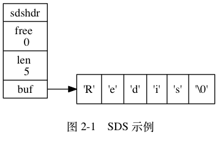
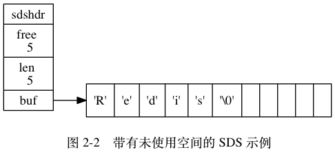

# 第2章 简单动态字符串

Redis 没有直接使用 C 语言传统的字符串表示（以空字符结尾的字符数组，以下简称 C 字符串）， 而是自己构建了一种名为简单动态字符串（simple dynamic string，SDS）的抽象类型， 并将 SDS 用作 Redis 的默认字符串表示。

在 Redis 里面， C 字符串只会作为字符串字面量（string literal）， 用在一些无须对字符串值进行修改的地方， 比如打印日志：

```
redisLog(REDIS_WARNING,"Redis is now ready to exit, bye bye...");
```

当 Redis 需要的不仅仅是一个字符串字面量， 而是一个可以被修改的字符串值时， Redis 就会使用 SDS 来表示字符串值： 比如在 Redis 的数据库里面， 包含字符串值的键值对在底层都是由 SDS 实现的。

举个例子， 如果客户端执行命令：

```
redis> SET msg "hello world"
OK
```

那么 Redis 将在数据库中创建了一个新的键值对， 其中：

- 键值对的键是一个字符串对象， 对象的底层实现是一个保存着字符串 `"msg"` 的 SDS 。
- 键值对的值也是一个字符串对象， 对象的底层实现是一个保存着字符串 `"hello world"` 的 SDS 。

又比如说， 如果客户端执行命令：

```
redis> RPUSH fruits "apple" "banana" "cherry"
(integer) 3
```

那么 Redis 将在数据库中创建一个新的键值对， 其中：

- 键值对的键是一个字符串对象， 对象的底层实现是一个保存了字符串 `"fruits"` 的 SDS 。
- 键值对的值是一个列表对象， 列表对象包含了三个字符串对象， 这三个字符串对象分别由三个 SDS 实现： 第一个 SDS 保存着字符串 `"apple"` ， 第二个 SDS 保存着字符串 `"banana"` ， 第三个 SDS 保存着字符串 `"cherry"` 。

除了用来保存数据库中的字符串值之外， SDS 还被用作缓冲区（buffer）： AOF 模块中的 AOF 缓冲区， 以及客户端状态中的输入缓冲区， 都是由 SDS 实现的， 在之后介绍 AOF 持久化和客户端状态的时候， 我们会看到 SDS 在这两个模块中的应用。

本章接下来将对 SDS 的实现进行介绍， 说明 SDS 和 C 字符串的不同之处， 解释为什么 Redis 要使用 SDS 而不是 C 字符串， 并在本章的最后列出 SDS 的操作 API 。

## 2.1 SDS的定义

每个 `sds.h/sdshdr` 结构表示一个 SDS 值：

```c
struct sdshdr {

    // 记录 buf 数组中已使用字节的数量
    // 等于 SDS 所保存字符串的长度
    int len;

    // 记录 buf 数组中未使用字节的数量
    int free;

    // 字节数组，用于保存字符串
    char buf[];

};
```

图 2-1 展示了一个 SDS 示例：

- `free` 属性的值为 `0` ， 表示这个 SDS 没有分配任何未使用空间。
- `len` 属性的值为 `5` ， 表示这个 SDS 保存了一个五字节长的字符串。
- `buf` 属性是一个 `char` 类型的数组， 数组的前五个字节分别保存了 `'R'` 、 `'e'` 、 `'d'` 、 `'i'` 、 `'s'` 五个字符， 而最后一个字节则保存了空字符 `'\0'` 。



SDS 遵循 C 字符串以空字符结尾的惯例， 保存空字符的 `1` 字节空间不计算在 SDS 的 `len` 属性里面， 并且为空字符分配额外的 `1` 字节空间， 以及添加空字符到字符串末尾等操作都是由 SDS 函数自动完成的， 所以这个空字符对于 SDS 的使用者来说是完全透明的。

遵循空字符结尾这一惯例的好处是， SDS 可以直接重用一部分 C 字符串函数库里面的函数。

举个例子， 如果我们有一个指向图 2-1 所示 SDS 的指针 `s` ， 那么我们可以直接使用 `stdio.h/printf` 函数， 通过执行以下语句：

```
printf("%s", s->buf);
```

来打印出 SDS 保存的字符串值 `"Redis"` ， 而无须为 SDS 编写专门的打印函数。

图 2-2 展示了另一个 SDS 示例:

- 这个 SDS 和之前展示的 SDS 一样， 都保存了字符串值 `"Redis"` 。
- 这个 SDS 和之前展示的 SDS 的区别在于， 这个 SDS 为 `buf` 数组分配了五字节未使用空间， 所以它的 `free` 属性的值为 `5` （图中使用五个空格来表示五字节的未使用空间）。



接下来的一节将详细地说明未使用空间在 SDS 中的作用。

## 2.2 SDS与C字符串的区别
## 2.3 SDS API
## 2.4 重点回顾
## 2.5 参考资料