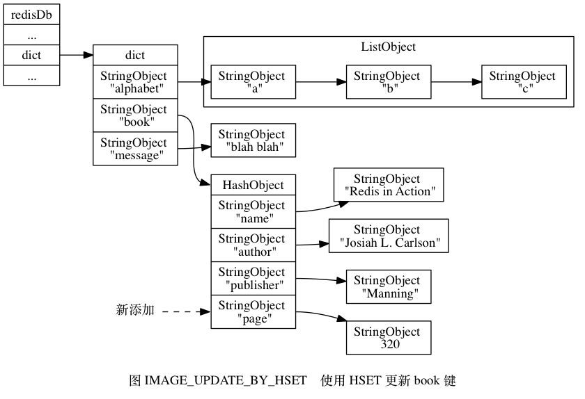
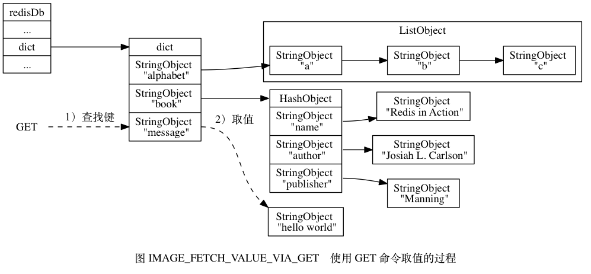

# 第9章 数据库
## 9.1 服务器中的数据库
## 9.2 切换数据库
## 9.3 数据库键空间

Redis 是一个键值对（key-value pair）数据库服务器， 服务器中的每个数据库都由一个 `redis.h/redisDb` 结构表示， 其中， `redisDb` 结构的 `dict` 字典保存了数据库中的所有键值对， 我们将这个字典称为键空间（key space）：

```
typedef struct redisDb {

    // ...

    // 数据库键空间，保存着数据库中的所有键值对
    dict *dict;

    // ...

} redisDb;
```

键空间和用户所见的数据库是直接对应的：

- 键空间的键也就是数据库的键， 每个键都是一个字符串对象。
- 键空间的值也就是数据库的值， 每个值可以是字符串对象、列表对象、哈希表对象、集合对象和有序集合对象在内的任意一种 Redis 对象。

举个例子， 如果我们在空白的数据库中执行以下命令：

```
redis> SET message "hello world"
OK

redis> RPUSH alphabet "a" "b" "c"
(integer) 3

redis> HSET book name "Redis in Action"
(integer) 1

redis> HSET book author "Josiah L. Carlson"
(integer) 1

redis> HSET book publisher "Manning"
(integer) 1
```

那么在这些命令执行之后， 数据库的键空间将会是图 IMAGE_DB_EXAMPLE 所展示的样子：

- `alphabet` 是一个列表键， 键的名字是一个包含字符串 `"alphabet"` 的字符串对象， 键的值则是一个包含三个元素的列表对象。
- `book` 是一个哈希表键， 键的名字是一个包含字符串 `"book"` 的字符串对象， 键的值则是一个包含三个键值对的哈希表对象。
- `message` 是一个字符串键， 键的名字是一个包含字符串 `"message"` 的字符串对象， 键的值则是一个包含字符串 `"hello world"` 的字符串对象。


因为数据库的键空间是一个字典， 所以所有针对数据库的操作 —— 比如添加一个键值对到数据库， 或者从数据库中删除一个键值对， 又或者在数据库中获取某个键值对， 等等， 实际上都是通过对键空间字典进行操作来实现的， 以下几个小节将分别介绍数据库的添加、删除、更新、取值等操作的实现原理。

### 添加新键

添加一个新键值对到数据库， 实际上就是将一个新键值对添加到键空间字典里面， 其中键为字符串对象， 而值则为任意一种类型的 Redis 对象。

举个例子， 如果键空间当前的状态如图 IMAGE_DB_EXAMPLE 所示， 那么在执行以下命令之后：

```
redis> SET date "2013.12.1"
OK
```

键空间将添加一个新的键值对， 这个新键值对的键是一个包含字符串 `"date"` 的字符串对象， 而键值对的值则是一个包含字符串 `"2013.12.1"` 的字符串对象， 如图 IMAGE_DB_AFTER_ADD_NEW_KEY 所示。


### 删除键

删除数据库中的一个键， 实际上就是在键空间里面删除键所对应的键值对对象。

举个例子， 如果键空间当前的状态如图 IMAGE_DB_EXAMPLE 所示， 那么在执行以下命令之后：

```
redis> DEL book
(integer) 1
```

键 `book` 以及它的值将从键空间中被删除， 如图 IMAGE_DB_AFTER_DEL 所示。


### 更新键

对一个数据库键进行更新， 实际上就是对键空间里面键所对应的值对象进行更新， 根据值对象的类型不同， 更新的具体方法也会有所不同。

举个例子， 如果键空间当前的状态如图 IMAGE_DB_EXAMPLE 所示， 那么在执行以下命令之后：

```
redis> SET message "blah blah"
OK
```

键 `message` 的值对象将从之前包含 `"hello world"` 字符串更新为包含 `"blah blah"` 字符串， 如图 IMAGE_DB_UPDATE_CAUSE_SET 所示。


再举个例子， 如果我们继续执行以下命令：

```
redis> HSET book page 320
(integer) 1
```

那么键空间中 `book` 键的值对象（一个哈希对象）将被更新， 新的键值对 `page` 和 `320` 会被添加到值对象里面， 如图 IMAGE_UPDATE_BY_HSET 所示。



### 对键取值

对一个数据库键进行取值， 实际上就是在键空间中取出键所对应的值对象， 根据值对象的类型不同， 具体的取值方法也会有所不同。

举个例子， 如果键空间当前的状态如图 IMAGE_DB_EXAMPLE 所示， 那么当执行以下命令时：

```
redis> GET message
"hello world"
```

GET 命令将首先在键空间中查找键 `message` ， 找到键之后接着取得该键所对应的字符串对象值， 之后再返回值对象所包含的字符串 `"hello world"` ， 取值过程如图 IMAGE_FETCH_VALUE_VIA_GET 所示。



再举一个例子， 当执行以下命令时：

```
redis> LRANGE alphabet 0 -1
1) "a"
2) "b"
3) "c"
```

LRANGE 命令将首先在键空间中查找键 `alphabet` ， 找到键之后接着取得该键所对应的列表对象值， 之后再返回列表对象中包含的三个字符串对象的值， 取值过程如图 IMAGE_FETCH_VALUE_VIA_LRANGE 所示。


### 其他键空间操作

除了上面列出的添加、删除、更新、取值操作之外， 还有很多针对数据库本身的 Redis 命令， 也是通过对键空间进行处理来完成的。

比如说， 用于清空整个数据库的 FLUSHDB 命令， 就是通过删除键空间中的所有键值对来实现的。

又比如说， 用于随机返回数据库中某个键的 RANDOMKEY 命令， 就是通过在键空间中随机返回一个键来实现的。

另外， 用于返回数据库键数量的 DBSIZE 命令， 就是通过返回键空间中包含键值对的数量来实现的。

类似的命令还有 EXISTS 、 RENAME 、 KEYS ， 等等， 这些命令都是通过对键空间进行操作来实现的。

### 读写键空间时的维护操作

当使用 Redis 命令对数据库进行读写时， 服务器不仅会对键空间执行指定的读写操作， 还会执行一些额外的维护操作， 其中包括：

- 在读取一个键之后（读操作和写操作都要对键进行读取）， 服务器会根据键是否存在， 以此来更新服务器的键空间命中（hit）次数或键空间不命中（miss）次数， 这两个值可以在 INFO stats 命令的 `keyspace_hits` 属性和 `keyspace_misses` 属性中查看。
- 在读取一个键之后， 服务器会更新键的 LRU （最后一次使用）时间， 这个值可以用于计算键的闲置时间， 使用命令 OBJECT idletime <key> 命令可以查看键 `key` 的闲置时间。
- 如果服务器在读取一个键时， 发现该键已经过期， 那么服务器会先删除这个过期键， 然后才执行余下的其他操作， 本章稍后对过期键的讨论会详细说明这一点。
- 如果有客户端使用 WATCH 命令监视了某个键， 那么服务器在对被监视的键进行修改之后， 会将这个键标记为脏（dirty）， 从而让事务程序注意到这个键已经被修改过， 《事务》一章会详细说明这一点。
- 服务器每次修改一个键之后， 都会对脏（dirty）键计数器的值增一， 这个计数器会触发服务器的持久化以及复制操作执行， 《RDB 持久化》、《AOF 持久化》和《复制》这三章都会说到这一点。
- 如果服务器开启了数据库通知功能， 那么在对键进行修改之后， 服务器将按配置发送相应的数据库通知， 本章稍后讨论数据库通知功能的实现时会详细说明这一点。

## 9.4 设置键的生存时间或过期时间
## 9.5 过期键删除策略 
## 9.6 Redis的过期键删除策略 
## 9.7 AOF、RDB和复制功能对过期键的处理 
## 9.8 数据库通知 
## 9.9 重点回顾 

- Redis 服务器的所有数据库都保存在 `redisServer.db` 数组中， 而数据库的数量则由 `redisServer.dbnum` 属性保存。
- 客户端通过修改目标数据库指针， 让它指向 `redisServer.db` 数组中的不同元素来切换不同的数据库。
- 数据库主要由 `dict` 和 `expires` 两个字典构成， 其中 `dict` 字典负责保存键值对， 而 `expires` 字典则负责保存键的过期时间。
- 因为数据库由字典构成， 所以对数据库的操作都是建立在字典操作之上的。
- 数据库的键总是一个字符串对象， 而值则可以是任意一种 Redis 对象类型， 包括字符串对象、哈希表对象、集合对象、列表对象和有序集合对象， 分别对应字符串键、哈希表键、集合键、列表键和有序集合键。
- `expires` 字典的键指向数据库中的某个键， 而值则记录了数据库键的过期时间， 过期时间是一个以毫秒为单位的 UNIX 时间戳。
- Redis 使用惰性删除和定期删除两种策略来删除过期的键： 惰性删除策略只在碰到过期键时才进行删除操作， 定期删除策略则每隔一段时间， 主动查找并删除过期键。
- 执行 SAVE 命令或者 BGSAVE 命令所产生的新 RDB 文件不会包含已经过期的键。
- 执行 BGREWRITEAOF 命令所产生的重写 AOF 文件不会包含已经过期的键。
- 当一个过期键被删除之后， 服务器会追加一条 DEL 命令到现有 AOF 文件的末尾， 显式地删除过期键。
- 当主服务器删除一个过期键之后， 它会向所有从服务器发送一条 DEL 命令， 显式地删除过期键。
- 从服务器即使发现过期键， 也不会自作主张地删除它， 而是等待主节点发来 DEL 命令， 这种统一、中心化的过期键删除策略可以保证主从服务器数据的一致性。
- 当 Redis 命令对数据库进行修改之后， 服务器会根据配置， 向客户端发送数据库通知。