# 第10章 RDB持久化

Redis是一个键值对数据库服务器，服务器中通常包含着任意个非空数据库，而每个非空数据库中又可以包含任意个键值对，为了方便起见，我们将服务器中的非空数据库以及它们的键值对统称为数据库状态。

举个例子，图10-1展示了一个包含三个非空数据库的Redis服务器，这三个数据库以及数据库中的键值对就是该服务器的数据库状态。

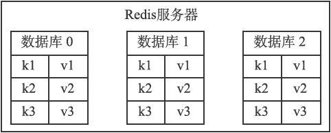

图10-1　数据库状态示例

因为Redis是内存数据库，它将自己的数据库状态储存在内存里面，所以如果不想办法将储存在内存中的数据库状态保存到磁盘里面，那么一旦服务器进程退出，服务器中的数据库状态也会消失不见。

为了解决这个问题，Redis提供了RDB持久化功能，这个功能可以将Redis在内存中的数据库状态保存到磁盘里面，避免数据意外丢失。

RDB持久化既可以手动执行，也可以根据服务器配置选项定期执行，该功能可以将某个时间点上的数据库状态保存到一个RDB文件中，如图10-2所示。

RDB持久化功能所生成的RDB文件是一个经过压缩的二进制文件，通过该文件可以还原生成RDB文件时的数据库状态，如图10-3所示。

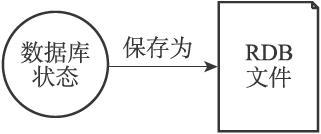

图10-2　将数据库状态保存为RDB文件

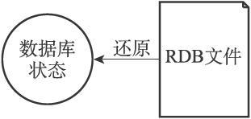

图10-3　用RDB文件来还原数据库状态

因为RDB文件是保存在硬盘里面的，所以即使Redis服务器进程退出，甚至运行Redis服务器的计算机停机，但只要RDB文件仍然存在，Redis服务器就可以用它来还原数据库状态。

本章首先介绍Redis服务器保存和载入RDB文件的方法，重点说明SAVE命令和BGSAVE命令的实现方式。

之后，本章会继续介绍Redis服务器自动保存功能的实现原理。

在介绍完关于保存和载入RDB文件方面的内容之后，我们会详细分析RDB文件中的各个组成部分，并说明这些部分的结构和含义。

在本章的最后，我们将对实际的RDB文件进行分析和解读，将之前学到的关于RDB文件的知识投入到实际应用中。

## 10.1 RDB 文件的创建与载入

有两个Redis命令可以用于生成RDB文件，一个是SAVE，另一个是BGSAVE。

SAVE命令会阻塞Redis服务器进程，直到RDB文件创建完毕为止，在服务器进程阻塞期间，服务器不能处理任何命令请求：

```
redis> SAVE       //
等待直到RDB
文件创建完毕
OK
```

和SAVE命令直接阻塞服务器进程的做法不同，BGSAVE命令会派生出一个子进程，然后由子进程负责创建RDB文件，服务器进程（父进程）继续处理命令请求：

```
redis> BGSAVE     //
派生子进程，并由子进程创建RDB
文件
Background saving started
```

创建RDB文件的实际工作由rdb.c/rdbSave函数完成，SAVE命令和BGSAVE命令会以不同的方式调用这个函数，通过以下伪代码可以明显地看出这两个命令之间的区别：

```
def SAVE():
    # 
创建RDB
文件
    rdbSave()
def BGSAVE():
    # 
创建子进程
    pid = fork()
    if pid == 0:
        # 
子进程负责创建RDB
文件
        rdbSave()
        # 
完成之后向父进程发送信号
        signal_parent()
    elif pid > 0:
        # 
父进程继续处理命令请求，并通过轮询等待子进程的信号
        handle_request_and_wait_signal()
    else:
        # 
处理出错情况
        handle_fork_error()
```

和使用SAVE命令或者BGSAVE命令创建RDB文件不同，RDB文件的载入工作是在服务器启动时自动执行的，所以Redis并没有专门用于载入RDB文件的命令，只要Redis服务器在启动时检测到RDB文件存在，它就会自动载入RDB文件。

以下是Redis服务器启动时打印的日志记录，其中第二条日志DB loaded from disk:...就是服务器在成功载入RDB文件之后打印的：

```
$ redis-server
[7379] 30 Aug 21:07:01.270 # Server started, Redis version 2.9.11
[7379] 30 Aug 21:07:01.289 * DB loaded from disk: 0.018 seconds
[7379] 30 Aug 21:07:01.289 * The server is now ready to accept connections on port 6379
```

另外值得一提的是，因为AOF文件的更新频率通常比RDB文件的更新频率高，所以：

- 如果服务器开启了AOF持久化功能，那么服务器会优先使用AOF文件来还原数据库状态。

- 只有在AOF持久化功能处于关闭状态时，服务器才会使用RDB文件来还原数据库状态。

服务器判断该用哪个文件来还原数据库状态的流程如图10-4所示。

载入RDB文件的实际工作由rdb.c/rdbLoad函数完成，这个函数和rdbSave函数之间的关系可以用图10-5表示。

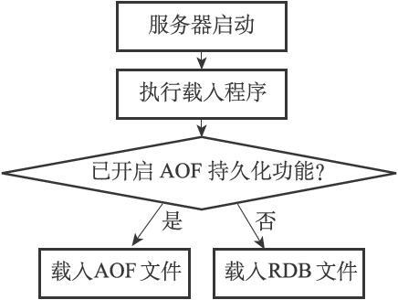

图10-4　服务器载入文件时的判断流程


图10-5　创建和载入RDB文件

### 10.1.1　SAVE命令执行时的服务器状态

前面提到过，当SAVE命令执行时，Redis服务器会被阻塞，所以当SAVE命令正在执行时，客户端发送的所有命令请求都会被拒绝。

只有在服务器执行完SAVE命令、重新开始接受命令请求之后，客户端发送的命令才会被处理。

### 10.1.2　BGSAVE命令执行时的服务器状态

因为BGSAVE命令的保存工作是由子进程执行的，所以在子进程创建RDB文件的过程中，Redis服务器仍然可以继续处理客户端的命令请求，但是，在BGSAVE命令执行期间，服务器处理SAVE、BGSAVE、BGREWRITEAOF三个命令的方式会和平时有所不同。

首先，在BGSAVE命令执行期间，客户端发送的SAVE命令会被服务器拒绝，服务器禁止SAVE命令和BGSAVE命令同时执行是为了避免父进程（服务器进程）和子进程同时执行两个rdbSave调用，防止产生竞争条件。

其次，在BGSAVE命令执行期间，客户端发送的BGSAVE命令会被服务器拒绝，因为同时执行两个BGSAVE命令也会产生竞争条件。

最后，BGREWRITEAOF和BGSAVE两个命令不能同时执行：

- 如果BGSAVE命令正在执行，那么客户端发送的BGREWRITEAOF命令会被延迟到BGSAVE命令执行完毕之后执行。

- 如果BGREWRITEAOF命令正在执行，那么客户端发送的BGSAVE命令会被服务器拒绝。

因为BGREWRITEAOF和BGSAVE两个命令的实际工作都由子进程执行，所以这两个命令在操作方面并没有什么冲突的地方，不能同时执行它们只是一个性能方面的考虑——并发出两个子进程，并且这两个子进程都同时执行大量的磁盘写入操作，这怎么想都不会是一个好主意。

### 10.1.3　RDB文件载入时的服务器状态

服务器在载入RDB文件期间，会一直处于阻塞状态，直到载入工作完成为止。

## 10.2 自动间隔性保存

在上一节，我们介绍了SAVE命令和BGSAVE的实现方法，并且说明了这两个命令在实现方面的主要区别：SAVE命令由服务器进程执行保存工作，BGSAVE命令则由子进程执行保存工作，所以SAVE命令会阻塞服务器，而BGSAVE命令则不会。

因为BGSAVE命令可以在不阻塞服务器进程的情况下执行，所以Redis允许用户通过设置服务器配置的save选项，让服务器每隔一段时间自动执行一次BGSAVE命令。

用户可以通过save选项设置多个保存条件，但只要其中任意一个条件被满足，服务器就会执行BGSAVE命令。

举个例子，如果我们向服务器提供以下配置：

```
save 900 1
save 300 10
save 60 10000
```

那么只要满足以下三个条件中的任意一个，BGSAVE命令就会被执行：

- 服务器在900秒之内，对数据库进行了至少1次修改。

- 服务器在300秒之内，对数据库进行了至少10次修改。

- 服务器在60秒之内，对数据库进行了至少10000次修改。

举个例子，以下是Redis服务器在60秒之内，对数据库进行了至少10000次修改之后，服务器自动执行BGSAVE命令时打印出来的日志：

```
[5085] 03 Sep 17:09:49.463 * 10000 changes in 60 seconds. Saving...
[5085] 03 Sep 17:09:49.463 * Background saving started by pid 5189
[5189] 03 Sep 17:09:49.522 * DB saved on disk
[5189] 03 Sep 17:09:49.522 * RDB: 0 MB of memory used by copy-on-write
[5085] 03 Sep 17:09:49.563 * Background saving terminated with success
```

在本节接下来的内容中，我们将介绍Redis服务器是如何根据save选项设置的保存条件，自动执行BGSAVE命令的。

### 10.2.1　设置保存条件

当Redis服务器启动时，用户可以通过指定配置文件或者传入启动参数的方式设置save选项，如果用户没有主动设置save选项，那么服务器会为save选项设置默认条件：

```
save 900 1
save 300 10
save 60 10000
```

接着，服务器程序会根据save选项所设置的保存条件，设置服务器状态redisServer结构的saveparams属性：

```
struct redisServer {
    // ...
    // 记录了保存条件的数组
    struct saveparam *saveparams;
    // ...
};
```

saveparams属性是一个数组，数组中的每个元素都是一个saveparam结构，每个saveparam结构都保存了一个save选项设置的保存条件：

```
struct saveparam {
    // 
秒数
    time_t seconds;
    // 
修改数
    int changes;
};
```

比如说，如果save选项的值为以下条件：

```
save 900 1
save 300 10
save 60 10000
```

那么服务器状态中的saveparams数组将会是图10-6所示的样子。


图10-6　服务器状态中的保存条件

### 10.2.2　dirty计数器和lastsave属性

除了saveparams数组之外，服务器状态还维持着一个dirty计数器，以及一个lastsave属性：

- dirty计数器记录距离上一次成功执行SAVE命令或者BGSAVE命令之后，服务器对数据库状态（服务器中的所有数据库）进行了多少次修改（包括写入、删除、更新等操作）。

- lastsave属性是一个UNIX时间戳，记录了服务器上一次成功执行SAVE命令或者BGSAVE命令的时间。

```
struct redisServer {
    // ...
    // 
修改计数器
    long long dirty;
    // 
上一次执行保存的时间
    time_t lastsave;
    // ...
};
```

当服务器成功执行一个数据库修改命令之后，程序就会对dirty计数器进行更新：命令修改了多少次数据库，dirty计数器的值就增加多少。

例如，如果我们为一个字符串键设置值：

```
redis> SET message "hello"
OK
```

那么程序会将dirty计数器的值增加1。

又例如，如果我们向一个集合键增加三个新元素：

```
redis> SADD database Redis MongoDB MariaDB
(integer) 3
```

那么程序会将dirty计数器的值增加3。

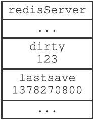

图10-7　服务器状态示例

图10-7展示了服务器状态中包含的dirty计数器和lastsave属性，说明如下：

- dirty计数器的值为123，表示服务器在上次保存之后，对数据库状态共进行了123次修改。

- lastsave属性则记录了服务器上次执行保存操作的时间1378270800（2013年9月4日零时）。

### 10.2.3　检查保存条件是否满足

Redis的服务器周期性操作函数serverCron默认每隔100毫秒就会执行一次，该函数用于对正在运行的服务器进行维护，它的其中一项工作就是检查save选项所设置的保存条件是否已经满足，如果满足的话，就执行BGSAVE命令。

以下伪代码展示了serverCron函数检查保存条件的过程：

```
def serverCron():
    # ...
    # 
遍历所有保存条件
    for saveparam in server.saveparams:
        # 
计算距离上次执行保存操作有多少秒
        save_interval = unixtime_now()-server.lastsave
        # 
如果数据库状态的修改次数超过条件所设置的次数
        # 
并且距离上次保存的时间超过条件所设置的时间
        # 
那么执行保存操作
        if      server.dirty >= saveparam.changes and \
           save_interval > saveparam.seconds:
            BGSAVE()
    # ...
```

程序会遍历并检查saveparams数组中的所有保存条件，只要有任意一个条件被满足，那么服务器就会执行BGSAVE命令。

举个例子，如果Redis服务器的当前状态如图10-8所示。

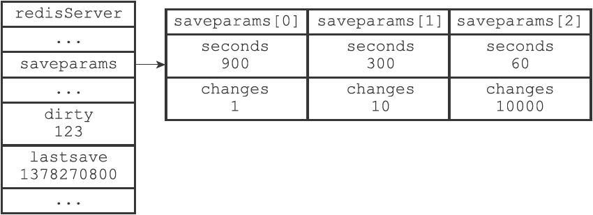

图10-8　服务器状态

那么当时间来到1378271101，也即是1378270800的301秒之后，服务器将自动执行一次BGSAVE命令，因为saveparams数组的第二个保存条件——300秒之内有至少10次修改——已经被满足。

假设BGSAVE在执行5秒之后完成，那么图10-8所示的服务器状态将更新为图10-9，其中dirty计数器已经被重置为0，而lastsave属性也被更新为1378271106。

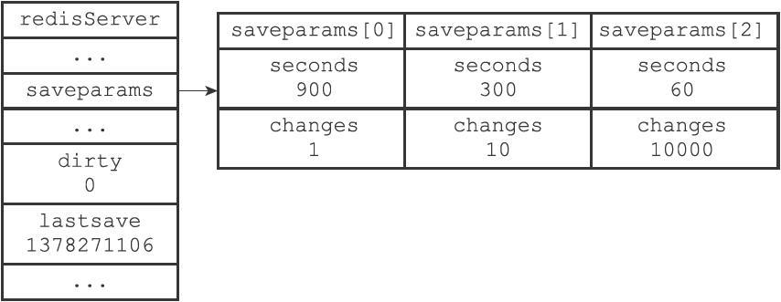

图10-9　执行BGSAVE之后的服务器状态

以上就是Redis服务器根据save选项所设置的保存条件，自动执行BGSAVE命令，进行间隔性数据保存的实现原理。


## 10.3 RDB 文件结构

在本章之前的内容中， 我们介绍了 Redis 服务器保存和载入 RDB 文件的方法， 在这一节， 我们将对 RDB 文件本身进行介绍， 并详细说明文件各个部分的结构和意义。

图 IMAGE_RDB_STRUCT_OVERVIEW 展示了一个完整 RDB 文件所包含的各个部分。

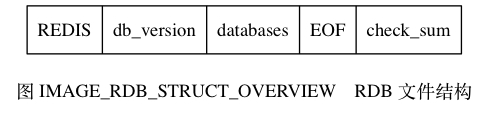

注意

为了方便区分变量、数据、常量， 图 IMAGE_RDB_STRUCT_OVERVIEW 中用全大写单词标示常量， 用全小写单词标示变量和数据。

本章展示的所有 RDB 文件结构图都遵循这一规则。

RDB 文件的最开头是 `REDIS` 部分， 这个部分的长度为 `5` 字节， 保存着 `"REDIS"` 五个字符。 通过这五个字符， 程序可以在载入文件时， 快速检查所载入的文件是否 RDB 文件。

注意

因为 RDB 文件保存的是二进制数据， 而不是 C 字符串， 为了简便起见， 我们用 `"REDIS"` 符号代表 `'R'` 、 `'E'` 、 `'D'` 、 `'I'` 、 `'S'` 五个字符， 而不是带 `'\0'` 结尾符号的 C 字符串 `'R'` 、 `'E'` 、 `'D'` 、 `'I'` 、 `'S'` 、 `'\0'` 。

本章介绍的所有内容，以及展示的所有 RDB 文件结构图都遵循这一规则。

`db_version` 长度为 `4` 字节， 它的值是一个字符串表示的整数， 这个整数记录了 RDB 文件的版本号， 比如 `"0006"` 就代表 RDB 文件的版本为第六版。 本章只介绍第六版 RDB 文件的结构。

`databases` 部分包含着零个或任意多个数据库， 以及各个数据库中的键值对数据：

- 如果服务器的数据库状态为空（所有数据库都是空的）， 那么这个部分也为空， 长度为 `0` 字节。
- 如果服务器的数据库状态为非空（有至少一个数据库非空）， 那么这个部分也为非空， 根据数据库所保存键值对的数量、类型和内容不同， 这个部分的长度也会有所不同。

`EOF` 常量的长度为 `1` 字节， 这个常量标志着 RDB 文件正文内容的结束， 当读入程序遇到这个值的时候， 它知道所有数据库的所有键值对都已经载入完毕了。

`check_sum` 是一个 `8` 字节长的无符号整数， 保存着一个校验和， 这个校验和是程序通过对 `REDIS` 、 `db_version` 、 `databases` 、 `EOF` 四个部分的内容进行计算得出的。 服务器在载入 RDB 文件时， 会将载入数据所计算出的校验和与 `check_sum` 所记录的校验和进行对比， 以此来检查 RDB 文件是否有出错或者损坏的情况出现。

作为例子， 图 IMAGE_RDB_WITH_EMPTY_DATABASE 展示了一个 `databases` 部分为空的 RDB 文件： 文件开头的 `"REDIS"` 表示这是一个 RDB 文件， 之后的 `"0006"` 表示这是第六版的 RDB 文件， 因为 `databases` 为空， 所以版本号之后直接跟着 `EOF` 常量， 最后的 `6265312314761917404` 是文件的校验和。

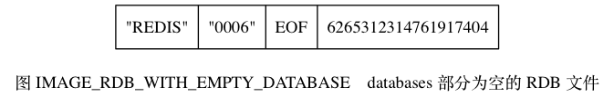

### databases 部分

一个 RDB 文件的 `databases` 部分可以保存任意多个非空数据库。

比如说， 如果服务器的 `0` 号数据库和 `3` 号数据库非空， 那么服务器将创建一个如图 IMAGE_RDB_WITH_TWO_DB 所示的 RDB 文件， 图中的 `database 0` 代表 `0` 号数据库中的所有键值对数据， 而 `database 3` 则代表 `3` 号数据库中的所有键值对数据。

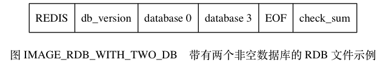

每个非空数据库在 RDB 文件中都可以保存为 `SELECTDB` 、 `db_number` 、 `key_value_pairs` 三个部分， 如图 IMAGE_DATABASE_STRUCT_OF_RDB 所示。


`SELECTDB` 常量的长度为 `1` 字节， 当读入程序遇到这个值的时候， 它知道接下来要读入的将是一个数据库号码。

`db_number` 保存着一个数据库号码， 根据号码的大小不同， 这个部分的长度可以是 `1` 字节、 `2` 字节或者 `5` 字节。 当程序读入 `db_number` 部分之后， 服务器会调用 SELECT 命令， 根据读入的数据库号码进行数据库切换， 使得之后读入的键值对可以载入到正确的数据库中。

`key_value_pairs` 部分保存了数据库中的所有键值对数据， 如果键值对带有过期时间， 那么过期时间也会和键值对保存在一起。 根据键值对的数量、类型、内容、以及是否有过期时间等条件的不同， `key_value_pairs` 部分的长度也会有所不同。

作为例子， 图 IMAGE_EXAMPLE_OF_DB 展示了 RDB 文件中， `0` 号数据库的结构。

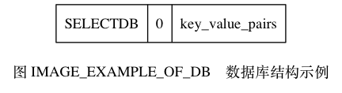

另外， 图 IMAGE_RDB_WITH_DB_0_AND_DB_3 则展示了一个完整的 RDB 文件， 文件中包含了 `0` 号数据库和 `3` 号数据库。

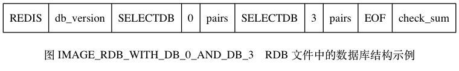

### key_value_pairs 部分

RDB 文件中的每个 `key_value_pairs` 部分都保存了一个或以上数量的键值对， 如果键值对带有过期时间的话， 那么键值对的过期时间也会被保存在内。

不带过期时间的键值对在 RDB 文件中对由 `TYPE` 、 `key` 、 `value` 三部分组成， 如图 IMAGE_KEY_WITHOUT_EXPIRE_TIME 所示。

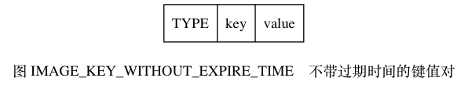

`TYPE` 记录了 `value` 的类型， 长度为 `1` 字节， 值可以是以下常量的其中一个：

- `REDIS_RDB_TYPE_STRING`
- `REDIS_RDB_TYPE_LIST`
- `REDIS_RDB_TYPE_SET`
- `REDIS_RDB_TYPE_ZSET`
- `REDIS_RDB_TYPE_HASH`
- `REDIS_RDB_TYPE_LIST_ZIPLIST`
- `REDIS_RDB_TYPE_SET_INTSET`
- `REDIS_RDB_TYPE_ZSET_ZIPLIST`
- `REDIS_RDB_TYPE_HASH_ZIPLIST`

以上列出的每个 `TYPE` 常量都代表了一种对象类型或者底层编码， 当服务器读入 RDB 文件中的键值对数据时， 程序会根据 `TYPE` 的值来决定如何读入和解释 `value` 的数据。

`key` 和 `value` 分别保存了键值对的键对象和值对象：

- 其中 `key` 总是一个字符串对象， 它的编码方式和 `REDIS_RDB_TYPE_STRING` 类型的 `value` 一样。 根据内容长度的不同， `key` 的长度也会有所不同。
- 根据 `TYPE` 类型的不同， 以及保存内容长度的不同， 保存 `value` 的结构和长度也会有所不同， 本节稍后会详细说明每种 `TYPE` 类型的 `value` 结构保存方式。

带有过期时间的键值对在 RDB 文件中的结构如图 `IMAGE_KEY_WITH_EXPIRE_TIME` 所示。


带有过期时间的键值对中的 `TYPE` 、 `key` 、 `value` 三个部分的意义， 和前面介绍的不带过期时间的键值对的 `TYPE` 、 `key` 、 `value` 三个部分的意义完全相同， 至于新增的 `EXPIRETIME_MS` 和 `ms` ， 它们的意义如下：

- `EXPIRETIME_MS` 常量的长度为 `1` 字节， 它告知读入程序， 接下来要读入的将是一个以毫秒为单位的过期时间。
- `ms` 是一个 `8` 字节长的带符号整数， 记录着一个以毫秒为单位的 UNIX 时间戳， 这个时间戳就是键值对的过期时间。

作为例子， 图 IMAGE_EXAMPLE_OF_KEY_WITHOUT_EXPIRE_TIME 展示了一个没有过期时间的字符串键值对。


图 IMAGE_EXAMPLE_OF_KEY_WITH_EXPIRE_TIME 展示了一个带有过期时间的集合键值对， 其中键的过期时间为 `1388556000000` （2014 年 1 月 1 日零时）。

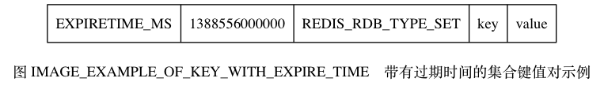

### value 的编码

RDB 文件中的每个 `value` 部分都保存了一个值对象， 每个值对象的类型都由与之对应的 `TYPE` 记录， 根据类型的不同， `value` 部分的结构、长度也会有所不同。

在接下来的各个小节中， 我们将分别介绍各种不同类型的值对象在 RDB 文件中的保存结构。

注意

本节接下来说到的各种 `REDIS_ENCODING_*` 编码曾经在《对象》一章中介绍过， 如果忘记了可以去回顾一下。

#### 字符串对象

如果 `TYPE` 的值为 `REDIS_RDB_TYPE_STRING` ， 那么 `value` 保存的就是一个字符串对象， 字符串对象的编码可以是 `REDIS_ENCODING_INT` 或者 `REDIS_ENCODING_RAW` 。

如果字符串对象的编码为 `REDIS_ENCODING_INT` ， 那么说明对象中保存的是长度不超过 `32` 位的整数， 这种编码的对象将以图 IMAGE_INT_ENCODING_STRING 所示的结构保存。


其中， `ENCODING` 的值可以是 `REDIS_RDB_ENC_INT8` 、 `REDIS_RDB_ENC_INT16` 或者 `REDIS_RDB_ENC_INT32` 三个常量的其中一个， 它们分别代表 RDB 文件使用 `8` 位（bit）、 `16` 位或者 `32` 位来保存整数值 `integer` 。

举个例子， 如果字符串对象中保存的是可以用 `8` 位来保存的整数 `123` ， 那么这个对象在 RDB 文件中保存的结构将如图 IMAGE_EXAMPLE_OF_INT_ENCODING_STRING 所示。

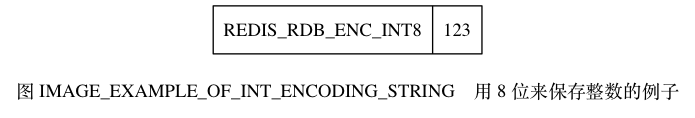

如果字符串对象的编码为 `REDIS_ENCODING_RAW` ， 那么说明对象所保存的是一个字符串值， 根据字符串长度的不同， 有压缩和不压缩两种方法来保存这个字符串：

- 如果字符串的长度小于等于 `20` 字节， 那么这个字符串会直接被原样保存。
- 如果字符串的长度大于 `20` 字节， 那么这个字符串会被压缩之后再保存。

注意

以上两个条件是在假设服务器打开了 RDB 文件压缩功能的情况下进行的， 如果服务器关闭了 RDB 文件压缩功能， 那么 RDB 程序总以无压缩的方式保存字符串值。

具体信息可以参考 `redis.conf` 文件中关于 `rdbcompression` 选项的说明。

对于没有被压缩的字符串， RDB 程序会以图 IMAGE_NON_COMPRESS_STRING 所示的结构来保存该字符串。


其中， `string` 部分保存了字符串值本身，而 `len` 保存了字符串值的长度。

对于压缩后的字符串， RDB 程序会以图 IMAGE_COMPRESSED_STRING 所示的结构来保存该字符串。

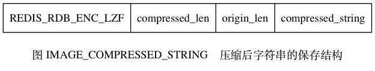

其中， `REDIS_RDB_ENC_LZF` 常量标志着字符串已经被 LZF 算法（[http://liblzf.plan9.de](http://liblzf.plan9.de/)）压缩过了， 读入程序在碰到这个常量时， 会根据之后的 `compressed_len` 、 `origin_len` 和 `compressed_string` 三部分， 对字符串进行解压缩： 其中 `compressed_len` 记录的是字符串被压缩之后的长度， 而 `origin_len` 记录的是字符串原来的长度， `compressed_string` 记录的则是被压缩之后的字符串。

图 IMAGE_EXAMPLE_OF_NON_COMPRESS_STRING 展示了一个保存无压缩字符串的例子， 其中字符串的长度为 `5` ， 字符串的值为 `"hello"` 。


图 IMAGE_EXAMPLE_OF_COMPRESS_STRING 展示了一个压缩后的字符串示例， 从图中可以看出， 字符串原本的长度为 `21` ， 压缩之后的长度为 `6` ， 压缩之后的字符串内容为 `"?aa???"` ， 其中 `?` 代表的是无法用字符串形式打印出来的字节。

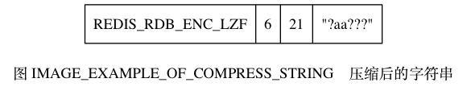

#### 列表对象

如果 `TYPE` 的值为 `REDIS_RDB_TYPE_LIST` ， 那么 `value` 保存的就是一个 `REDIS_ENCODING_LINKEDLIST` 编码的列表对象， RDB 文件保存这种对象的结构如图 IMAGE_LINKEDLIST_ENCODING_LIST 所示。


`list_length` 记录了列表的长度， 它记录列表保存了多少个项（item）， 读入程序可以通过这个长度知道自己应该读入多少个列表项。

图中以 `item` 开头的部分代表列表的项， 因为每个列表项都是一个字符串对象， 所以程序会以处理字符串对象的方式来保存和读入列表项。

作为示例， 图 IMAGE_EXAMPLE_OF_LINKEDLIST_ENCODING_LIST 展示了一个包含三个元素的列表。


结构中的第一个数字 `3` 是列表的长度， 之后跟着的分别是第一个列表项、第二个列表项和第三个列表项， 其中：

- 第一个列表项的长度为 `5` ， 内容为字符串 `"hello"` 。
- 第二个列表项的长度也为 `5` ， 内容为字符串 `"world"` 。
- 第三个列表项的长度为 `1` ， 内容为字符串 `"!"` 。

#### 集合对象

如果 `TYPE` 的值为 `REDIS_RDB_TYPE_SET` ， 那么 `value` 保存的就是一个 `REDIS_ENCODING_HT` 编码的集合对象， RDB 文件保存这种对象的结构如图 IMAGE_HT_ENCODING_SET 所示。

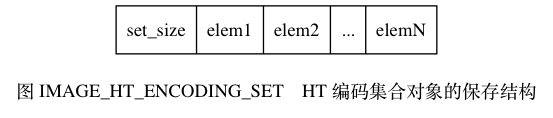

其中， `set_size` 是集合的大小， 它记录集合保存了多少个元素， 读入程序可以通过这个大小知道自己应该读入多少个集合元素。

图中以 `elem` 开头的部分代表集合的元素， 因为每个集合元素都是一个字符串对象， 所以程序会以处理字符串对象的方式来保存和读入集合元素。

作为示例， 图 IMAGE_EXAMPLE_OF_HT_SET 展示了一个包含四个元素的集合。

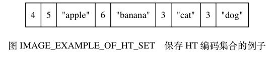

结构中的第一个数字 `4` 记录了集合的大小， 之后跟着的是集合的四个元素：

- 第一个元素的长度为 `5` ，值为 `"apple"` 。
- 第二个元素的长度为 `6` ，值为 `"banana"` 。
- 第三个元素的长度为 `3` ，值为 `"cat"` 。
- 第四个元素的长度为 `3` ，值为 `"dog"` 。

#### 哈希表对象

如果 `TYPE` 的值为 `REDIS_RDB_TYPE_HASH` ， 那么 `value` 保存的就是一个 `REDIS_ENCODING_HT` 编码的集合对象， RDB 文件保存这种对象的结构如图 IMAGE_HT_HASH 所示：

- `hash_size` 记录了哈希表的大小， 也即是这个哈希表保存了多少键值对， 读入程序可以通过这个大小知道自己应该读入多少个键值对。
- 以 `key_value_pair` 开头的部分代表哈希表中的键值对， 键值对的键和值都是字符串对象， 所以程序会以处理字符串对象的方式来保存和读入键值对。

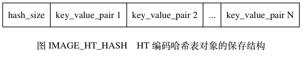

结构中的每个键值对都以键紧挨着值的方式排列在一起， 如图 IMAGE_KEY_VALUE_PAIR_OF_HT_HASH 所示。


因此， 从更详细的角度看， 图 IMAGE_HT_HASH 所展示的结构可以进一步修改为图 IMAGE_DETIAL_HT_HASH 。

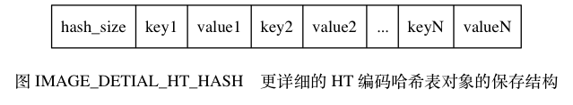

作为示例， 图 IMAGE_EXAMPLE_OF_HT_HASH 展示了一个包含两个键值对的哈希表。

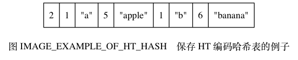

在这个示例结构中， 第一个数字 `2` 记录了哈希表的键值对数量， 之后跟着的是两个键值对：

- 第一个键值对的键是长度为 `1` 的字符串 `"a"` ， 值是长度为 `5` 的字符串 `"apple"` 。
- 第二个键值对的键是长度为 `1` 的字符串 `"b"` ， 值是长度为 `6` 的字符串 `"banana"` 。

#### 有序集合对象

如果 `TYPE` 的值为 `REDIS_RDB_TYPE_ZSET` ， 那么 `value` 保存的就是一个 `REDIS_ENCODING_SKIPLIST` 编码的有序集合对象， RDB 文件保存这种对象的结构如图 IMAGE_SKIPLIST_ZSET 所示。

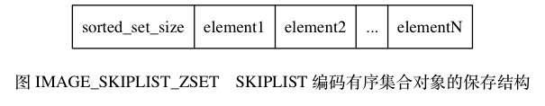

`sorted_set_size` 记录了有序集合的大小， 也即是这个有序集合保存了多少元素， 读入程序需要根据这个值来决定应该读入多少有序集合元素。

以 `element` 开头的部分代表有序集合中的元素， 每个元素又分为成员（member）和分值（score）两部分， 成员是一个字符串对象， 分值则是一个 `double` 类型的浮点数， 程序在保存 RDB 文件时会先将分值转换成字符串对象， 然后再用保存字符串对象的方法将分值保存起来。

有序集合中的每个元素都以成员紧挨着分值的方式排列， 如图 IMAGE_MEMBER_AND_SCORE_OF_ZSET 所示。

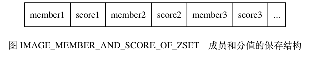

因此， 从更详细的角度看， 图 IMAGE_SKIPLIST_ZSET 所展示的结构可以进一步修改为图 IMAGE_DETIAL_SKIPLIST_ZSET 。


作为示例， 图 IMAGE_EXAMPLE_OF_SKIPLIST_ZSET 展示了一个带有两个元素的有序集合。


在这个示例结构中， 第一个数字 `2` 记录了有序集合的元素数量， 之后跟着的是两个有序集合元素：

- 第一个元素的成员是长度为 `2` 的字符串 `"pi"` ， 分值被转换成字符串之后变成了长度为 `4` 的字符串 `"3.14"` 。
- 第二个元素的成员是长度为 `1` 的字符串 `"e"` ， 分值被转换成字符串之后变成了长度为 `3` 的字符串 `"2.7"` 。

#### INTSET 编码的集合

如果 `TYPE` 的值为 `REDIS_RDB_TYPE_SET_INTSET` ， 那么 `value` 保存的就是一个整数集合对象， RDB 文件保存这种对象的方法是， 先将整数集合转换为字符串对象， 然后将这个字符串对象保存到 RDB 文件里面。

如果程序在读入 RDB 文件的过程中， 碰到由整数集合对象转换成的字符串对象， 那么程序会根据 `TYPE` 值的指示， 先读入字符串对象， 再将这个字符串对象转换成原来的整数集合对象。

#### ZIPLIST 编码的列表、哈希表或者有序集合

如果 `TYPE` 的值为 `REDIS_RDB_TYPE_LIST_ZIPLIST` 、 `REDIS_RDB_TYPE_HASH_ZIPLIST` 或者 `REDIS_RDB_TYPE_ZSET_ZIPLIST` ， 那么 `value` 保存的就是一个压缩列表对象， RDB 文件保存这种对象的方法是：

1. 将压缩列表转换成一个字符串对象。
2. 将转换所得的字符串对象保存到 RDB 文件。

如果程序在读入 RDB 文件的过程中， 碰到由压缩列表对象转换成的字符串对象， 那么程序会根据 `TYPE` 值的指示， 执行以下操作：

1. 读入字符串对象，并将它转换成原来的压缩列表对象。
2. 根据 `TYPE` 的值，设置压缩列表对象的类型： 如果 `TYPE` 的值为 `REDIS_RDB_TYPE_LIST_ZIPLIST` ， 那么压缩列表对象的类型为列表； 如果 `TYPE` 的值为 `REDIS_RDB_TYPE_HASH_ZIPLIST` ， 那么压缩列表对象的类型为哈希表； 如果 `TYPE` 的值为 `REDIS_RDB_TYPE_ZSET_ZIPLIST` ， 那么压缩列表对象的类型为有序集合。

从步骤 2 可以看出， 由于 `TYPE` 的存在， 即使列表、哈希表和有序集合三种类型都使用压缩列表来保存， RDB 读入程序也总可以将读入并转换之后得出的压缩列表设置成原来的类型。

## 10.4 分析RDB文件

通过上一节对RDB文件的介绍，我们现在应该对RDB文件中的各种内容和结构有一定的了解了，是时候抛开单纯的图片示例，开始分析和观察一下实际的RDB文件了。

我们使用od命令来分析Redis服务器产生的RDB文件，该命令可以用给定的格式转存（dump）并打印输入文件。比如说，给定-c参数可以以ASCII编码的方式打印输入文件，给定-x参数可以以十六进制的方式打印输入文件，诸如此类，具体的信息可以参考od命令的文档。

### 10.4.1　不包含任何键值对的RDB文件

让我们首先从最简单的情况开始，执行以下命令，创建一个数据库状态为空的RDB文件：

```
redis> FLUSHALL
OK
redis> SAVE
OK
```

然后调用od命令，打印RDB文件：

```
$ od -c dump.rdb
0000000   R E D I S 0 0 0 6 377 334 263 C 360 Z 334
0000020 362 V
0000022
```

根据之前学习的RDB文件结构知识，当一个RDB文件没有包含任何数据库数据时，这个RDB文件将由以下四个部分组成：

- 五个字节的"REDIS"字符串。

- 四个字节的版本号（db_version）。

- 一个字节的EOF常量。

- 八个字节的校验和（check_sum）。

从od命令的输出中可以看到，最开头的是“REDIS”字符串，之后的0006是版本号，再之后的一个字节377代表EOF常量，最后的334 263 C 360 Z 334 362 V八个字节则代表RDB文件的校验和。

### 10.4.2　包含字符串键的RDB文件

这次我们来分析一个带有单个字符串键的数据库：

```
redis> FLUSHALL
OK
redis> SET MSG "HELLO"
OK
redis> SAVE
OK
```

再次执行od命令：

```
$ od -c dump.rdb
0000000   R   E  D  I  S  0   0   0  6 376  \0 \0 003  M   S  G
0000020 005   H  E  L  L  O 377 207  z  =  304  f   T  L 343
0000037
```

根据之前学习的数据库结构知识，当一个数据库被保存到RDB文件时，这个数据库将由以下三部分组成：

- 一个一字节长的特殊值SELECTDB。

- 一个长度可能为一字节、两字节或者五字节的数据库号码（db_number）。

- 一个或以上数量的键值对（key_value_pairs）。

观察od命令打印的输出，RDB文件的最开始仍然是REDIS和版本号0006，之后出现的376代表SELECTDB常量，再之后的\0代表整数0，表示被保存的数据库为0号数据库。

在数据库号码之后，直到代表EOF常量的377为止，RDB文件包含有以下内容：

```
\0 003 M S G 005 H E L L O
```

根据之前学习的键值对结构知识，在RDB文件中，没有过期时间的键值对由类型（TYPE）、键（key）、值（value）三部分组成：其中类型的长度为一字节，键和值都是字符串对象，并且字符串在未被压缩前，都是以字符串长度为前缀，后跟字符串内容本身的方式来储存的。

根据这些特征，我们可以确定\0就是字符串类型的TYPE值REDIS_RDB_TYPE_STRING（这个常量的实际值为整数0），之后的003是键MSG的长度值，再之后的005则是值HELLO的长度。

### 10.4.3　包含带有过期时间的字符串键的RDB文件

现在，让我们来创建一个带有过期时间的字符串键：

```
redis> FLUSHALL
OK
redis> SETEX MSG 10086 "HELLO"
OK
redis> SAVE
OK
```

打印RDB文件：

```
$ od -c dump.rdb
0000000   R   E  D   I   S   0   0   0  6 376 \0 374  \  2 365 336
0000020   @ 001 \0  \0  \0 003   M   S  G 005  H   E  L  L   O 377
0000040 212 231  x 247 252   } 021 306
0000050
```

根据之前学习的键值对结构知识，一个带有过期时间的键值对将由以下部分组成：

- 一个一字节长的EXPIRETIME_MS特殊值。

- 一个八字节长的过期时间（ms）。

- 一个一字节长的类型（TYPE）。

- 一个键（key）和一个值（value）。

根据这些特征，可以得出RDB文件各个部分的意义：

- REDIS0006：RDB文件标志和版本号。

- 376\0：切换到0号数据库。

- 374：代表特殊值EXPIRETIME_MS。

- \2 365 336@001\0\0：代表八字节长的过期时间。

- \0 003 M S G：\0表示这是一个字符串键，003是键的长度，MSG是键。

- 005 H E L L O：005是值的长度，HELLO是值。

- 377：代表EOF常量。

- 212 231 x 247 252 } 021 306：代表八字节长的校验和。

### 10.4.4　包含一个集合键的RDB文件

最后，让我们试试在RDB文件中包含集合键：

```
redis> FLUSHALL
OK
redis> SADD LANG "C" "JAVA" "RUBY"
(integer) 3
redis> SAVE
OK
```

打印输出如下：

```
$ od -c dump.rdb
0000000   R   E   D   I   S  0   0   0 6 376 \0 002 004 L   A   N
0000020   G 003 004   R   U  B   Y 004 J   A  V   A 001 C 377 202
0000040 312   r 352 346 305  * 023
0000047
```

以下是RDB文件各个部分的意义：

- REDIS0006：RDB文件标志和版本号。

- 376\0：切换到0号数据库。

- 002 004 L A N G：002是常量REDIS_RDB_TYPE_SET（这个常量的实际值为整数2），表示这是一个哈希表编码的集合键，004表示键的长度，LANG是键的名字。

- 003：集合的大小，说明这个集合包含三个元素。

- 004 R U B Y：集合的第一个元素。

- 004 J A V A：集合的第二个元素。

- 001 C：集合的第三个元素。

- 377：代表常量EOF。

- 202 312 r 352 346 305*023：代表校验和。

### 10.4.5　关于分析RDB文件的说明

因为Redis本身带有RDB文件检查工具redis-check-dump，网上也能找到很多处理RDB文件的工具，所以人工分析RDB文件的内容并不是学习Redis所必须掌握的技能。

不过从学习RDB文件的角度来看，人工分析RDB文件是一个不错的练习，这种练习可以帮助我们熟悉RDB文件的结构和格式，如果读者有兴趣的话，可以在理解本章的内容之后，适当地尝试一下。

最后要提醒的是，前面我们一直用od命令配合-c参数来打印RDB文件，因为使用ASCII编码打印RDB文件可以很容易地发现文件中的字符串内容。

但是，对于RDB文件中的数字值，比如校验和来说，通过ASCII编码来打印它并不容易看出它的真实值，更好的办法是使用-cx参数调用od命令，同时以ASCII编码和十六进制格式打印RDB文件：

```
$ od -cx dump.rdb
0000000   R  E D  I S  0 0  0  6 377  334 263  C 360  Z 334
          4552 4944 3053 3030   ff36     b3dc   f043   dc5a
0000020 362  V
          56f2
0000022
```

现在可以从输出中看出，RDB文件的校验和为0x 56f2 dc5a f043 b3dc（校验和以小端方式保存），这比用ASCII编码打印出来的334 263 C360 Z 334 362 V要清晰得多，后者看起来就像乱码一样。

## 10.5 重点回顾

- RDB 文件用于保存和还原 Redis 服务器所有数据库中的所有键值对数据。
- SAVE 命令由服务器进程直接执行保存操作，所以该命令会阻塞服务器。
- BGSAVE 命令由子进程执行保存操作，所以该命令不会阻塞服务器。
- 服务器状态中会保存所有用 `save` 选项设置的保存条件，当任意一个保存条件被满足时，服务器会自动执行 BGSAVE 命令。
- RDB 文件是一个经过压缩的二进制文件，由多个部分组成。
- 对于不同类型的键值对， RDB 文件会使用不同的方式来保存它们。

## 10.6 参考资料

- Sripathi Krishnan编写的《Redis RDB文件格式》文档以文字的形式详细记录了RDB文件的格式，如果想深入理解RDB文件，或者为RDB文件编写分析/载入程序，那么这篇文档会是很好的参考资料：https://github.com/sripathikrishnan/redis-rdb-tools/wiki/Redis-RDB-Dump-File-Format。

- Sripathi Krishnan编写的《Redis RDB版本历史》也详细地记录了RDB文件在各个版本中的变化，因为本章只介绍了Redis 2.6或以上版本目前正在使用的第六版RDB文件，而没有对其他版本的RDB文件进行介绍，所以如果读者对RDB文件的演进历史感兴趣，或者要处理不同版本的RDB文件的话，那么这篇文档会是很好的资料：https://github.com/sripathikrishnan/redis-rdbtools/blob/master/docs/RDB_Version_History.textile。

- Redis作者的博文《Redis persistence demystified》很好地解释了Redis的持久化功能和其他常见数据库的持久化功能之间的异同，非常值得一读：http://oldblog.antirez.com/post/redispersistence-demystified.html，NoSQLFan网站上有这篇文章的翻译版《解密Redis持久化》：http://blog.nosqlfan.com/html/3813.html。