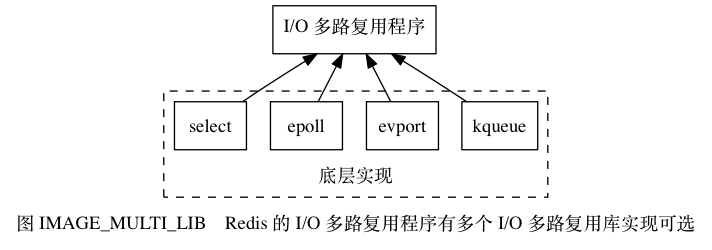
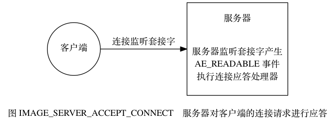
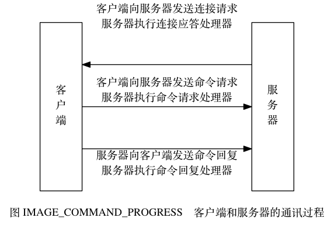
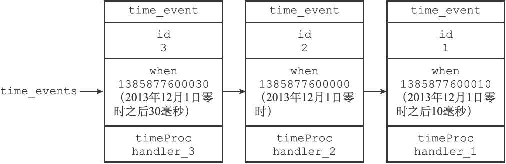
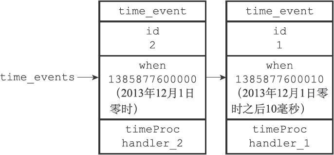

# 第12章 事件

Redis服务器是一个事件驱动程序，服务器需要处理以下两类事件：

- 文件事件（file event）：Redis服务器通过套接字与客户端（或者其他Redis服务器）进行连接，而文件事件就是服务器对套接字操作的抽象。服务器与客户端（或者其他服务器）的通信会产生相应的文件事件，而服务器则通过监听并处理这些事件来完成一系列网络通信操作。

- 时间事件（time event）：Redis服务器中的一些操作（比如serverCron函数）需要在给定的时间点执行，而时间事件就是服务器对这类定时操作的抽象。

本章将对文件事件和时间事件进行介绍，说明这两种事件在Redis服务器中的应用，它们的实现方法，以及处理这些事件的API等等。

本章最后将对服务器的事件调度方式进行介绍，说明Redis服务器是如何安排并执行文件事件和时间事件的。

## 12.1 文件事件

Redis 基于 [Reactor 模式](http://en.wikipedia.org/wiki/Reactor_pattern)开发了自己的网络事件处理器： 这个处理器被称为文件事件处理器（file event handler）：

- 文件事件处理器使用 [I/O 多路复用（multiplexing）](http://en.wikipedia.org/wiki/Multiplexing)程序来同时监听多个套接字， 并根据套接字目前执行的任务来为套接字关联不同的事件处理器。
- 当被监听的套接字准备好执行连接应答（accept）、读取（read）、写入（write）、关闭（close）等操作时， 与操作相对应的文件事件就会产生， 这时文件事件处理器就会调用套接字之前关联好的事件处理器来处理这些事件。

虽然文件事件处理器以单线程方式运行， 但通过使用 I/O 多路复用程序来监听多个套接字， 文件事件处理器既实现了高性能的网络通信模型， 又可以很好地与 Redis 服务器中其他同样以单线程方式运行的模块进行对接， 这保持了 Redis 内部单线程设计的简单性。

### 文件事件处理器的构成

图 IMAGE_CONSTRUCT_OF_FILE_EVENT_HANDLER 展示了文件事件处理器的四个组成部分， 它们分别是套接字、 I/O 多路复用程序、 文件事件分派器（dispatcher）、 以及事件处理器。


文件事件是对套接字操作的抽象， 每当一个套接字准备好执行连接应答（accept）、写入、读取、关闭等操作时， 就会产生一个文件事件。 因为一个服务器通常会连接多个套接字， 所以多个文件事件有可能会并发地出现。

I/O 多路复用程序负责监听多个套接字， 并向文件事件分派器传送那些产生了事件的套接字。

尽管多个文件事件可能会并发地出现， 但 I/O 多路复用程序总是会将所有产生事件的套接字都入队到一个队列里面， 然后通过这个队列， 以有序（sequentially）、同步（synchronously）、每次一个套接字的方式向文件事件分派器传送套接字： 当上一个套接字产生的事件被处理完毕之后（该套接字为事件所关联的事件处理器执行完毕）， I/O 多路复用程序才会继续向文件事件分派器传送下一个套接字， 如图 IMAGE_DISPATCH_EVENT_VIA_QUEUE 。


文件事件分派器接收 I/O 多路复用程序传来的套接字， 并根据套接字产生的事件的类型， 调用相应的事件处理器。

服务器会为执行不同任务的套接字关联不同的事件处理器， 这些处理器是一个个函数， 它们定义了某个事件发生时， 服务器应该执行的动作。

### I/O 多路复用程序的实现

Redis 的 I/O 多路复用程序的所有功能都是通过包装常见的 `select` 、 `epoll` 、 `evport` 和 `kqueue` 这些 I/O 多路复用函数库来实现的， 每个 I/O 多路复用函数库在 Redis 源码中都对应一个单独的文件， 比如 `ae_select.c` 、 `ae_epoll.c` 、 `ae_kqueue.c` ， 诸如此类。

因为 Redis 为每个 I/O 多路复用函数库都实现了相同的 API ， 所以 I/O 多路复用程序的底层实现是可以互换的， 如图 IMAGE_MULTI_LIB 所示。



Redis 在 I/O 多路复用程序的实现源码中用 `#include` 宏定义了相应的规则， 程序会在编译时自动选择系统中性能最高的 I/O 多路复用函数库来作为 Redis 的 I/O 多路复用程序的底层实现：

```
/* Include the best multiplexing layer supported by this system.
 * The following should be ordered by performances, descending. */
#ifdef HAVE_EVPORT
#include "ae_evport.c"
#else
    #ifdef HAVE_EPOLL
    #include "ae_epoll.c"
    #else
        #ifdef HAVE_KQUEUE
        #include "ae_kqueue.c"
        #else
        #include "ae_select.c"
        #endif
    #endif
#endif
```

### 事件的类型

I/O 多路复用程序可以监听多个套接字的 `ae.h/AE_READABLE` 事件和 `ae.h/AE_WRITABLE` 事件， 这两类事件和套接字操作之间的对应关系如下：

- 当套接字变得可读时（客户端对套接字执行 `write` 操作，或者执行 `close` 操作）， 或者有新的可应答（acceptable）套接字出现时（客户端对服务器的监听套接字执行 `connect` 操作）， 套接字产生 `AE_READABLE` 事件。
- 当套接字变得可写时（客户端对套接字执行 `read` 操作）， 套接字产生 `AE_WRITABLE` 事件。

I/O 多路复用程序允许服务器同时监听套接字的 `AE_READABLE` 事件和 `AE_WRITABLE` 事件， 如果一个套接字同时产生了这两种事件， 那么文件事件分派器会优先处理 `AE_READABLE` 事件， 等到 `AE_READABLE` 事件处理完之后， 才处理 `AE_WRITABLE` 事件。

这也就是说， 如果一个套接字又可读又可写的话， 那么服务器将先读套接字， 后写套接字。

### API

`ae.c/aeCreateFileEvent` 函数接受一个套接字描述符、 一个事件类型、 以及一个事件处理器作为参数， 将给定套接字的给定事件加入到 I/O 多路复用程序的监听范围之内， 并对事件和事件处理器进行关联。

`ae.c/aeDeleteFileEvent` 函数接受一个套接字描述符和一个监听事件类型作为参数， 让 I/O 多路复用程序取消对给定套接字的给定事件的监听， 并取消事件和事件处理器之间的关联。

`ae.c/aeGetFileEvents` 函数接受一个套接字描述符， 返回该套接字正在被监听的事件类型：

- 如果套接字没有任何事件被监听， 那么函数返回 `AE_NONE` 。
- 如果套接字的读事件正在被监听， 那么函数返回 `AE_READABLE` 。
- 如果套接字的写事件正在被监听， 那么函数返回 `AE_WRITABLE` 。
- 如果套接字的读事件和写事件正在被监听， 那么函数返回 `AE_READABLE | AE_WRITABLE` 。

`ae.c/aeWait` 函数接受一个套接字描述符、一个事件类型和一个毫秒数为参数， 在给定的时间内阻塞并等待套接字的给定类型事件产生， 当事件成功产生， 或者等待超时之后， 函数返回。

`ae.c/aeApiPoll` 函数接受一个 `sys/time.h/struct timeval` 结构为参数， 并在指定的时间內， 阻塞并等待所有被 `aeCreateFileEvent` 函数设置为监听状态的套接字产生文件事件， 当有至少一个事件产生， 或者等待超时后， 函数返回。

`ae.c/aeProcessEvents` 函数是文件事件分派器， 它先调用 `aeApiPoll` 函数来等待事件产生， 然后遍历所有已产生的事件， 并调用相应的事件处理器来处理这些事件。

`ae.c/aeGetApiName` 函数返回 I/O 多路复用程序底层所使用的 I/O 多路复用函数库的名称： 返回 `"epoll"` 表示底层为 `epoll` 函数库， 返回 `"select"` 表示底层为 `select` 函数库， 诸如此类。

### 文件事件的处理器

Redis 为文件事件编写了多个处理器， 这些事件处理器分别用于实现不同的网络通讯需求， 比如说：

- 为了对连接服务器的各个客户端进行应答， 服务器要为监听套接字关联连接应答处理器。
- 为了接收客户端传来的命令请求， 服务器要为客户端套接字关联命令请求处理器。
- 为了向客户端返回命令的执行结果， 服务器要为客户端套接字关联命令回复处理器。
- 当主服务器和从服务器进行复制操作时， 主从服务器都需要关联特别为复制功能编写的复制处理器。
- 等等。

在这些事件处理器里面， 服务器最常用的要数与客户端进行通信的连接应答处理器、 命令请求处理器和命令回复处理器。

#### 连接应答处理器

`networking.c/acceptTcpHandler` 函数是 Redis 的连接应答处理器， 这个处理器用于对连接服务器监听套接字的客户端进行应答， 具体实现为 `sys/socket.h/accept` 函数的包装。

当 Redis 服务器进行初始化的时候， 程序会将这个连接应答处理器和服务器监听套接字的 `AE_READABLE` 事件关联起来， 当有客户端用 `sys/socket.h/connect` 函数连接服务器监听套接字的时候， 套接字就会产生 `AE_READABLE` 事件， 引发连接应答处理器执行， 并执行相应的套接字应答操作， 如图 IMAGE_SERVER_ACCEPT_CONNECT 所示。



#### 命令请求处理器

`networking.c/readQueryFromClient` 函数是 Redis 的命令请求处理器， 这个处理器负责从套接字中读入客户端发送的命令请求内容， 具体实现为 `unistd.h/read` 函数的包装。

当一个客户端通过连接应答处理器成功连接到服务器之后， 服务器会将客户端套接字的 `AE_READABLE` 事件和命令请求处理器关联起来， 当客户端向服务器发送命令请求的时候， 套接字就会产生 `AE_READABLE` 事件， 引发命令请求处理器执行， 并执行相应的套接字读入操作， 如图 IMAGE_SERVER_RECIVE_COMMAND_REQUEST 所示。


在客户端连接服务器的整个过程中， 服务器都会一直为客户端套接字的 `AE_READABLE` 事件关联命令请求处理器。

#### 命令回复处理器

`networking.c/sendReplyToClient` 函数是 Redis 的命令回复处理器， 这个处理器负责将服务器执行命令后得到的命令回复通过套接字返回给客户端， 具体实现为 `unistd.h/write` 函数的包装。

当服务器有命令回复需要传送给客户端的时候， 服务器会将客户端套接字的 `AE_WRITABLE` 事件和命令回复处理器关联起来， 当客户端准备好接收服务器传回的命令回复时， 就会产生 `AE_WRITABLE` 事件， 引发命令回复处理器执行， 并执行相应的套接字写入操作， 如图 IMAGE_SERVER_SEND_REPLY 所示。


当命令回复发送完毕之后， 服务器就会解除命令回复处理器与客户端套接字的 `AE_WRITABLE` 事件之间的关联。

#### 一次完整的客户端与服务器连接事件示例

让我们来追踪一次 Redis 客户端与服务器进行连接并发送命令的整个过程， 看看在过程中会产生什么事件， 而这些事件又是如何被处理的。

假设一个 Redis 服务器正在运作， 那么这个服务器的监听套接字的 `AE_READABLE` 事件应该正处于监听状态之下， 而该事件所对应的处理器为连接应答处理器。

如果这时有一个 Redis 客户端向服务器发起连接， 那么监听套接字将产生 `AE_READABLE` 事件， 触发连接应答处理器执行： 处理器会对客户端的连接请求进行应答， 然后创建客户端套接字， 以及客户端状态， 并将客户端套接字的 `AE_READABLE` 事件与命令请求处理器进行关联， 使得客户端可以向主服务器发送命令请求。

之后， 假设客户端向主服务器发送一个命令请求， 那么客户端套接字将产生 `AE_READABLE` 事件， 引发命令请求处理器执行， 处理器读取客户端的命令内容， 然后传给相关程序去执行。

执行命令将产生相应的命令回复， 为了将这些命令回复传送回客户端， 服务器会将客户端套接字的 `AE_WRITABLE` 事件与命令回复处理器进行关联： 当客户端尝试读取命令回复的时候， 客户端套接字将产生 `AE_WRITABLE` 事件， 触发命令回复处理器执行， 当命令回复处理器将命令回复全部写入到套接字之后， 服务器就会解除客户端套接字的 `AE_WRITABLE` 事件与命令回复处理器之间的关联。

图 IMAGE_COMMAND_PROGRESS 总结了上面描述的整个通讯过程， 以及通讯时用到的事件处理器。



## 12.2 时间事件

Redis的时间事件分为以下两类：

- 定时事件：让一段程序在指定的时间之后执行一次。比如说，让程序X在当前时间的30毫秒之后执行一次。

- 周期性事件：让一段程序每隔指定时间就执行一次。比如说，让程序Y每隔30毫秒就执行一次。

一个时间事件主要由以下三个属性组成：

- id：服务器为时间事件创建的全局唯一ID（标识号）。ID号按从小到大的顺序递增，新事件的ID号比旧事件的ID号要大。

- when：毫秒精度的UNIX时间戳，记录了时间事件的到达（arrive）时间。

- timeProc：时间事件处理器，一个函数。当时间事件到达时，服务器就会调用相应的处理器来处理事件。

一个时间事件是定时事件还是周期性事件取决于时间事件处理器的返回值：

- 如果事件处理器返回ae.h/AE_NOMORE，那么这个事件为定时事件：该事件在达到一次之后就会被删除，之后不再到达。

- 如果事件处理器返回一个非AE_NOMORE的整数值，那么这个事件为周期性时间：当一个时间事件到达之后，服务器会根据事件处理器返回的值，对时间事件的when属性进行更新，让这个事件在一段时间之后再次到达，并以这种方式一直更新并运行下去。比如说，如果一个时间事件的处理器返回整数值30，那么服务器应该对这个时间事件进行更新，让这个事件在30毫秒之后再次到达。

目前版本的Redis只使用周期性事件，而没有使用定时事件。

### 12.2.1　实现

服务器将所有时间事件都放在一个无序链表中，每当时间事件执行器运行时，它就遍历整个链表，查找所有已到达的时间事件，并调用相应的事件处理器。

图12-8展示了一个保存时间事件的链表的例子，链表中包含了三个不同的时间事件：因为新的时间事件总是插入到链表的表头，所以三个时间事件分别按ID逆序排序，表头事件的ID为3，中间事件的ID为2，表尾事件的ID为1。



图12-8　用链表连接起来的三个时间事件

注意，我们说保存时间事件的链表为无序链表，指的不是链表不按ID排序，而是说，该链表不按when属性的大小排序。正因为链表没有按when属性进行排序，所以当时间事件执行器运行的时候，它必须遍历链表中的所有时间事件，这样才能确保服务器中所有已到达的时间事件都会被处理。

> **无序链表并不影响时间事件处理器的性能**
>
> 在目前版本中，正常模式下的Redis服务器只使用serverCron一个时间事件，而在benchmark模式下，服务器也只使用两个时间事件。在这种情况下，服务器几乎是将无序链表退化成一个指针来使用，所以使用无序链表来保存时间事件，并不影响事件执行的性能。

### 12.2.2　API

ae.c/aeCreateTimeEvent函数接受一个毫秒数milliseconds和一个时间事件处理器proc作为参数，将一个新的时间事件添加到服务器，这个新的时间事件将在当前时间的milliseconds毫秒之后到达，而事件的处理器为proc。

例如，如果服务器当前所保存的时间事件如图12-9所示。



图12-9　用链表连接起来的两个时间事件

那么当程序以50毫秒和handler_3处理器为参数，在时间1385877599980（2013年12月1日零时前20毫秒）时调用aeCreateTimeEvent函数，服务器将创建ID为3的时间事件，这时服务器所保存的时间事件将如图12-8所示。

ae.c/aeDeleteFileEvent函数接受一个时间事件ID作为参数，然后从服务器中删除该ID所对应的时间事件。

举个例子，如果服务器当前保存的时间事件如图12-8所示，那么当程序调用aeDeleteFileEvent（3）之后，服务器保存的时间事件将变成图12-9所示的样子。

ae.c/aeSearchNearestTimer函数返回到达时间距离当前时间最接近的那个时间事件。

举个例子，如果当前时间为1385877599980（2013年12月1日零时前20毫秒），而服务器当前保存的时间事件如图12-8所示，那么调用aeSearchNearestTimer函数将返回ID为2的事件。

ae.c/processTimeEvents函数是时间事件的执行器，这个函数会遍历所有已到达的时间事件，并调用这些事件的处理器。已到达指的是，时间事件的when属性记录的UNIX时间戳等于或小于当前时间的UNIX时间戳。

举个例子，如果服务器保存的时间事件如图12-8所示，并且当前时间为1385877600010（2013年12月1日零时之后10毫秒），那么processTimeEvents函数将处理图中ID为2和1的时间事件，因为这两个事件的到达时间都大于等于1385877600010。

processTimeEvents函数的定义可以用以下伪代码来描述：

```c
def processTimeEvents():
    # 遍历服务器中的所有时间事件
    for time_event in all_time_event():
        # 检查事件是否已经到达
        if time_event.when <= unix_ts_now():
            # 事件已到达
            # 执行事件处理器，并获取返回值
            retval = time_event.timeProc()
            # 如果这是一个定时事件
            if retval == AE_NOMORE:
                # 那么将该事件从服务器中删除
                delete_time_event_from_server(time_event)
        # 如果这是一个周期性事件
        else:
            # 那么按照事件处理器的返回值更新时间事件的 when 属性
            # 让这个事件在指定的时间之后再次到达
            update_when(time_event, retval)
```

### 12.2.3　时间事件应用实例：serverCron函数

持续运行的Redis服务器需要定期对自身的资源和状态进行检查和调整，从而确保服务器可以长期、稳定地运行，这些定期操作由redis.c/serverCron函数负责执行，它的主要工作包括：

- 更新服务器的各类统计信息，比如时间、内存占用、数据库占用情况等。

- 清理数据库中的过期键值对。

- 关闭和清理连接失效的客户端。

- 尝试进行AOF或RDB持久化操作。

- 如果服务器是主服务器，那么对从服务器进行定期同步。

- 如果处于集群模式，对集群进行定期同步和连接测试。

Redis服务器以周期性事件的方式来运行serverCron函数，在服务器运行期间，每隔一段时间，serverCron就会执行一次，直到服务器关闭为止。

在Redis2.6版本，服务器默认规定serverCron每秒运行10次，平均每间隔100毫秒运行一次。

从Redis2.8开始，用户可以通过修改hz选项来调整serverCron的每秒执行次数，具体信息请参考示例配置文件redis.conf关于hz选项的说明。

## 12.3 事件的调度与执行
## 12.4 重点回顾

- Redis 服务器是一个事件驱动程序， 服务器处理的事件分为时间事件和文件事件两类。
- 文件事件处理器是基于 Reactor 模式实现的网络通讯程序。
- 文件事件是对套接字操作的抽象： 每次套接字变得可应答（acceptable）、可写（writable）或者可读（readable）时， 相应的文件事件就会产生。
- 文件事件分为 `AE_READABLE` 事件（读事件）和 `AE_WRITABLE` 事件（写事件）两类。
- 时间事件分为定时事件和周期性事件： 定时事件只在指定的时间达到一次， 而周期性事件则每隔一段时间到达一次。
- 服务器在一般情况下只执行 `serverCron` 函数一个时间事件， 并且这个事件是周期性事件。
- 文件事件和时间事件之间是合作关系， 服务器会轮流处理这两种事件， 并且处理事件的过程中也不会进行抢占。
- 时间事件的实际处理时间通常会比设定的到达时间晚一些。

## 12.5 参考资料

《Pattern-Oriented Software Architecture, Volume 4: A Pattern Language for Distributed Computing》第 11 章中的《Reactor》一节介绍了 Reactor 模型的定义、实现方法和作用。

《Linux System Programming, 2e》第 2 章的《Multiplexed I/O》小节和第 4 章的《Event Poll》小节， 以及《Unix 环境高级编程，第 2 版》的 14.5 节， 都对 I/O 多路复用及其相关函数进行了介绍。