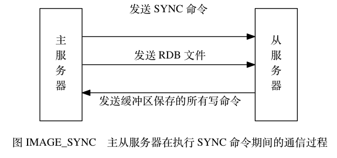
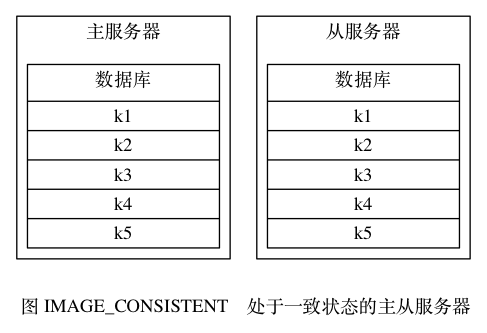
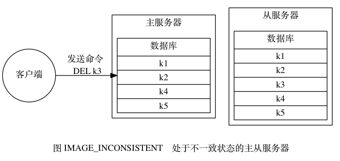
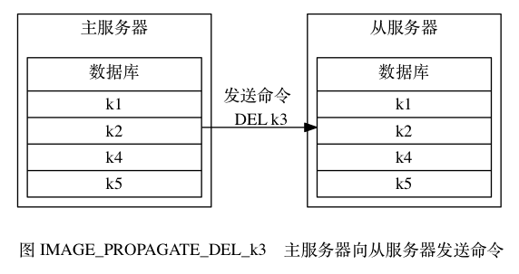

# 第15章 复制
## 15.1 旧版复制功能的实现

Redis 的复制功能分为同步（sync）和命令传播（command propagate）两个操作：

- 其中， 同步操作用于将从服务器的数据库状态更新至主服务器当前所处的数据库状态。
- 而命令传播操作则用于在主服务器的数据库状态被修改， 导致主从服务器的数据库状态出现不一致时， 让主从服务器的数据库重新回到一致状态。

本节接下来将对同步和命令传播两个操作进行详细的介绍。

### 同步

当客户端向从服务器发送 SLAVEOF 命令， 要求从服务器复制主服务器时， 从服务器首先需要执行同步操作， 也即是， 将从服务器的数据库状态更新至主服务器当前所处的数据库状态。

从服务器对主服务器的同步操作需要通过向主服务器发送 SYNC 命令来完成， 以下是 SYNC 命令的执行步骤：

1. 从服务器向主服务器发送 SYNC 命令。
2. 收到 SYNC 命令的主服务器执行 BGSAVE 命令， 在后台生成一个 RDB 文件， 并使用一个缓冲区记录从现在开始执行的所有写命令。
3. 当主服务器的 BGSAVE 命令执行完毕时， 主服务器会将 BGSAVE 命令生成的 RDB 文件发送给从服务器， 从服务器接收并载入这个 RDB 文件， 将自己的数据库状态更新至主服务器执行 BGSAVE 命令时的数据库状态。
4. 主服务器将记录在缓冲区里面的所有写命令发送给从服务器， 从服务器执行这些写命令， 将自己的数据库状态更新至主服务器数据库当前所处的状态。

图 IMAGE_SYNC 展示了 SYNC 命令执行期间， 主从服务器的通信过程。

表 TABLE_SYNC_EXAMPLE 展示了一个主从服务器进行同步的例子。

| 时间 | 主服务器                                                     | 从服务器                                                     |
| :--- | :----------------------------------------------------------- | :----------------------------------------------------------- |
| T0   | 服务器启动。                                                 | 服务器启动。                                                 |
| T1   | 执行 `SET k1 v1` 。                                          |                                                              |
| T2   | 执行 `SET k2 v2` 。                                          |                                                              |
| T3   | 执行 `SET k3 v3` 。                                          |                                                              |
| T4   |                                                              | 向主服务器发送 SYNC 命令。                                   |
| T5   | 接收到从服务器发来的 SYNC 命令， 执行 BGSAVE 命令， 创建包含键 `k1` 、 `k2` 、 `k3` 的 RDB 文件， 并使用缓冲区记录接下来执行的所有写命令。 |                                                              |
| T6   | 执行 `SET k4 v4` ， 并将这个命令记录到缓冲区里面。           |                                                              |
| T7   | 执行 `SET k5 v5` ， 并将这个命令记录到缓冲区里面。           |                                                              |
| T8   | BGSAVE 命令执行完毕， 向从服务器发送 RDB 文件。              |                                                              |
| T9   |                                                              | 接收并载入主服务器发来的 RDB 文件 ， 获得 `k1` 、 `k2` 、 `k3` 三个键。 |
| T10  | 向从服务器发送缓冲区中保存的写命令 `SET k4 v4` 和 `SET k5 v5` 。 |                                                              |
| T11  |                                                              | 接收并执行主服务器发来的两个 SET 命令， 得到 `k4` 和 `k5` 两个键。 |
| T12  | 同步完成， 现在主从服务器两者的数据库都包含了键 `k1` 、 `k2` 、 `k3` 、 `k4` 和 `k5` 。 | 同步完成， 现在主从服务器两者的数据库都包含了键 `k1` 、 `k2` 、 `k3` 、 `k4` 和 `k5` 。 |

### 命令传播

在同步操作执行完毕之后， 主从服务器两者的数据库将达到一致状态， 但这种一致并不是一成不变的 —— 每当主服务器执行客户端发送的写命令时， 主服务器的数据库就有可能会被修改， 并导致主从服务器状态不再一致。

举个例子， 假设一个主服务器和一个从服务器刚刚完成同步操作， 它们的数据库都保存了相同的五个键 `k1` 至 `k5` ， 如图 IMAGE_CONSISTENT 所示。

如果这时， 客户端向主服务器发送命令 `DEL k3` ， 那么主服务器在执行完这个 DEL 命令之后， 主从服务器的数据库将出现不一致： 主服务器的数据库已经不再包含键 `k3` ， 但这个键却仍然包含在从服务器的数据库里面， 如图 IMAGE_INCONSISTENT 所示。

为了让主从服务器再次回到一致状态， 主服务器需要对从服务器执行命令传播操作： 主服务器会将自己执行的写命令 —— 也即是造成主从服务器不一致的那条写命令 —— 发送给从服务器执行， 当从服务器执行了相同的写命令之后， 主从服务器将再次回到一致状态。

在上面的例子中， 主服务器因为执行了命令 `DEL k3` 而导致主从服务器不一致， 所以主服务器将向从服务器发送相同的命令 `DEL k3` ： 当从服务器执行完这个命令之后， 主从服务器将再次回到一致状态 —— 现在主从服务器两者的数据库都不再包含键 `k3` 了， 如图 IMAGE_PROPAGATE_DEL_k3 所示。

## 15.2 旧版复制功能的缺陷
## 15.3 新版复制功能的实现
## 15.4 部分重同步的实现
## 15.5 PSYNC 命令的实现
## 15.6 复制的实现
## 15.7 心跳检测
## 15.8 重点回顾

- Redis 2.8 以前的复制功能不能高效地处理断线后重复制情况， 但 Redis 2.8 新添加的部分重同步功能可以解决这个问题。
- 部分重同步通过复制偏移量、复制积压缓冲区、服务器运行 ID 三个部分来实现。
- 在复制操作刚开始的时候， 从服务器会成为主服务器的客户端， 并通过向主服务器发送命令请求来执行复制步骤， 而在复制操作的后期， 主从服务器会互相成为对方的客户端。
- 主服务器通过向从服务器传播命令来更新从服务器的状态， 保持主从服务器一致， 而从服务器则通过向主服务器发送命令来进行心跳检测， 以及命令丢失检测。