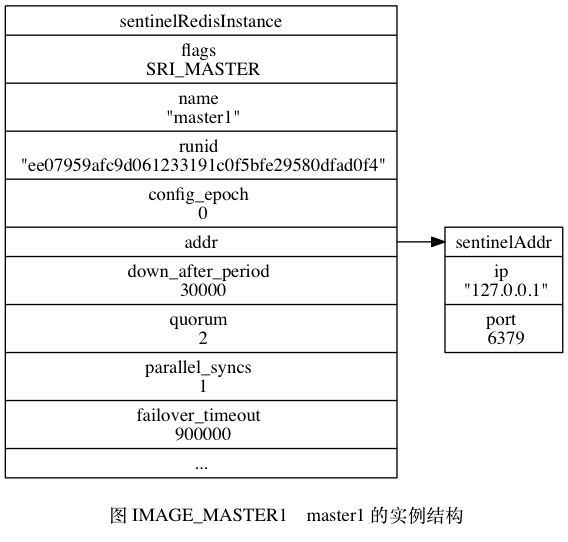
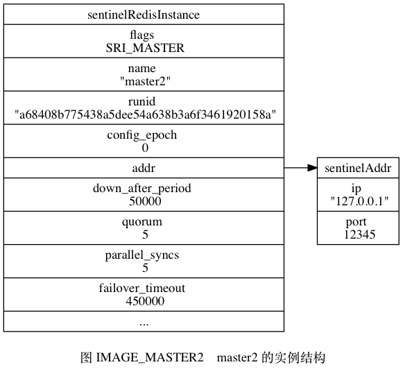
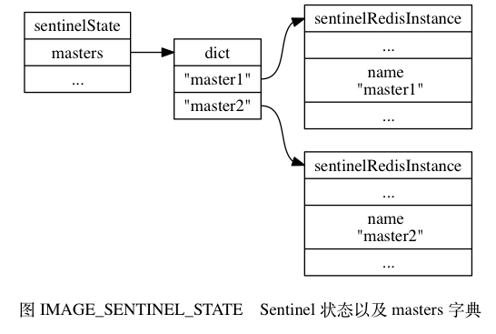
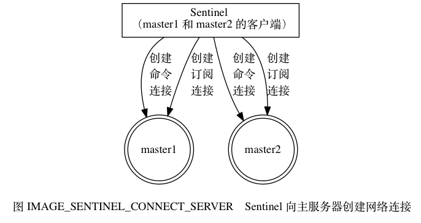

# 第16章 Sentinel
## 16.1 启动并初始化Sentinel

启动一个 Sentinel 可以使用命令：

```
$ redis-sentinel /path/to/your/sentinel.conf
```

或者命令：

```
$ redis-server /path/to/your/sentinel.conf --sentinel
```

这两个命令的效果完全相同。

当一个 Sentinel 启动时， 它需要执行以下步骤：

1. 初始化服务器。
2. 将普通 Redis 服务器使用的代码替换成 Sentinel 专用代码。
3. 初始化 Sentinel 状态。
4. 根据给定的配置文件， 初始化 Sentinel 的监视主服务器列表。
5. 创建连向主服务器的网络连接。

本节接下来的内容将分别对这些步骤进行介绍。

### 初始化服务器

首先， 因为 Sentinel 本质上只是一个运行在特殊模式下的 Redis 服务器， 所以启动 Sentinel 的第一步， 就是初始化一个普通的 Redis 服务器， 具体的步骤和《服务器》一章介绍的类似。

不过， 因为 Sentinel 执行的工作和普通 Redis 服务器执行的工作不同， 所以 Sentinel 的初始化过程和普通 Redis 服务器的初始化过程并不完全相同。

比如说， 普通服务器在初始化时会通过载入 RDB 文件或者 AOF 文件来还原数据库状态， 但是因为 Sentinel 并不使用数据库， 所以初始化 Sentinel 时就不会载入 RDB 文件或者 AOF 文件。

表 TABLE_SENTINEL_FUNCTION 展示了 Redis 服务器在 Sentinel 模式下运行时， 服务器各个主要功能的使用情况。

------

表 TABLE_SENTINEL_FUNCTION Sentinel 模式下 Redis 服务器主要功能的使用情况

| 功能                                                     | 使用情况                                                     |
| :------------------------------------------------------- | :----------------------------------------------------------- |
| 数据库和键值对方面的命令， 比如 SET 、 DEL 、 FLUSHDB 。 | 不使用。                                                     |
| 事务命令， 比如 MULTI 和 WATCH 。                        | 不使用。                                                     |
| 脚本命令，比如 EVAL 。                                   | 不使用。                                                     |
| RDB 持久化命令， 比如 SAVE 和 BGSAVE 。                  | 不使用。                                                     |
| AOF 持久化命令， 比如 BGREWRITEAOF 。                    | 不使用。                                                     |
| 复制命令，比如 SLAVEOF 。                                | Sentinel 内部可以使用，但客户端不可以使用。                  |
| 发布与订阅命令， 比如 PUBLISH 和 SUBSCRIBE 。            | SUBSCRIBE 、 PSUBSCRIBE 、 UNSUBSCRIBE PUNSUBSCRIBE 四个命令在 Sentinel 内部和客户端都可以使用， 但 PUBLISH 命令只能在 Sentinel 内部使用。 |
| 文件事件处理器（负责发送命令请求、处理命令回复）。       | Sentinel 内部使用， 但关联的文件事件处理器和普通 Redis 服务器不同。 |
| 时间事件处理器（负责执行 `serverCron` 函数）。           | Sentinel 内部使用， 时间事件的处理器仍然是 `serverCron` 函数， `serverCron` 函数会调用 `sentinel.c/sentinelTimer` 函数， 后者包含了 Sentinel 要执行的所有操作。 |

------

### 使用 Sentinel 专用代码

启动 Sentinel 的第二个步骤就是将一部分普通 Redis 服务器使用的代码替换成 Sentinel 专用代码。

比如说， 普通 Redis 服务器使用 `redis.h/REDIS_SERVERPORT` 常量的值作为服务器端口：

```
#define REDIS_SERVERPORT 6379
```

而 Sentinel 则使用 `sentinel.c/REDIS_SENTINEL_PORT` 常量的值作为服务器端口：

```
#define REDIS_SENTINEL_PORT 26379
```

除此之外， 普通 Redis 服务器使用 `redis.c/redisCommandTable` 作为服务器的命令表：

```
struct redisCommand redisCommandTable[] = {
    {"get",getCommand,2,"r",0,NULL,1,1,1,0,0},
    {"set",setCommand,-3,"wm",0,noPreloadGetKeys,1,1,1,0,0},
    {"setnx",setnxCommand,3,"wm",0,noPreloadGetKeys,1,1,1,0,0},
    // ...
    {"script",scriptCommand,-2,"ras",0,NULL,0,0,0,0,0},
    {"time",timeCommand,1,"rR",0,NULL,0,0,0,0,0},
    {"bitop",bitopCommand,-4,"wm",0,NULL,2,-1,1,0,0},
    {"bitcount",bitcountCommand,-2,"r",0,NULL,1,1,1,0,0}
}
```

而 Sentinel 则使用 `sentinel.c/sentinelcmds` 作为服务器的命令表， 并且其中的 INFO 命令会使用 Sentinel 模式下的专用实现 `sentinel.c/sentinelInfoCommand` 函数， 而不是普通 Redis 服务器使用的实现 `redis.c/infoCommand` 函数：

```
struct redisCommand sentinelcmds[] = {
    {"ping",pingCommand,1,"",0,NULL,0,0,0,0,0},
    {"sentinel",sentinelCommand,-2,"",0,NULL,0,0,0,0,0},
    {"subscribe",subscribeCommand,-2,"",0,NULL,0,0,0,0,0},
    {"unsubscribe",unsubscribeCommand,-1,"",0,NULL,0,0,0,0,0},
    {"psubscribe",psubscribeCommand,-2,"",0,NULL,0,0,0,0,0},
    {"punsubscribe",punsubscribeCommand,-1,"",0,NULL,0,0,0,0,0},
    {"info",sentinelInfoCommand,-1,"",0,NULL,0,0,0,0,0}
};
```

`sentinelcmds` 命令表也解释了为什么在 Sentinel 模式下， Redis 服务器不能执行诸如 SET 、 DBSIZE 、 EVAL 等等这些命令 —— 因为服务器根本没有在命令表中载入这些命令： PING 、 SENTINEL 、 INFO 、 SUBSCRIBE 、 UNSUBSCRIBE 、 PSUBSCRIBE 和 PUNSUBSCRIBE 这七个命令就是客户端可以对 Sentinel 执行的全部命令了。

### 初始化 Sentinel 状态

在应用了 Sentinel 的专用代码之后， 接下来， 服务器会初始化一个 `sentinel.c/sentinelState` 结构（后面简称“Sentinel 状态”）， 这个结构保存了服务器中所有和 Sentinel 功能有关的状态 （服务器的一般状态仍然由 `redis.h/redisServer` 结构保存）：

```
struct sentinelState {

    // 当前纪元，用于实现故障转移
    uint64_t current_epoch;

    // 保存了所有被这个 sentinel 监视的主服务器
    // 字典的键是主服务器的名字
    // 字典的值则是一个指向 sentinelRedisInstance 结构的指针
    dict *masters;

    // 是否进入了 TILT 模式？
    int tilt;

    // 目前正在执行的脚本的数量
    int running_scripts;

    // 进入 TILT 模式的时间
    mstime_t tilt_start_time;

    // 最后一次执行时间处理器的时间
    mstime_t previous_time;

    // 一个 FIFO 队列，包含了所有需要执行的用户脚本
    list *scripts_queue;

} sentinel;
```

### 初始化 Sentinel 状态的 `masters` 属性

Sentinel 状态中的 `masters` 字典记录了所有被 Sentinel 监视的主服务器的相关信息， 其中：

- 字典的键是被监视主服务器的名字。
- 而字典的值则是被监视主服务器对应的 `sentinel.c/sentinelRedisInstance` 结构。

每个 `sentinelRedisInstance` 结构（后面简称“实例结构”）代表一个被 Sentinel 监视的 Redis 服务器实例（instance）， 这个实例可以是主服务器、从服务器、或者另外一个 Sentinel 。

实例结构包含的属性非常多， 以下代码展示了实例结构在表示主服务器时使用的其中一部分属性， 本章接下来将逐步对实例结构中的各个属性进行介绍：

```
typedef struct sentinelRedisInstance {

    // 标识值，记录了实例的类型，以及该实例的当前状态
    int flags;

    // 实例的名字
    // 主服务器的名字由用户在配置文件中设置
    // 从服务器以及 Sentinel 的名字由 Sentinel 自动设置
    // 格式为 ip:port ，例如 "127.0.0.1:26379"
    char *name;

    // 实例的运行 ID
    char *runid;

    // 配置纪元，用于实现故障转移
    uint64_t config_epoch;

    // 实例的地址
    sentinelAddr *addr;

    // SENTINEL down-after-milliseconds 选项设定的值
    // 实例无响应多少毫秒之后才会被判断为主观下线（subjectively down）
    mstime_t down_after_period;

    // SENTINEL monitor <master-name> <IP> <port> <quorum> 选项中的 quorum 参数
    // 判断这个实例为客观下线（objectively down）所需的支持投票数量
    int quorum;

    // SENTINEL parallel-syncs <master-name> <number> 选项的值
    // 在执行故障转移操作时，可以同时对新的主服务器进行同步的从服务器数量
    int parallel_syncs;

    // SENTINEL failover-timeout <master-name> <ms> 选项的值
    // 刷新故障迁移状态的最大时限
    mstime_t failover_timeout;

    // ...

} sentinelRedisInstance;
```

`sentinelRedisInstance.addr` 属性是一个指向 `sentinel.c/sentinelAddr` 结构的指针， 这个结构保存着实例的 IP 地址和端口号：

```
typedef struct sentinelAddr {

    char *ip;

    int port;

} sentinelAddr;
```

对 Sentinel 状态的初始化将引发对 `masters` 字典的初始化， 而 `masters` 字典的初始化是根据被载入的 Sentinel 配置文件来进行的。

举个例子， 如果用户在启动 Sentinel 时， 指定了包含以下内容的配置文件：

```
#####################
# master1 configure #
#####################

sentinel monitor master1 127.0.0.1 6379 2

sentinel down-after-milliseconds master1 30000

sentinel parallel-syncs master1 1

sentinel failover-timeout master1 900000

#####################
# master2 configure #
#####################

sentinel monitor master2 127.0.0.1 12345 5

sentinel down-after-milliseconds master2 50000

sentinel parallel-syncs master2 5

sentinel failover-timeout master2 450000
```

那么 Sentinel 将为主服务器 `master1` 创建如图 IMAGE_MASTER1 所示的实例结构， 并为主服务器 `master2` 创建如图 IMAGE_MASTER2 所示的实例结构， 而这两个实例结构又会被保存到 Sentinel 状态的 `masters` 字典中， 如图 IMAGE_SENTINEL_STATE 所示。







### 创建连向主服务器的网络连接

初始化 Sentinel 的最后一步是创建连向被监视主服务器的网络连接： Sentinel 将成为主服务器的客户端， 它可以向主服务器发送命令， 并从命令回复中获取相关的信息。

对于每个被 Sentinel 监视的主服务器来说， Sentinel 会创建两个连向主服务器的异步网络连接：

- 一个是命令连接， 这个连接专门用于向主服务器发送命令， 并接收命令回复。
- 另一个是订阅连接， 这个连接专门用于订阅主服务器的 `__sentinel__:hello` 频道。

为什么有两个连接？

在 Redis 目前的发布与订阅功能中， 被发送的信息都不会保存在 Redis 服务器里面， 如果在信息发送时， 想要接收信息的客户端不在线或者断线， 那么这个客户端就会丢失这条信息。

因此， 为了不丢失 `__sentinel__:hello` 频道的任何信息， Sentinel 必须专门用一个订阅连接来接收该频道的信息。

而另一方面， 除了订阅频道之外， Sentinel 还又必须向主服务器发送命令， 以此来与主服务器进行通讯， 所以 Sentinel 还必须向主服务器创建命令连接。

并且因为 Sentinel 需要与多个实例创建多个网络连接， 所以 Sentinel 使用的是异步连接。

图 IMAGE_SENTINEL_CONNECT_SERVER 展示了一个 Sentinel 向被它监视的两个主服务器 `master1` 和 `master2` 创建命令连接和订阅连接的例子。



接下来的一节将介绍 Sentinel 是如何通过命令连接和订阅连接来与被监视主服务器进行通讯的。

## 16.2 获取主服务器信息
## 16.3 获取从服务器信息
## 16.4 向主服务器和从服务器发送信息
## 16.5 接收来自主服务器和从服务器的频道信息
## 16.6 检测主观下线状态
## 16.7 检查客观下线状态
## 16.8 选举领头Sentinel
## 16.9 故障转移
## 16.10 重点回顾

- Sentinel 只是一个运行在特殊模式下的 Redis 服务器， 它使用了和普通模式不同的命令表， 所以 Sentinel 模式能够使用的命令和普通 Redis 服务器能够使用的命令不同。
- Sentinel 会读入用户指定的配置文件， 为每个要被监视的主服务器创建相应的实例结构， 并创建连向主服务器的命令连接和订阅连接， 其中命令连接用于向主服务器发送命令请求， 而订阅连接则用于接收指定频道的消息。
- Sentinel 通过向主服务器发送 INFO 命令来获得主服务器属下所有从服务器的地址信息， 并为这些从服务器创建相应的实例结构， 以及连向这些从服务器的命令连接和订阅连接。
- 在一般情况下， Sentinel 以每十秒一次的频率向被监视的主服务器和从服务器发送 INFO 命令， 当主服务器处于下线状态， 或者 Sentinel 正在对主服务器进行故障转移操作时， Sentinel 向从服务器发送 INFO 命令的频率会改为每秒一次。
- 对于监视同一个主服务器和从服务器的多个 Sentinel 来说， 它们会以每两秒一次的频率， 通过向被监视服务器的 `__sentinel__:hello` 频道发送消息来向其他 Sentinel 宣告自己的存在。
- 每个 Sentinel 也会从 `__sentinel__:hello` 频道中接收其他 Sentinel 发来的信息， 并根据这些信息为其他 Sentinel 创建相应的实例结构， 以及命令连接。
- Sentinel 只会与主服务器和从服务器创建命令连接和订阅连接， Sentinel 与 Sentinel 之间则只创建命令连接。
- Sentinel 以每秒一次的频率向实例（包括主服务器、从服务器、其他 Sentinel）发送 PING 命令， 并根据实例对 PING 命令的回复来判断实例是否在线： 当一个实例在指定的时长中连续向 Sentinel 发送无效回复时， Sentinel 会将这个实例判断为主观下线。
- 当 Sentinel 将一个主服务器判断为主观下线时， 它会向同样监视这个主服务器的其他 Sentinel 进行询问， 看它们是否同意这个主服务器已经进入主观下线状态。
- 当 Sentinel 收集到足够多的主观下线投票之后， 它会将主服务器判断为客观下线， 并发起一次针对主服务器的故障转移操作。

## 16.11 参考资料

Sentinel 系统选举领头 Sentinel 的方法是对 Raft 算法的领头选举方法的实现， 关于这一方法的详细信息可以观看 Raft 算法的作者录制的《Raft 教程》视频： http://v.youku.com/v_show/id_XNjQxOTk5MTk2.html ， 或者 Raft 算法的论文。