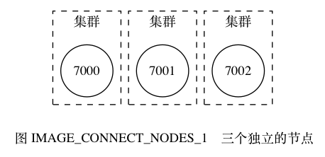
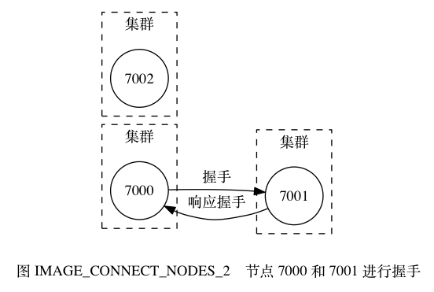
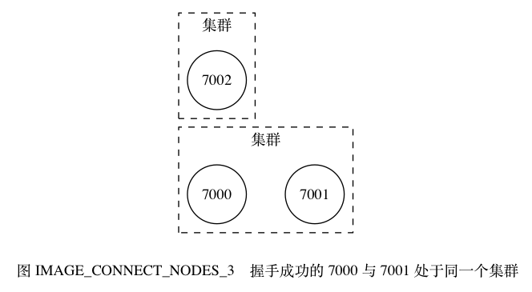
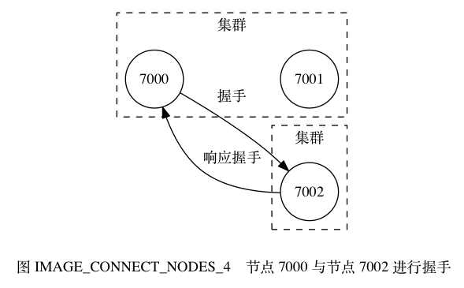
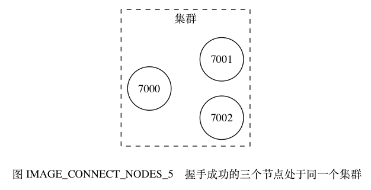
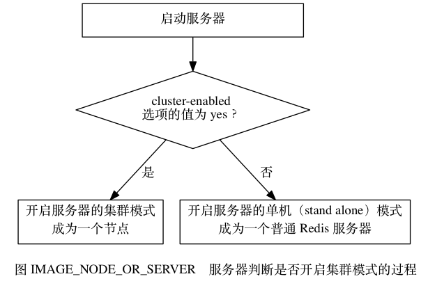
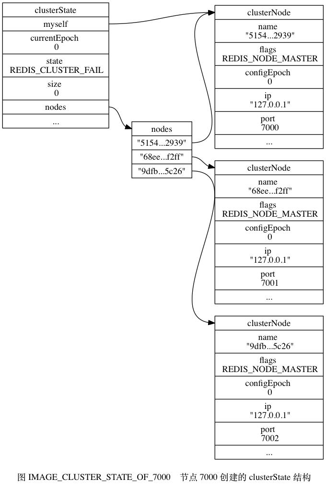
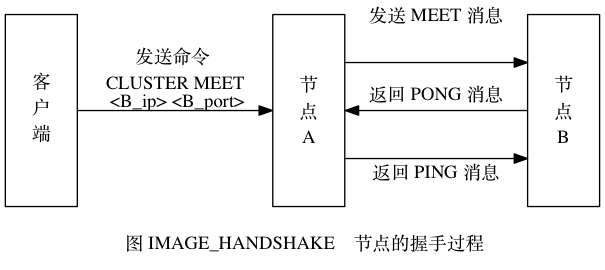

# 第17章 集群
## 17.1 节点

一个 Redis 集群通常由多个节点（node）组成， 在刚开始的时候， 每个节点都是相互独立的， 它们都处于一个只包含自己的集群当中， 要组建一个真正可工作的集群， 我们必须将各个独立的节点连接起来， 构成一个包含多个节点的集群。

连接各个节点的工作可以使用 CLUSTER MEET 命令来完成， 该命令的格式如下：

```
CLUSTER MEET <ip> <port>
```

向一个节点 `node` 发送 CLUSTER MEET 命令， 可以让 `node` 节点与 `ip` 和 `port` 所指定的节点进行握手（handshake）， 当握手成功时， `node` 节点就会将 `ip` 和 `port` 所指定的节点添加到 `node` 节点当前所在的集群中。

举个例子， 假设现在有三个独立的节点 `127.0.0.1:7000` 、 `127.0.0.1:7001` 、 `127.0.0.1:7002` （下文省略 IP 地址，直接使用端口号来区分各个节点）， 我们首先使用客户端连上节点 7000 ， 通过发送 CLUSTER NODE 命令可以看到， 集群目前只包含 7000 自己一个节点：

```
$ redis-cli -c -p 7000
127.0.0.1:7000> CLUSTER NODES
51549e625cfda318ad27423a31e7476fe3cd2939 :0 myself,master - 0 0 0 connected
```

通过向节点 7000 发送以下命令， 我们可以将节点 7001 添加到节点 7000 所在的集群里面：

```
127.0.0.1:7000> CLUSTER MEET 127.0.0.1 7001
OK

127.0.0.1:7000> CLUSTER NODES
68eef66df23420a5862208ef5b1a7005b806f2ff 127.0.0.1:7001 master - 0 1388204746210 0 connected
51549e625cfda318ad27423a31e7476fe3cd2939 :0 myself,master - 0 0 0 connected
```

继续向节点 7000 发送以下命令， 我们可以将节点 7002 也添加到节点 7000 和节点 7001 所在的集群里面：

```
127.0.0.1:7000> CLUSTER MEET 127.0.0.1 7002
OK

127.0.0.1:7000> CLUSTER NODES
68eef66df23420a5862208ef5b1a7005b806f2ff 127.0.0.1:7001 master - 0 1388204848376 0 connected
9dfb4c4e016e627d9769e4c9bb0d4fa208e65c26 127.0.0.1:7002 master - 0 1388204847977 0 connected
51549e625cfda318ad27423a31e7476fe3cd2939 :0 myself,master - 0 0 0 connected
```

现在， 这个集群里面包含了 7000 、 7001 和 7002 三个节点， 图 IMAGE_CONNECT_NODES_1 至 IMAGE_CONNECT_NODES_5 展示了这三个节点进行握手的整个过程。











本节接下来的内容将介绍启动节点的方法， 和集群有关的数据结构， 以及 CLUSTER MEET 命令的实现原理。

### 启动节点

一个节点就是一个运行在集群模式下的 Redis 服务器， Redis 服务器在启动时会根据 `cluster-enabled` 配置选项的是否为 `yes` 来决定是否开启服务器的集群模式， 如图 IMAGE_NODE_OR_SERVER 所示。



节点（运行在集群模式下的 Redis 服务器）会继续使用所有在单机模式中使用的服务器组件， 比如说：

- 节点会继续使用文件事件处理器来处理命令请求和返回命令回复。
- 节点会继续使用时间事件处理器来执行 `serverCron` 函数， 而 `serverCron` 函数又会调用集群模式特有的 `clusterCron` 函数： `clusterCron` 函数负责执行在集群模式下需要执行的常规操作， 比如向集群中的其他节点发送 Gossip 消息， 检查节点是否断线； 又或者检查是否需要对下线节点进行自动故障转移， 等等。
- 节点会继续使用数据库来保存键值对数据，键值对依然会是各种不同类型的对象。
- 节点会继续使用 RDB 持久化模块和 AOF 持久化模块来执行持久化工作。
- 节点会继续使用发布与订阅模块来执行 PUBLISH 、 SUBSCRIBE 等命令。
- 节点会继续使用复制模块来进行节点的复制工作。
- 节点会继续使用 Lua 脚本环境来执行客户端输入的 Lua 脚本。

诸如此类。

除此之外， 节点会继续使用 `redisServer` 结构来保存服务器的状态， 使用 `redisClient` 结构来保存客户端的状态， 至于那些只有在集群模式下才会用到的数据， 节点将它们保存到了 `cluster.h/clusterNode` 结构， `cluster.h/clusterLink` 结构， 以及 `cluster.h/clusterState` 结构里面， 接下来的一节将对这三种数据结构进行介绍。

### 集群数据结构

`clusterNode` 结构保存了一个节点的当前状态， 比如节点的创建时间， 节点的名字， 节点当前的配置纪元， 节点的 IP 和地址， 等等。

每个节点都会使用一个 `clusterNode` 结构来记录自己的状态， 并为集群中的所有其他节点（包括主节点和从节点）都创建一个相应的 `clusterNode` 结构， 以此来记录其他节点的状态：

```
struct clusterNode {

    // 创建节点的时间
    mstime_t ctime;

    // 节点的名字，由 40 个十六进制字符组成
    // 例如 68eef66df23420a5862208ef5b1a7005b806f2ff
    char name[REDIS_CLUSTER_NAMELEN];

    // 节点标识
    // 使用各种不同的标识值记录节点的角色（比如主节点或者从节点），
    // 以及节点目前所处的状态（比如在线或者下线）。
    int flags;

    // 节点当前的配置纪元，用于实现故障转移
    uint64_t configEpoch;

    // 节点的 IP 地址
    char ip[REDIS_IP_STR_LEN];

    // 节点的端口号
    int port;

    // 保存连接节点所需的有关信息
    clusterLink *link;

    // ...

};
```

`clusterNode` 结构的 `link` 属性是一个 `clusterLink` 结构， 该结构保存了连接节点所需的有关信息， 比如套接字描述符， 输入缓冲区和输出缓冲区：

```
typedef struct clusterLink {

    // 连接的创建时间
    mstime_t ctime;

    // TCP 套接字描述符
    int fd;

    // 输出缓冲区，保存着等待发送给其他节点的消息（message）。
    sds sndbuf;

    // 输入缓冲区，保存着从其他节点接收到的消息。
    sds rcvbuf;

    // 与这个连接相关联的节点，如果没有的话就为 NULL
    struct clusterNode *node;

} clusterLink;
```

`redisClient` 结构和 `clusterLink` 结构的相同和不同之处

`redisClient` 结构和 `clusterLink` 结构都有自己的套接字描述符和输入、输出缓冲区， 这两个结构的区别在于， `redisClient` 结构中的套接字和缓冲区是用于连接客户端的， 而 `clusterLink` 结构中的套接字和缓冲区则是用于连接节点的。

最后， 每个节点都保存着一个 `clusterState` 结构， 这个结构记录了在当前节点的视角下， 集群目前所处的状态 —— 比如集群是在线还是下线， 集群包含多少个节点， 集群当前的配置纪元， 诸如此类：

```
typedef struct clusterState {

    // 指向当前节点的指针
    clusterNode *myself;

    // 集群当前的配置纪元，用于实现故障转移
    uint64_t currentEpoch;

    // 集群当前的状态：是在线还是下线
    int state;

    // 集群中至少处理着一个槽的节点的数量
    int size;

    // 集群节点名单（包括 myself 节点）
    // 字典的键为节点的名字，字典的值为节点对应的 clusterNode 结构
    dict *nodes;

    // ...

} clusterState;
```

以前面介绍的 7000 、 7001 、 7002 三个节点为例， 图 IMAGE_CLUSTER_STATE_OF_7000 展示了节点 7000 创建的 `clusterState` 结构， 这个结构从节点 7000 的角度记录了集群、以及集群包含的三个节点的当前状态 （为了空间考虑，图中省略了 `clusterNode` 结构的一部分属性）：

- 结构的 `currentEpoch` 属性的值为 `0` ， 表示集群当前的配置纪元为 `0` 。
- 结构的 `size` 属性的值为 `0` ， 表示集群目前没有任何节点在处理槽： 因此结构的 `state` 属性的值为 `REDIS_CLUSTER_FAIL` —— 这表示集群目前处于下线状态。
- 结构的 `nodes` 字典记录了集群目前包含的三个节点， 这三个节点分别由三个 `clusterNode` 结构表示： 其中 `myself` 指针指向代表节点 7000 的 `clusterNode` 结构， 而字典中的另外两个指针则分别指向代表节点 7001 和代表节点 7002 的 `clusterNode` 结构， 这两个节点是节点 7000 已知的在集群中的其他节点。
- 三个节点的 `clusterNode` 结构的 `flags` 属性都是 `REDIS_NODE_MASTER` ，说明三个节点都是主节点。

节点 7001 和节点 7002 也会创建类似的 `clusterState` 结构：

- 不过在节点 7001 创建的 `clusterState` 结构中， `myself` 指针将指向代表节点 7001 的 `clusterNode` 结构， 而节点 7000 和节点 7002 则是集群中的其他节点。
- 而在节点 7002 创建的 `clusterState` 结构中， `myself` 指针将指向代表节点 7002 的 `clusterNode` 结构， 而节点 7000 和节点 7001 则是集群中的其他节点。



### CLUSTER MEET 命令的实现

通过向节点 A 发送 CLUSTER MEET 命令， 客户端可以让接收命令的节点 A 将另一个节点 B 添加到节点 A 当前所在的集群里面：

```
CLUSTER MEET <ip> <port>
```

收到命令的节点 A 将与节点 B 进行握手（handshake）， 以此来确认彼此的存在， 并为将来的进一步通信打好基础：

1. 节点 A 会为节点 B 创建一个 `clusterNode` 结构， 并将该结构添加到自己的 `clusterState.nodes` 字典里面。
2. 之后， 节点 A 将根据 CLUSTER MEET 命令给定的 IP 地址和端口号， 向节点 B 发送一条 `MEET` 消息（message）。
3. 如果一切顺利， 节点 B 将接收到节点 A 发送的 `MEET` 消息， 节点 B 会为节点 A 创建一个 `clusterNode` 结构， 并将该结构添加到自己的 `clusterState.nodes` 字典里面。
4. 之后， 节点 B 将向节点 A 返回一条 `PONG` 消息。
5. 如果一切顺利， 节点 A 将接收到节点 B 返回的 `PONG` 消息， 通过这条 `PONG` 消息节点 A 可以知道节点 B 已经成功地接收到了自己发送的 `MEET` 消息。
6. 之后， 节点 A 将向节点 B 返回一条 `PING` 消息。
7. 如果一切顺利， 节点 B 将接收到节点 A 返回的 `PING` 消息， 通过这条 `PING` 消息节点 B 可以知道节点 A 已经成功地接收到了自己返回的 `PONG` 消息， 握手完成。

图 IMAGE_HANDSHAKE 展示了以上步骤描述的握手过程。



之后， 节点 A 会将节点 B 的信息通过 Gossip 协议传播给集群中的其他节点， 让其他节点也与节点 B 进行握手， 最终， 经过一段时间之后， 节点 B 会被集群中的所有节点认识。

## 17.2 槽指派
## 17.3 在集群中执行命令
## 17.4 重新分片
## 17.5 ASK错误
## 17.6 复制与故障转移
## 17.7 消息
## 17.8 重点回顾

- 节点通过握手来将其他节点添加到自己所处的集群当中。
- 集群中的 `16384` 个槽可以分别指派给集群中的各个节点， 每个节点都会记录哪些槽指派给了自己， 而哪些槽又被指派给了其他节点。
- 节点在接到一个命令请求时， 会先检查这个命令请求要处理的键所在的槽是否由自己负责， 如果不是的话， 节点将向客户端返回一个 `MOVED` 错误， `MOVED` 错误携带的信息可以指引客户端转向至正在负责相关槽的节点。
- 对 Redis 集群的重新分片工作是由客户端执行的， 重新分片的关键是将属于某个槽的所有键值对从一个节点转移至另一个节点。
- 如果节点 A 正在迁移槽 `i` 至节点 B ， 那么当节点 A 没能在自己的数据库中找到命令指定的数据库键时， 节点 A 会向客户端返回一个 `ASK` 错误， 指引客户端到节点 B 继续查找指定的数据库键。
- `MOVED` 错误表示槽的负责权已经从一个节点转移到了另一个节点， 而 `ASK` 错误只是两个节点在迁移槽的过程中使用的一种临时措施。
- 集群里的从节点用于复制主节点， 并在主节点下线时， 代替主节点继续处理命令请求。
- 集群中的节点通过发送和接收消息来进行通讯， 常见的消息包括 `MEET` 、 `PING` 、 `PONG` 、 `PUBLISH` 、 `FAIL` 五种。