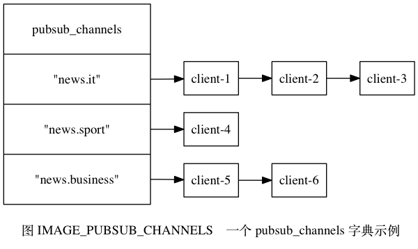
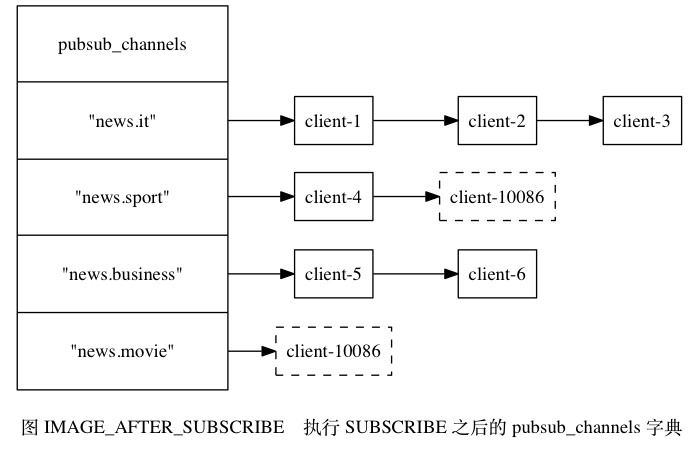
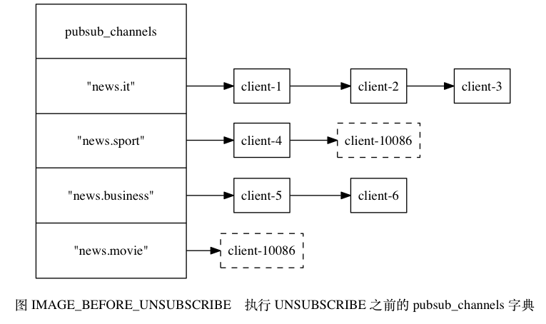
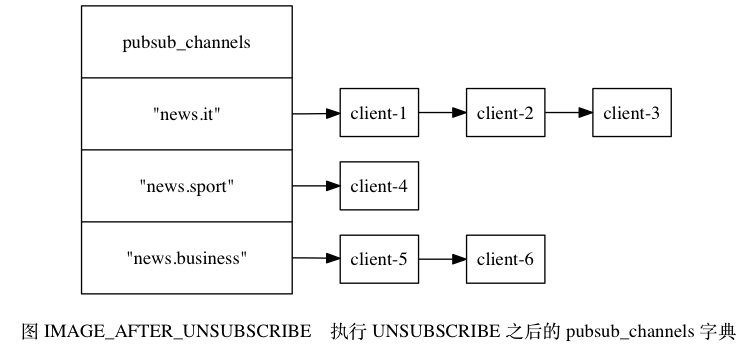

# 第18章 发布与订阅
## 18.1 频道的订阅与退订

当一个客户端执行 SUBSCRIBE 命令， 订阅某个或某些频道的时候， 这个客户端与被订阅频道之间就建立起了一种订阅关系。

Redis 将所有频道的订阅关系都保存在服务器状态的 `pubsub_channels` 字典里面， 这个字典的键是某个被订阅的频道， 而键的值则是一个链表， 链表里面记录了所有订阅这个频道的客户端：

```
struct redisServer {

    // ...

    // 保存所有频道的订阅关系
    dict *pubsub_channels;

    // ...

};
```

比如说， 图 IMAGE_PUBSUB_CHANNELS 就展示了一个 `pubsub_channels` 字典示例， 这个字典记录了以下信息：

- `client-1` 、 `client-2` 、 `client-3` 三个客户端正在订阅 `"news.it"` 频道。
- 客户端 `client-4` 正在订阅 `"news.sport"` 频道。
- `client-5` 和 `client-6` 两个客户端正在订阅 `"news.business"` 频道。



### 订阅频道

每当客户端执行 SUBSCRIBE 命令， 订阅某个或某些频道的时候， 服务器都会将客户端与被订阅的频道在 `pubsub_channels` 字典中进行关联。

根据频道是否已经有其他订阅者， 关联操作分为两种情况执行：

- 如果频道已经有其他订阅者， 那么它在 `pubsub_channels` 字典中必然有相应的订阅者链表， 程序唯一要做的就是将客户端添加到订阅者链表的末尾。
- 如果频道还未有任何订阅者， 那么它必然不存在于 `pubsub_channels` 字典， 程序首先要在 `pubsub_channels` 字典中为频道创建一个键， 并将这个键的值设置为空链表， 然后再将客户端添加到链表， 成为链表的第一个元素。

举个例子， 假设服务器 `pubsub_channels` 字典的当前状态如图 IMAGE_PUBSUB_CHANNELS 所示， 那么当客户端 `client-10086` 执行命令：

```
SUBSCRIBE "news.sport" "news.movie"
```

之后， `pubsub_channels` 字典将更新至图 IMAGE_AFTER_SUBSCRIBE 所示的状态， 其中用虚线包围的是新添加的节点：

- 更新后的 `pubsub_channels` 字典新增了 `"news.movie"` 键， 该键对应的链表值只包含一个 `client-10086` 节点， 表示目前只有 `client-10086` 一个客户端在订阅 `"news.movie"` 频道。
- 至于原本就已经有客户端在订阅的 `"news.sport"` 频道， `client-10086` 的节点放在了频道对应链表的末尾， 排在 `client-4` 节点的后面。



SUBSCRIBE 命令的实现可以用以下伪代码来描述：

```
def subscribe(*all_input_channels):

    # 遍历输入的所有频道
    for channel in all_input_channels:

        # 如果 channel 不存在于 pubsub_channels 字典（没有任何订阅者）
        # 那么在字典中添加 channel 键，并设置它的值为空链表
        if channel not in server.pubsub_channels:
            server.pubsub_channels[channel] = []

        # 将订阅者添加到频道所对应的链表的末尾
        server.pubsub_channels[channel].append(client)
```

### 退订频道

UNSUBSCRIBE 命令的行为和 SUBSCRIBE 命令的行为正好相反 —— 当一个客户端退订某个或某些频道的时候， 服务器将从 `pubsub_channels` 中解除客户端与被退订频道之间的关联：

- 程序会根据被退订频道的名字， 在 `pubsub_channels` 字典中找到频道对应的订阅者链表， 然后从订阅者链表中删除退订客户端的信息。
- 如果删除退订客户端之后， 频道的订阅者链表变成了空链表， 那么说明这个频道已经没有任何订阅者了， 程序将从 `pubsub_channels` 字典中删除频道对应的键。

举个例子， 假设 `pubsub_channels` 的当前状态如图 IMAGE_BEFORE_UNSUBSCRIBE 所示， 那么当客户端 `client-10086` 执行命令：

```
UNSUBSCRIBE "news.sport" "news.movie"
```

之后， 图中用虚线包围的两个节点将被删除， 如图 IMAGE_AFTER_UNSUBSCRIBE 所示：

- 在 `pubsub_channels` 字典更新之后， `client-10086` 的信息已经从 `"news.sport"` 频道和 `"news.movie"` 频道的订阅者链表中被删除了。
- 另外， 因为删除 `client-10086` 之后， 频道 `"news.movie"` 已经没有任何订阅者， 因此键 `"news.movie"` 也从字典中被删除了。





UNSUBSCRIBE 命令的实现可以用以下伪代码来描述：

```
def unsubscribe(*all_input_channels):

    # 遍历要退订的所有频道
    for channel in all_input_channels:

        # 在订阅者链表中删除退订的客户端
        server.pubsub_channels[channel].remove(client)

        # 如果频道已经没有任何订阅者了（订阅者链表为空）
        # 那么将频道从字典中删除
        if len(server.pubsub_channels[channel]) == 0:
            server.pubsub_channels.remove(channel)
```

## 18.2 模式的订阅与退订
## 18.3 发送消息
## 18.4 查看订阅信息
## 18.5 重点回顾

- 服务器状态在 `pubsub_channels` 字典保存了所有频道的订阅关系： SUBSCRIBE 命令负责将客户端和被订阅的频道关联到这个字典里面， 而 UNSUBSCRIBE 命令则负责解除客户端和被退订频道之间的关联。
- 服务器状态在 `pubsub_patterns` 链表保存了所有模式的订阅关系： PSUBSCRIBE 命令负责将客户端和被订阅的模式记录到这个链表中， 而 UNSUBSCRIBE 命令则负责移除客户端和被退订模式在链表中的记录。
- PUBLISH 命令通过访问 `pubsub_channels` 字典来向频道的所有订阅者发送消息， 通过访问 `pubsub_patterns` 链表来向所有匹配频道的模式的订阅者发送消息。
- PUBSUB 命令的三个子命令都是通过读取 `pubsub_channels` 字典和 `pubsub_patterns` 链表中的信息来实现的。

## 18.6 参考资料

关于发布与订阅模式的定义可以参考维基百科的 Publish Subscribe Pattern 词条： http://en.wikipedia.org/wiki/Publish-subscribe_pattern ， 以及《[设计模式](http://book.douban.com/subject/1052241/)》一书的 5.7 节。

另外， 《[Pattern-Oriented Software Architecture Volume 4, A Pattern Language for Distributed Computing](http://book.douban.com/subject/2122140/)》 一书第 10 章《Distribution Infrastructure》关于信息、信息传递、发布与订阅等主题的讨论也非常好， 值得一看。

维基百科的 Glob 词条给出了 Glob 风格模式匹配的简介： [http://en.wikipedia.org/wiki/Glob_(programming)](http://en.wikipedia.org/wiki/Publish–subscribe_pattern) ， 具体的匹配符语法可以参考 `glob(7)` 手册的 Wildcard Matching 小节。