# 第18章 发布与订阅

Redis的发布与订阅功能由PUBLISH、SUBSCRIBE、PSUBSCRIBE等命令组成。

通过执行SUBSCRIBE命令，客户端可以订阅一个或多个频道，从而成为这些频道的订阅者（subscriber）：每当有其他客户端向被订阅的频道发送消息（message）时，频道的所有订阅者都会收到这条消息。

举个例子，假设A、B、C三个客户端都执行了命令：

```
SUBSCRIBE "news.it"
```

那么这三个客户端就是"news.it"频道的订阅者，如图18-1所示。

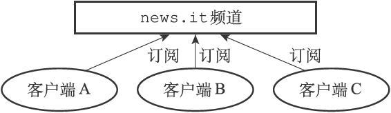

图18-1　news.it频道和它的三个订阅者

如果这时某个客户端执行命令

```
PUBLISH "news.it" "hello"
```

向"news.it"频道发送消息"hello"，那么"news.it"的三个订阅者都将收到这条消息，如图18-2所示。

-%E9%BB%84%E5%81%A5%E5%AE%8F%20%E8%91%97/images/000150.jpg)

图18-2　向news.it频道发送消息

除了订阅频道之外，客户端还可以通过执行PSUBSCRIBE命令订阅一个或多个模式，从而成为这些模式的订阅者：每当有其他客户端向某个频道发送消息时，消息不仅会被发送给这个频道的所有订阅者，它还会被发送给所有与这个频道相匹配的模式的订阅者。

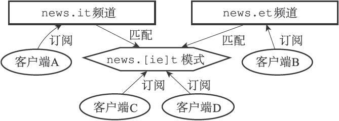

图18-3　频道和模式的订阅状态

举个例子，假设如图18-3所示：

- 客户端A正在订阅频道"news.it"。

- 客户端B正在订阅频道"news.et"。

- 客户端C和客户端D正在订阅与"news.it"频道和"news.et"频道相匹配的模式"news.[ie]t"。

如果这时某个客户端执行命令

```
PUBLISH "news.it" "hello"
```

向"news.it"频道发送消息"hello"，那么不仅正在订阅"news.it"频道的客户端A会收到消息，客户端C和客户端D也同样会收到消息，因为这两个客户端正在订阅匹配"news.it"频道的"news.[ie]t"模式，如图18-4所示。

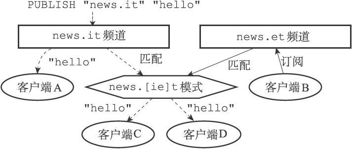

图18-4　将消息发送给频道的订阅者和匹配模式的订阅者（1）

与此类似，如果某个客户端执行命令

```
PUBLISH "news.et" "world"
```

向"news.et"频道发送消息"world"，那么不仅正在订阅"news.et"频道的客户端B会收到消息，客户端C和客户端D也同样会收到消息，因为这两个客户端正在订阅匹配"news.et"频道的"news.[ie]t"模式，如图18-5所示。

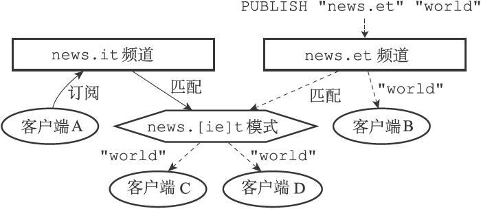

图18-5　将消息发送给频道的订阅者和匹配模式的订阅者（2）

本章接下来的内容将首先介绍订阅频道的SUBSCRIBE命令和退订频道的UNSUBSCRIBE命令的实现原理，然后介绍订阅模式的PSUBSCRIBE命令和退订模式的PUNSUBSCRIBE命令的实现原理。

在介绍完以上四个命令的实现原理之后，本章会对PUBLISH命令的实现原理进行介绍，说明消息是如何发送给频道的订阅者以及模式的订阅者的。

最后，本章将对Redis 2.8新引入的PUBSUB命令的三个子命令进行介绍，并说明这三个子命令的实现原理。

## 18.1 频道的订阅与退订

当一个客户端执行 SUBSCRIBE 命令， 订阅某个或某些频道的时候， 这个客户端与被订阅频道之间就建立起了一种订阅关系。

Redis 将所有频道的订阅关系都保存在服务器状态的 `pubsub_channels` 字典里面， 这个字典的键是某个被订阅的频道， 而键的值则是一个链表， 链表里面记录了所有订阅这个频道的客户端：

```
struct redisServer {

    // ...

    // 保存所有频道的订阅关系
    dict *pubsub_channels;

    // ...

};
```

比如说， 图 IMAGE_PUBSUB_CHANNELS 就展示了一个 `pubsub_channels` 字典示例， 这个字典记录了以下信息：

- `client-1` 、 `client-2` 、 `client-3` 三个客户端正在订阅 `"news.it"` 频道。
- 客户端 `client-4` 正在订阅 `"news.sport"` 频道。
- `client-5` 和 `client-6` 两个客户端正在订阅 `"news.business"` 频道。


### 订阅频道

每当客户端执行 SUBSCRIBE 命令， 订阅某个或某些频道的时候， 服务器都会将客户端与被订阅的频道在 `pubsub_channels` 字典中进行关联。

根据频道是否已经有其他订阅者， 关联操作分为两种情况执行：

- 如果频道已经有其他订阅者， 那么它在 `pubsub_channels` 字典中必然有相应的订阅者链表， 程序唯一要做的就是将客户端添加到订阅者链表的末尾。
- 如果频道还未有任何订阅者， 那么它必然不存在于 `pubsub_channels` 字典， 程序首先要在 `pubsub_channels` 字典中为频道创建一个键， 并将这个键的值设置为空链表， 然后再将客户端添加到链表， 成为链表的第一个元素。

举个例子， 假设服务器 `pubsub_channels` 字典的当前状态如图 IMAGE_PUBSUB_CHANNELS 所示， 那么当客户端 `client-10086` 执行命令：

```
SUBSCRIBE "news.sport" "news.movie"
```

之后， `pubsub_channels` 字典将更新至图 IMAGE_AFTER_SUBSCRIBE 所示的状态， 其中用虚线包围的是新添加的节点：

- 更新后的 `pubsub_channels` 字典新增了 `"news.movie"` 键， 该键对应的链表值只包含一个 `client-10086` 节点， 表示目前只有 `client-10086` 一个客户端在订阅 `"news.movie"` 频道。
- 至于原本就已经有客户端在订阅的 `"news.sport"` 频道， `client-10086` 的节点放在了频道对应链表的末尾， 排在 `client-4` 节点的后面。


SUBSCRIBE 命令的实现可以用以下伪代码来描述：

```
def subscribe(*all_input_channels):

    # 遍历输入的所有频道
    for channel in all_input_channels:

        # 如果 channel 不存在于 pubsub_channels 字典（没有任何订阅者）
        # 那么在字典中添加 channel 键，并设置它的值为空链表
        if channel not in server.pubsub_channels:
            server.pubsub_channels[channel] = []

        # 将订阅者添加到频道所对应的链表的末尾
        server.pubsub_channels[channel].append(client)
```

### 退订频道

UNSUBSCRIBE 命令的行为和 SUBSCRIBE 命令的行为正好相反 —— 当一个客户端退订某个或某些频道的时候， 服务器将从 `pubsub_channels` 中解除客户端与被退订频道之间的关联：

- 程序会根据被退订频道的名字， 在 `pubsub_channels` 字典中找到频道对应的订阅者链表， 然后从订阅者链表中删除退订客户端的信息。
- 如果删除退订客户端之后， 频道的订阅者链表变成了空链表， 那么说明这个频道已经没有任何订阅者了， 程序将从 `pubsub_channels` 字典中删除频道对应的键。

举个例子， 假设 `pubsub_channels` 的当前状态如图 IMAGE_BEFORE_UNSUBSCRIBE 所示， 那么当客户端 `client-10086` 执行命令：

```
UNSUBSCRIBE "news.sport" "news.movie"
```

之后， 图中用虚线包围的两个节点将被删除， 如图 IMAGE_AFTER_UNSUBSCRIBE 所示：

- 在 `pubsub_channels` 字典更新之后， `client-10086` 的信息已经从 `"news.sport"` 频道和 `"news.movie"` 频道的订阅者链表中被删除了。
- 另外， 因为删除 `client-10086` 之后， 频道 `"news.movie"` 已经没有任何订阅者， 因此键 `"news.movie"` 也从字典中被删除了。


UNSUBSCRIBE 命令的实现可以用以下伪代码来描述：

```
def unsubscribe(*all_input_channels):

    # 遍历要退订的所有频道
    for channel in all_input_channels:

        # 在订阅者链表中删除退订的客户端
        server.pubsub_channels[channel].remove(client)

        # 如果频道已经没有任何订阅者了（订阅者链表为空）
        # 那么将频道从字典中删除
        if len(server.pubsub_channels[channel]) == 0:
            server.pubsub_channels.remove(channel)
```

## 18.2 模式的订阅与退订

前面说过，服务器将所有频道的订阅关系都保存在服务器状态的pubsub_channels属性里面，与此类似，服务器也将所有模式的订阅关系都保存在服务器状态的pubsub_patterns属性里面：

```
struct redisServer {
  // ...
  // 
保存所有模式订阅关系
  list *pubsub_patterns;
  // ...
};
```

pubsub_patterns属性是一个链表，链表中的每个节点都包含着一个pubsub Pattern结构，这个结构的pattern属性记录了被订阅的模式，而client属性则记录了订阅模式的客户端：

```
typedef struct pubsubPattern {
  // 
订阅模式的客户端
  redisClient *client;
  // 
被订阅的模式
  robj *pattern;
} pubsubPattern;
```

图18-10是一个pubsubPattern结构示例，它显示客户端client-9正在订阅模式"news.*"。

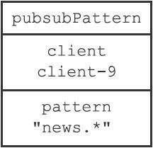

图18-10　pubsubPattern结构示例

图18-11展示了一个pubsub_patterns链表示例，这个链表记录了以下信息：

- 客户端client-7正在订阅模式"music.*"。

- 客户端client-8正在订阅模式"book.*"。

- 客户端client-9正在订阅模式"news.*"。

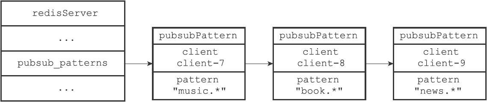

图18-11　pubsub_patterns链表示例

### 18.2.1　订阅模式

每当客户端执行PSUBSCRIBE命令订阅某个或某些模式的时候，服务器会对每个被订阅的模式执行以下两个操作：

1）新建一个pubsubPattern结构，将结构的pattern属性设置为被订阅的模式，client属性设置为订阅模式的客户端。

2）将pubsubPattern结构添加到pubsub_patterns链表的表尾。举个例子，假设服务器中pubsub_patterns链表的当前状态如图18-12所示。

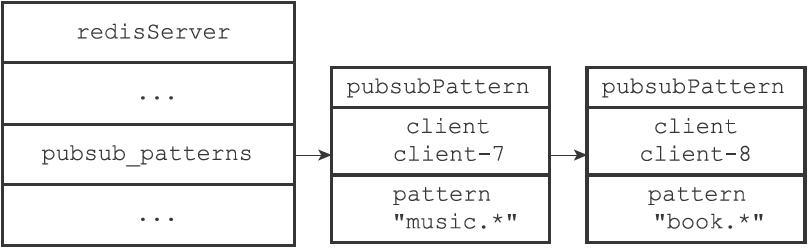

图18-12　执行PSUBSCRIBE命令之前的pubsub_patterns链表

那么当客户端client-9执行命令

```
PSUBSCRIBE "news.*"
```

之后，pubsub_patterns链表将更至新图18-13所示的状态，其中用虚线包围的是新添加的pubsubPattern结构。

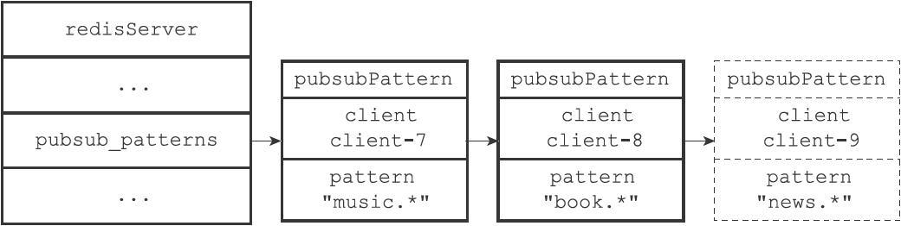

图18-13　执行PSUBSCRIBE命令之后的pubsub_patterns链表

PSUBSCRIBE命令的实现原理可以用以下伪代码来描述：

```
def psubscribe(*all_input_patterns):
  # 
遍历输入的所有模式
  for pattern in all_input_patterns:
    # 
创建新的pubsubPattern
结构
    # 
记录被订阅的模式，以及订阅模式的客户端
    pubsubPattern = create_new_pubsubPattern()
    pubsubPattern.client = client
    pubsubPattern.pattern = pattern
    # 
将新的pubsubPattern
追加到pubsub_patterns
链表末尾
    server.pubsub_patterns.append(pubsubPattern)
```

### 18.2.2　退订模式

模式的退订命令PUNSUBSCRIBE是PSUBSCRIBE命令的反操作：当一个客户端退订某个或某些模式的时候，服务器将在pubsub_patterns链表中查找并删除那些pattern属性为被退订模式，并且client属性为执行退订命令的客户端的pubsubPattern结构。

举个例子，假设服务器pubsub_patterns链表的当前状态如图18-14所示。

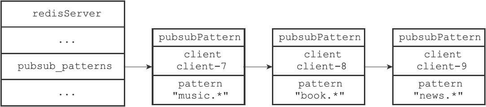

图18-14　执行PUNSUBSCRIBE命令之前的pubsub_patterns链表

那么当客户端client-9执行命令

```
PUNSUBSCRIBE "news.*"
```

之后，client属性为client-9，pattern属性为"news.*"的pubsubPattern结构将被删除，pubsub_patterns链表将更新至图18-15所示的样子。


图18-15　执行PUNSUBSCRIBE命令之后的pubsub_patterns链表

PUNSUBSCRIBE命令的实现原理可以用以下伪代码来描述：

```
def punsubscribe(*all_input_patterns):
  # 
遍历所有要退订的模式
  for pattern in all_input_patterns:
    # 
遍历pubsub_patterns
链表中的所有pubsubPattern
结构
    for pubsubPattern in server.pubsub_patterns:
    # 
如果当前客户端和pubsubPattern
记录的客户端相同
    # 
并且要退订的模式也和pubsubPattern
记录的模式相同
    if client == pubsubPattern.client and \
     pattern == pubsubPattern.pattern:
     # 
那么将这个pubsubPattern
从链表中删除
     server.pubsub_patterns.remove(pubsubPattern)
```

## 18.3 发送消息

当一个Redis客户端执行PUBLISH<channel><message>命令将消息message发送给频道channel的时候，服务器需要执行以下两个动作：

1）将消息message发送给channel频道的所有订阅者。

2）如果有一个或多个模式pattern与频道channel相匹配，那么将消息message发送给pattern模式的订阅者。

接下来的两个小节将分别介绍这两个动作的实现方式。

### 18.3.1　将消息发送给频道订阅者

因为服务器状态中的pubsub_channels字典记录了所有频道的订阅关系，所以为了将消息发送给channel频道的所有订阅者，PUBLISH命令要做的就是在pubsub_channels字典里找到频道channel的订阅者名单（一个链表），然后将消息发送给名单上的所有客户端。举个例子，假设服务器pubsub_channels字典当前的状态如图18-16所示。

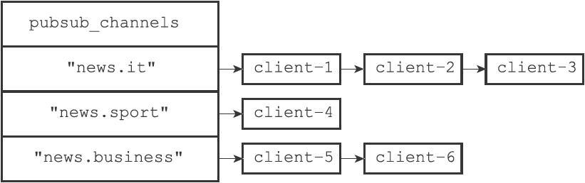

图18-16　pubsub_channels字典

如果这时某个客户端执行命令

```
PUBLISH "news.it" "hello"
```

那么PUBLISH命令将在pubsub_channels字典中查找键"news.it"对应的链表值，并通过遍历链表将消息"hello"发送给"news.it"频道的三个订阅者：client-1、client-2和client-3。

PUBLISH命令将消息发送给频道订阅者的方法可以用以下伪代码来描述：

```
def channel_publish(channel, message):
  # 
如果channel
键不存在于pubsub_channels
字典中
  # 
那么说明channel
频道没有任何订阅者
  # 
程序不做发送动作，直接返回
  if channel not in server.pubsub_channels:
   return
  # 
运行到这里，说明channel
频道至少有一个订阅者
  # 
程序遍历channel
频道的订阅者链表
  # 
将消息发送给所有订阅者
  for subscriber in server.pubsub_channels[channel]:
    send_message(subscriber, message)
```

### 18.3.2　将消息发送给模式订阅者

因为服务器状态中的pubsub_patterns链表记录了所有模式的订阅关系，所以为了将消息发送给所有与channel频道相匹配的模式的订阅者，PUBLISH命令要做的就是遍历整个pubsub_patterns链表，查找那些与channel频道相匹配的模式，并将消息发送给订阅了这些模式的客户端。

举个例子，假设pubsub_patterns链表的当前状态如图18-17所示。


图18-17　pubsub_patterns链表

如果这时某个客户端执行命令

```
PUBLISH "news.it" "hello"
```

那么PUBLISH命令会首先将消息"hello"发送给"news.it"频道的所有订阅者，然后开始在pubsub_patterns链表中查找是否有被订阅的模式与"news.it"频道相匹配，结果发现"news.it"频道和客户端client-9订阅的"news.*"频道匹配，于是命令将消息"hello"发送给客户端client-9。

PUBLISH命令将消息发送给模式订阅者的方法可以用以下伪代码来描述：

```
def pattern_publish(channel, message):
  # 
遍历所有模式订阅消息
  for pubsubPattern in server.pubsub_patterns:
    # 
如果频道和模式相匹配
    if match(channel, pubsubPattern.pattern):
          # 
那么将消息发送给订阅该模式的客户端
          send_message(pubsubPattern.client, message)
```

最后，PUBLISH命令的实现可以用以下伪代码来描述：

```
def publish(channel, message):
  # 
将消息发送给channel
频道的所有订阅者
  channel_publish(channel, message)
  # 
将消息发送给所有和channel
频道相匹配的模式的订阅者
  pattern_publish(channel, message)
```

## 18.4 查看订阅信息

PUBSUB命令是Redis 2.8新增加的命令之一，客户端可以通过这个命令来查看频道或者模式的相关信息，比如某个频道目前有多少订阅者，又或者某个模式目前有多少订阅者，诸如此类。

以下三个小节将分别介绍PUBSUB命令的三个子命令，以及这些子命令的实现原理。

### 18.4.1　PUBSUB CHANNELS

PUBSUB CHANNELS[pattern]子命令用于返回服务器当前被订阅的频道，其中pattern参数是可选的：

- 如果不给定pattern参数，那么命令返回服务器当前被订阅的所有频道。

- 如果给定pattern参数，那么命令返回服务器当前被订阅的频道中那些与pattern模式相匹配的频道。

这个子命令是通过遍历服务器pubsub_channels字典的所有键（每个键都是一个被订阅的频道），然后记录并返回所有符合条件的频道来实现的，这个过程可以用以下伪代码来描述：

```
def pubsub_channels(pattern=None):
  # 
一个列表，用于记录所有符合条件的频道
  channel_list = []
  # 
遍历服务器中的所有频道
  # 
（也即是pubsub_channels
字典的所有键）
  for channel in server.pubsub_channels:
    # 
当以下两个条件的任意一个满足时，将频道添加到链表里面：
    #1 
）用户没有指定pattern
参数
    #2 
）用户指定了pattern
参数，并且channel
和pattern
匹配
    if (pattern is None) or match(channel, pattern):
     channel_list.append(channel)
# 
向客户端返回频道列表
return channel_list
```

举个例子，对于图18-18所示的pubsub_channels字典来说，执行PUBSUB CHANNELS命令将返回服务器目前被订阅的四个频道：

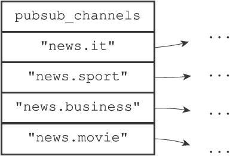

图18-18　pubsub_channels字典示例

```
redis> PUBSUB CHANNELS
1) "news.it"
2) "news.sport"
3) "news.business"
4) "news.movie"
```

另一方面，执行PUBSUB CHANNELS"news.[is]*"命令将返回"news.it"和"news.sport"两个频道，因为只有这两个频道和"news.[is]*"模式相匹配：

```
redis> PUBSUB CHANNELS "news.[is]*"
1) "news.it"
2) "news.sport"
```

### 18.4.2　PUBSUB NUMSUB

PUBSUB NUMSUB[channel-1 channel-2...channel-n]子命令接受任意多个频道作为输入参数，并返回这些频道的订阅者数量。

这个子命令是通过在pubsub_channels字典中找到频道对应的订阅者链表，然后返回订阅者链表的长度来实现的（订阅者链表的长度就是频道订阅者的数量），这个过程可以用以下伪代码来描述：

```
def pubsub_numsub(*all_input_channels):
  # 
遍历输入的所有频道
  for channel in all_input_channels:
       # 
如果pubsub_channels
字典中没有channel
这个键
       # 
那么说明channel
频道没有任何订阅者
       if channel not in server.pubsub_channels:
         # 
返回频道名
         reply_channel_name(channel)
         # 
订阅者数量为0 
         reply_subscribe_count(0)
  # 
如果pubsub_channels
字典中存在channel
键
  # 
那么说明channel
频道至少有一个订阅者
  else:
    # 
返回频道名
    reply_channel_name(channel)
    # 
订阅者链表的长度就是订阅者数量
    reply_subscribe_count(len(server.pubsub_channels[channel]))
```

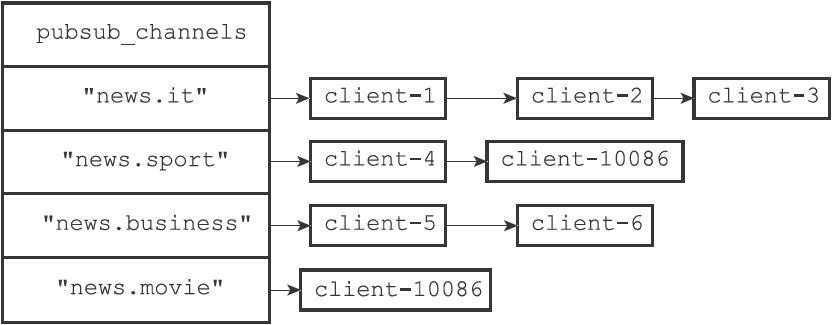

图18-19　pubsub_channels字典

举个例子，对于图18-19所示的pubsub_channels字典来说，对字典中的四个频道执行PUBSUB NUMSUB命令将获得以下回复：

```
redis> PUBSUB NUMSUB news.it news.sport news.business news.movie
1) "news.it"
2) "3"
3) "news.sport"
4) "2"
5) "news.business"
6) "2"
7) "news.movie"
8) "1"
```

### 18.4.3　PUBSUB NUMPAT

PUBSUB NUMPAT子命令用于返回服务器当前被订阅模式的数量。

这个子命令是通过返回pubsub_patterns链表的长度来实现的，因为这个链表的长度就是服务器被订阅模式的数量，这个过程可以用以下伪代码来描述：

```
def pubsub_numpat():
  # pubsub_patterns
链表的长度就是被订阅模式的数量
  reply_pattern_count(len(server.pubsub_patterns))
```

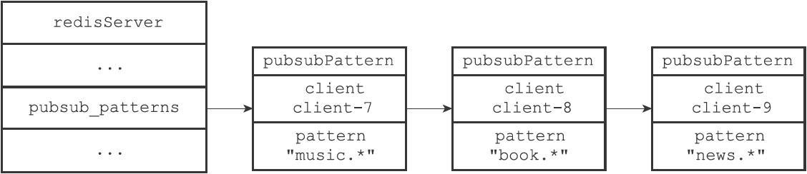

图18-20　pubsub_patterns链表

举个例子，对于图18-20所示的pubsub_patterns链表来说，执行PUBSUB NUMPAT命令将返回3：

```
redis> PUBSUB NUMPAT
(integer) 3
```

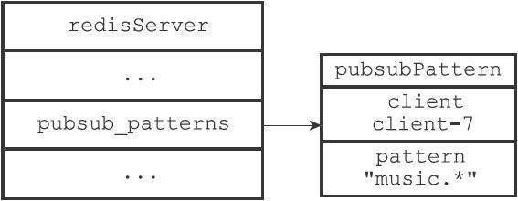

图18-21　pubsub_patterns链表

而对于图18-21所示的pubsub_patterns链表来说，执行PUBSUB NUMPAT命令将返回1：

```
redis> PUBSUB NUMPAT
(integer) 1
```

## 18.5 重点回顾

- 服务器状态在 `pubsub_channels` 字典保存了所有频道的订阅关系： SUBSCRIBE 命令负责将客户端和被订阅的频道关联到这个字典里面， 而 UNSUBSCRIBE 命令则负责解除客户端和被退订频道之间的关联。
- 服务器状态在 `pubsub_patterns` 链表保存了所有模式的订阅关系： PSUBSCRIBE 命令负责将客户端和被订阅的模式记录到这个链表中， 而 UNSUBSCRIBE 命令则负责移除客户端和被退订模式在链表中的记录。
- PUBLISH 命令通过访问 `pubsub_channels` 字典来向频道的所有订阅者发送消息， 通过访问 `pubsub_patterns` 链表来向所有匹配频道的模式的订阅者发送消息。
- PUBSUB 命令的三个子命令都是通过读取 `pubsub_channels` 字典和 `pubsub_patterns` 链表中的信息来实现的。

## 18.6 参考资料

关于发布与订阅模式的定义可以参考维基百科的 Publish Subscribe Pattern 词条： http://en.wikipedia.org/wiki/Publish-subscribe_pattern ， 以及《[设计模式](http://book.douban.com/subject/1052241/)》一书的 5.7 节。

另外， 《[Pattern-Oriented Software Architecture Volume 4, A Pattern Language for Distributed Computing](http://book.douban.com/subject/2122140/)》 一书第 10 章《Distribution Infrastructure》关于信息、信息传递、发布与订阅等主题的讨论也非常好， 值得一看。

维基百科的 Glob 词条给出了 Glob 风格模式匹配的简介： [http://en.wikipedia.org/wiki/Glob_(programming)](http://en.wikipedia.org/wiki/Publish–subscribe_pattern) ， 具体的匹配符语法可以参考 `glob(7)` 手册的 Wildcard Matching 小节。