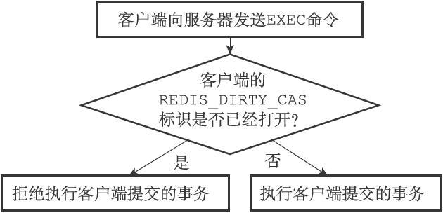
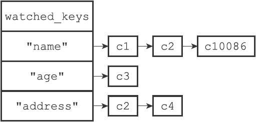

# 第19章 事务

Redis通过MULTI、EXEC、WATCH等命令来实现事务（transaction）功能。事务提供了一种将多个命令请求打包，然后一次性、按顺序地执行多个命令的机制，并且在事务执行期间，服务器不会中断事务而改去执行其他客户端的命令请求，它会将事务中的所有命令都执行完毕，然后才去处理其他客户端的命令请求。

以下是一个事务执行的过程，该事务首先以一个MULTI命令为开始，接着将多个命令放入事务当中，最后由EXEC命令将这个事务提交（commit）给服务器执行：

```
redis> MULTI
OK
redis> SET "name" "Practical Common Lisp"
QUEUED
redis> GET "name"
QUEUED
redis> SET "author" "Peter Seibel"
QUEUED
redis> GET "author"
QUEUED
redis> EXEC
1) OK
2) "Practical Common Lisp"
3) OK
4) "Peter Seibel"
```

在本章接下来的内容中，我们首先会介绍Redis如何使用MULTI和EXEC命令来实现事务功能，说明事务中的多个命令是如何被保存到事务里面的，而这些命令又是如何被执行的。

在介绍了事务的实现原理之后，我们将对WATCH命令的作用进行介绍，并说明WATCH命令的实现原理。

因为事务的安全性和可靠性也是大家关注的焦点，所以本章最后将以常见的ACID性质对Redis事务的原子性、一致性、隔离性和耐久性进行说明。

## 19.1 事务的实现

一个事务从开始到结束通常会经历以下三个阶段：

1. 事务开始。
2. 命令入队。
3. 事务执行。

本节接下来的内容将对这三个阶段进行介绍， 说明一个事务从开始到结束的整个过程。

### 事务开始

MULTI 命令的执行标志着事务的开始：

```
redis> MULTI
OK
```

MULTI 命令可以将执行该命令的客户端从非事务状态切换至事务状态， 这一切换是通过在客户端状态的 `flags` 属性中打开 `REDIS_MULTI` 标识来完成的， MULTI 命令的实现可以用以下伪代码来表示：

```
def MULTI():

    # 打开事务标识
    client.flags |= REDIS_MULTI

    # 返回 OK 回复
    replyOK()
```

### 命令入队

当一个客户端处于非事务状态时， 这个客户端发送的命令会立即被服务器执行：

```
redis> SET "name" "Practical Common Lisp"
OK

redis> GET "name"
"Practical Common Lisp"

redis> SET "author" "Peter Seibel"
OK

redis> GET "author"
"Peter Seibel"
```

与此不同的是， 当一个客户端切换到事务状态之后， 服务器会根据这个客户端发来的不同命令执行不同的操作：

- 如果客户端发送的命令为 EXEC 、 DISCARD 、 WATCH 、 MULTI 四个命令的其中一个， 那么服务器立即执行这个命令。
- 与此相反， 如果客户端发送的命令是 EXEC 、 DISCARD 、 WATCH 、 MULTI 四个命令以外的其他命令， 那么服务器并不立即执行这个命令， 而是将这个命令放入一个事务队列里面， 然后向客户端返回 `QUEUED` 回复。

服务器判断命令是该入队还是该立即执行的过程可以用流程图 IMAGE_ENQUEUE_OR_EXEC 来描述。


### 事务队列

每个 Redis 客户端都有自己的事务状态， 这个事务状态保存在客户端状态的 `mstate` 属性里面：

```
typedef struct redisClient {

    // ...

    // 事务状态
    multiState mstate;      /* MULTI/EXEC state */

    // ...

} redisClient;
```

事务状态包含一个事务队列， 以及一个已入队命令的计数器 （也可以说是事务队列的长度）：

```
typedef struct multiState {

    // 事务队列，FIFO 顺序
    multiCmd *commands;

    // 已入队命令计数
    int count;

} multiState;
```

事务队列是一个 `multiCmd` 类型的数组， 数组中的每个 `multiCmd` 结构都保存了一个已入队命令的相关信息， 包括指向命令实现函数的指针， 命令的参数， 以及参数的数量：

```
typedef struct multiCmd {

    // 参数
    robj **argv;

    // 参数数量
    int argc;

    // 命令指针
    struct redisCommand *cmd;

} multiCmd;
```

事务队列以先进先出（FIFO）的方式保存入队的命令： 较先入队的命令会被放到数组的前面， 而较后入队的命令则会被放到数组的后面。

举个例子， 如果客户端执行以下命令：

```
redis> MULTI
OK

redis> SET "name" "Practical Common Lisp"
QUEUED

redis> GET "name"
QUEUED

redis> SET "author" "Peter Seibel"
QUEUED

redis> GET "author"
QUEUED
```

那么服务器将为客户端创建图 IMAGE_TRANSACTION_STATE 所示的事务状态：

- 最先入队的 SET 命令被放在了事务队列的索引 `0` 位置上。
- 第二入队的 GET 命令被放在了事务队列的索引 `1` 位置上。
- 第三入队的另一个 SET 命令被放在了事务队列的索引 `2` 位置上。
- 最后入队的另一个 GET 命令被放在了事务队列的索引 `3` 位置上。

![digraph {      label = "\n 图 IMAGE_TRANSACTION_STATE    事务状态";      rankdir = LR;      node [shape = record];      //redisClient [label = " <head> redisClient | ... | <mstate> mstate | ... "];      multiState [label = " <head> multiState | <commands> commands | count \n 4 "];      commands [label = " <head> multiCmd[4] | <0> [0] | <1> [1] | <2> [2] | <3> [3] "];      multiCmd0 [label = " <head> multiCmd | <argv> argv | argc \n 3 | <cmd> cmd "];      multiCmd1 [label = " <head> multiCmd | <argv> argv | argc \n 2 | <cmd> cmd "];      multiCmd2 [label = " <head> multiCmd | <argv> argv | argc \n 3 | <cmd> cmd "];      multiCmd3 [label = " <head> multiCmd | <argv> argv | argc \n 2 | <cmd> cmd "];      //redisClient:mstate -> multiState:head;      multiState:commands -> commands:head;      commands:0 -> multiCmd0:head;     commands:1 -> multiCmd1:head;     commands:2 -> multiCmd2:head;     commands:3 -> multiCmd3:head;      argv0 [label = " robj*[3] | { StringObject \n \"SET\" | StringObject \n \"name\" | StringObject \n \"Practical Common Lisp\" } "];     cmd0 [label = " setCommand ", shape = plaintext];      multiCmd0:argv -> argv0;     multiCmd0:cmd -> cmd0;      argv1 [label = " robj*[2] | { StringObject \n \"GET\" | StringObject \n \"name\" } "];     cmd1 [label = " getCommand ", shape = plaintext];      multiCmd1:argv -> argv1;     multiCmd1:cmd -> cmd1;      argv2 [label = " robj*[3] | { StringObject \n \"SET\" | StringObject \n \"author\" | StringObject \n \"Peter Seibel\" } "];     cmd2 [label = " setCommand ", shape = plaintext];      multiCmd2:argv -> argv2;     multiCmd2:cmd -> cmd2;      argv3 [label = " robj*[2] | { StringObject \n \"GET\" | StringObject \n \"author\" } "];     cmd3 [label = " getCommand ", shape = plaintext];      multiCmd3:argv -> argv3;     multiCmd3:cmd -> cmd3;  }](http://redisbook.com/_images/graphviz-245806f251029ebb86048d1b4015ebefd3dc3fbb.png)

### 执行事务

当一个处于事务状态的客户端向服务器发送 EXEC 命令时， 这个 EXEC 命令将立即被服务器执行： 服务器会遍历这个客户端的事务队列， 执行队列中保存的所有命令， 最后将执行命令所得的结果全部返回给客户端。

举个例子， 对于图 IMAGE_TRANSACTION_STATE 所示的事务队列来说， 服务器首先会执行命令：

```
SET "name" "Practical Common Lisp"
```

接着执行命令：

```
GET "name"
```

之后执行命令：

```
SET "author" "Peter Seibel"
```

再之后执行命令：

```
GET "author"
```

最后， 服务器会将执行这四个命令所得的回复返回给客户端：

```
redis> EXEC
1) OK
2) "Practical Common Lisp"
3) OK
4) "Peter Seibel"
```

EXEC 命令的实现原理可以用以下伪代码来描述：

```
def EXEC():

    # 创建空白的回复队列
    reply_queue = []

    # 遍历事务队列中的每个项
    # 读取命令的参数，参数的个数，以及要执行的命令
    for argv, argc, cmd in client.mstate.commands:

        # 执行命令，并取得命令的返回值
        reply = execute_command(cmd, argv, argc)

        # 将返回值追加到回复队列末尾
        reply_queue.append(reply)

    # 移除 REDIS_MULTI 标识，让客户端回到非事务状态
    client.flags &= ~REDIS_MULTI

    # 清空客户端的事务状态，包括：
    # 1）清零入队命令计数器
    # 2）释放事务队列
    client.mstate.count = 0
    release_transaction_queue(client.mstate.commands)

    # 将事务的执行结果返回给客户端
    send_reply_to_client(client, reply_queue)
```

## 19.2 WATCH 命令的实现

WATCH命令是一个乐观锁（optimistic locking），它可以在EXEC命令执行之前，监视任意数量的数据库键，并在EXEC命令执行时，检查被监视的键是否至少有一个已经被修改过了，如果是的话，服务器将拒绝执行事务，并向客户端返回代表事务执行失败的空回复。

以下是一个事务执行失败的例子：

```
redis> WATCH "name"
OK
redis> MULTI
OK
redis> SET "name" "peter"
QUEUED
redis> EXEC
(nil)
```

表19-1展示了上面的例子是如何失败的。

表19-1　两个客户端执行命令的过程


在时间T4，客户端B修改了"name"键的值，当客户端A在T5执行EXEC命令时，服务器会发现WATCH监视的键"name"已经被修改，因此服务器拒绝执行客户端A的事务，并向客户端A返回空回复。

本节接下来的内容将介绍WATCH命令的实现原理，说明事务系统是如何监视某个键，并在键被修改的情况下，确保事务的安全性的。

### 19.2.1　使用WATCH命令监视数据库键

每个Redis数据库都保存着一个watched_keys字典，这个字典的键是某个被WATCH命令监视的数据库键，而字典的值则是一个链表，链表中记录了所有监视相应数据库键的客户端：

```
typedef struct redisDb {
  // ...
  // 
正在被WATCH
命令监视的键
  dict *watched_keys;
  // ...
} redisDb;
```

通过watched_keys字典，服务器可以清楚地知道哪些数据库键正在被监视，以及哪些客户端正在监视这些数据库键。

图19-3是一个watched_keys字典的示例，从这个watched_keys字典中可以看出：

- 客户端c1和c2正在监视键"name"。

- 客户端c3正在监视键"age"。

- 客户端c2和c4正在监视键"address"。

通过执行WATCH命令，客户端可以在watched_keys字典中与被监视的键进行关联。举个例子，如果当前客户端为c10086，那么客户端执行以下WATCH命令之后：

```
redis> WATCH "name" "age"
OK
```

图19-3展示的watched_keys字典将被更新至图19-4所示的状态，其中用虚线包围的两个c10086节点就是由刚刚执行的WATCH命令添加到字典中的。


图19-3　一个watched_keys字典


图19-4　执行WATCH命令之后的watched_keys字典

### 19.2.2　监视机制的触发

所有对数据库进行修改的命令，比如SET、LPUSH、SADD、ZREM、DEL、FLUSHDB等等，在执行之后都会调用multi.c/touchWatchKey函数对watched_keys字典进行检查，查看是否有客户端正在监视刚刚被命令修改过的数据库键，如果有的话，那么touchWatchKey函数会将监视被修改键的客户端的REDIS_DIRTY_CAS标识打开，表示该客户端的事务安全性已经被破坏。

touchWatchKey函数的定义可以用以下伪代码来描述：

```
def touchWatchKey(db, key):
  # 
如果键key
存在于数据库的watched_keys
字典中
  # 
那么说明至少有一个客户端在监视这个key
  if key in db.watched_keys:
    # 
遍历所有监视键key
的客户端
    for client in db.watched_keys[key]:
      # 
打开标识
      client.flags |= REDIS_DIRTY_CAS
```

举个例子，对于图19-5所示的watched_keys字典来说：

- 如果键"name"被修改，那么c1、c2、c10086三个客户端的REDIS_DIRTY_CAS标识将被打开。

- 如果键"age"被修改，那么c3和c10086两个客户端的REDIS_DIRTY_CAS标识将被打开。

- 如果键"address"被修改，那么c2和c4两个客户端的REDIS_DIRTY_CAS标识将被打开。


图19-5　watched_keys字典

### 19.2.3　判断事务是否安全

当服务器接收到一个客户端发来的EXEC命令时，服务器会根据这个客户端是否打开了REDIS_DIRTY_CAS标识来决定是否执行事务：

·如果客户端的REDIS_DIRTY_CAS标识已经被打开，那么说明客户端所监视的键当中，至少有一个键已经被修改过了，在这种情况下，客户端提交的事务已经不再安全，所以服务器会拒绝执行客户端提交的事务。

·如果客户端的REDIS_DIRTY_CAS标识没有被打开，那么说明客户端监视的所有键都没有被修改过（或者客户端没有监视任何键），事务仍然是安全的，服务器将执行客户端提交的这个事务。

这个判断是否执行事务的过程可以用流程图19-6来描述。



图19-6　服务器判断是否执行事务的过程

举个例子，对于图19-5所示的watched_keys字典来说，如果某个客户端对"name"键进行了修改（比如执行SET"name""john"），那么c1、c2、c10086三个客户端的REDIS_DIRTY_CAS标识将被打开。当这三个客户端向服务器发送EXEC命令的时候，服务器会拒绝执行它们提交的事务，以此来保证事务的安全性。

### 19.2.4　一个完整的WATCH事务执行过程

为了进一步熟悉WATCH命令的运作方式，让我们来看一个带有WATCH的事务从开始到失败的整个过程。

假设当前客户端为c10086，而数据库watched_keys字典的当前状态如图19-7所示，那么当c10086执行以下WATCH命令之后：

```
c10086> WATCH "name"
OK
```

watched_keys字典将更新至图19-8所示的状态。


图19-7　执行WATCH命令之前的watched_keys字典



图19-8　执行WATCH命令之后的watched_keys字典

接下来，客户端c10086继续向服务器发送MULTI命令，并将一个SET命令放入事务队列：

```
c10086> MULTI
OK
c10086> SET "name" "peter"
QUEUED
```

就在这时，另一个客户端c999向服务器发送了一条SET命令，将"name"键的值设置成了"john"：

```
c999> SET "name" "john"
OK
```

c999执行的这个SET命令会导致正在监视"name"的所有客户端的REDIS_DIRTY_CAS标识被打开，其中包括客户端c10086。

之后，当c10086向服务器发送EXEC命令时候，因为c10086的REDIS_DIRTY_CAS标志已经被打开，所以服务器将拒绝执行它提交的事务：

```
c10086> EXEC
(nil)
```

## 19.3 事务的ACID 性质

在传统的关系式数据库中，常常用ACID性质来检验事务功能的可靠性和安全性。

在Redis中，事务总是具有原子性（Atomicity）、一致性（Consistency）和隔离性（Isolation），并且当Redis运行在某种特定的持久化模式下时，事务也具有耐久性（Durability）。

以下四个小节将分别对这四个性质进行讨论。

### 19.3.1　原子性

事务具有原子性指的是，数据库将事务中的多个操作当作一个整体来执行，服务器要么就执行事务中的所有操作，要么就一个操作也不执行。

对于Redis的事务功能来说，事务队列中的命令要么就全部都执行，要么就一个都不执行，因此，Redis的事务是具有原子性的。

举个例子，以下展示的是一个成功执行的事务，事务中的所有命令都会被执行：

```
redis> MULTI
OK
redis> SET msg "hello"
QUEUED
redis> GET msg
QUEUED
redis> EXEC
1) OK
2) "hello"
```

与此相反，以下展示了一个执行失败的事务，这个事务因为命令入队出错而被服务器拒绝执行，事务中的所有命令都不会被执行：

```
redis> MULTI
OK
redis> SET msg "hello"
QUEUED
redis> GET
(error) ERR wrong number of arguments for 'get' command
redis> GET msg
QUEUED
redis> EXEC
(error) EXECABORT Transaction discarded because of previous errors.
```

Redis的事务和传统的关系型数据库事务的最大区别在于，Redis不支持事务回滚机制（rollback），即使事务队列中的某个命令在执行期间出现了错误，整个事务也会继续执行下去，直到将事务队列中的所有命令都执行完毕为止。

在下面的这个例子中，即使RPUSH命令在执行期间出现了错误，事务的后续命令也会继续执行下去，并且之前执行的命令也不会有任何影响：

```
redis> SET msg "hello" # msg
键是一个字符串
OK 
redis> MULTI
OK
redis> SADD fruit "apple" "banana" "cherry"
QUEUED
redis> RPUSH msg "good bye" "bye bye" # 
错误地对字符串键msg
执行列表键的命令
QUEUED 
redis> SADD alphabet "a" "b" "c"
QUEUED
redis> EXEC
1) (integer) 3
2) (error) WRONGTYPE Operation against a key holding the wrong kind of value
3) (integer) 3
```

Redis的作者在事务功能的文档中解释说，不支持事务回滚是因为这种复杂的功能和Redis追求简单高效的设计主旨不相符，并且他认为，Redis事务的执行时错误通常都是编程错误产生的，这种错误通常只会出现在开发环境中，而很少会在实际的生产环境中出现，所以他认为没有必要为Redis开发事务回滚功能。

### 19.3.2　一致性

事务具有一致性指的是，如果数据库在执行事务之前是一致的，那么在事务执行之后，无论事务是否执行成功，数据库也应该仍然是一致的。

“一致”指的是数据符合数据库本身的定义和要求，没有包含非法或者无效的错误数据。

Redis通过谨慎的错误检测和简单的设计来保证事务的一致性，以下三个小节将分别介绍三个Redis事务可能出错的地方，并说明Redis是如何妥善地处理这些错误，从而确保事务的一致性的。

#### 1.入队错误

如果一个事务在入队命令的过程中，出现了命令不存在，或者命令的格式不正确等情况，那么Redis将拒绝执行这个事务。

在以下展示的示例中，因为客户端尝试向事务入队一个不存在的命令YAHOOOO，所以客户端提交的事务会被服务器拒绝执行：

```
redis> MULTI
OK
redis> SET msg "hello"
QUEUED
redis> YAHOOOO
(error) ERR unknown command 'YAHOOOO'
redis> GET msg
QUEUED
redis> EXEC
(error) EXECABORT Transaction discarded because of previous errors.
```

因为服务器会拒绝执行入队过程中出现错误的事务，所以Redis事务的一致性不会被带有入队错误的事务影响。

> Redis 2.6.5以前的入队错误处理
>
> 根据文档记录，在Redis 2.6.5以前的版本，即使有命令在入队过程中发生了错误，事务一样可以执行，不过被执行的命令只包括那些正确入队的命令。以下这段代码是在Redis 2.6.4版本上测试的，可以看到，事务可以正常执行，但只有成功入队的SET命令和GET命令被执行了，而错误的YAHOOOO则被忽略了：
>
> ```
> redis> MULTI
> OK
> redis> SET msg "hello"
> QUEUED
> redis> YAHOOOO
> (error) ERR unknown command 'YAHOOOO'
> redis> GET msg
> QUEUED
> redis> EXEC
> 1) OK
> 2) "hello"
> ```
>
> 因为错误的命令不会被入队，所以Redis不会尝试去执行错误的命令，因此，即使在2.6.5以前的版本中，Redis事务的一致性也不会被入队错误影响。

#### 2.执行错误

除了入队时可能发生错误以外，事务还可能在执行的过程中发生错误。

关于这种错误有两个需要说明的地方：

- 执行过程中发生的错误都是一些不能在入队时被服务器发现的错误，这些错误只会在命令实际执行时被触发。

- 即使在事务的执行过程中发生了错误，服务器也不会中断事务的执行，它会继续执行事务中余下的其他命令，并且已执行的命令（包括执行命令所产生的结果）不会被出错的命令影响。

对数据库键执行了错误类型的操作是事务执行期间最常见的错误之一。

在下面展示的这个例子中，我们首先用SET命令将键"msg"设置成了一个字符串键，然后在事务里面尝试对"msg"键执行只能用于列表键的RPUSH命令，这将引发一个错误，并且这种错误只能在事务执行（也即是命令执行）期间被发现：

```
redis> SET msg "hello"
OK
redis> MULTI
OK
redis> SADD fruit "apple" "banana" "cherry"
QUEUED
redis> RPUSH msg "good bye" "bye bye"
QUEUED
redis> SADD alphabet "a" "b" "c"
QUEUED
redis> EXEC
1) (integer) 3
2) (error) WRONGTYPE Operation against a key holding the wrong kind of value
3) (integer) 3
```

因为在事务执行的过程中，出错的命令会被服务器识别出来，并进行相应的错误处理，所以这些出错命令不会对数据库做任何修改，也不会对事务的一致性产生任何影响。

#### 3.服务器停机

如果Redis服务器在执行事务的过程中停机，那么根据服务器所使用的持久化模式，可能有以下情况出现：

- 如果服务器运行在无持久化的内存模式下，那么重启之后的数据库将是空白的，因此数据总是一致的。

- 如果服务器运行在RDB模式下，那么在事务中途停机不会导致不一致性，因为服务器可以根据现有的RDB文件来恢复数据，从而将数据库还原到一个一致的状态。如果找不到可供使用的RDB文件，那么重启之后的数据库将是空白的，而空白数据库总是一致的。

- 如果服务器运行在AOF模式下，那么在事务中途停机不会导致不一致性，因为服务器可以根据现有的AOF文件来恢复数据，从而将数据库还原到一个一致的状态。如果找不到可供使用的AOF文件，那么重启之后的数据库将是空白的，而空白数据库总是一致的。

综上所述，无论Redis服务器运行在哪种持久化模式下，事务执行中途发生的停机都不会影响数据库的一致性。

### 19.3.3　隔离性

事务的隔离性指的是，即使数据库中有多个事务并发地执行，各个事务之间也不会互相影响，并且在并发状态下执行的事务和串行执行的事务产生的结果完全相同。

因为Redis使用单线程的方式来执行事务（以及事务队列中的命令），并且服务器保证，在执行事务期间不会对事务进行中断，因此，Redis的事务总是以串行的方式运行的，并且事务也总是具有隔离性的。

### 19.3.4　耐久性

事务的耐久性指的是，当一个事务执行完毕时，执行这个事务所得的结果已经被保存到永久性存储介质（比如硬盘）里面了，即使服务器在事务执行完毕之后停机，执行事务所得的结果也不会丢失。

因为Redis的事务不过是简单地用队列包裹起了一组Redis命令，Redis并没有为事务提供任何额外的持久化功能，所以Redis事务的耐久性由Redis所使用的持久化模式决定：

·当服务器在无持久化的内存模式下运作时，事务不具有耐久性：一旦服务器停机，包括事务数据在内的所有服务器数据都将丢失。

·当服务器在RDB持久化模式下运作时，服务器只会在特定的保存条件被满足时，才会执行BGSAVE命令，对数据库进行保存操作，并且异步执行的BGSAVE不能保证事务数据被第一时间保存到硬盘里面，因此RDB持久化模式下的事务也不具有耐久性。

·当服务器运行在AOF持久化模式下，并且appendfsync选项的值为always时，程序总会在执行命令之后调用同步（sync）函数，将命令数据真正地保存到硬盘里面，因此这种配置下的事务是具有耐久性的。

·当服务器运行在AOF持久化模式下，并且appendfsync选项的值为everysec时，程序会每秒同步一次命令数据到硬盘。因为停机可能会恰好发生在等待同步的那一秒钟之内，这可能会造成事务数据丢失，所以这种配置下的事务不具有耐久性。

·当服务器运行在AOF持久化模式下，并且appendfsync选项的值为no时，程序会交由操作系统来决定何时将命令数据同步到硬盘。因为事务数据可能在等待同步的过程中丢失，所以这种配置下的事务不具有耐久性。

> no-appendfsync-on-rewrite配置选项对耐久性的影响
>
> 配置选项no-appendfsync-on-rewrite可以配合appendfsync选项为always或者everysec的AOF持久化模式使用。当no-appendfsync-on-rewrite选项处于打开状态时，在执行BGSAVE命令或者BGREWRITEAOF命令期间，服务器会暂时停止对AOF文件进行同步，从而尽可能地减少I/O阻塞。但是这样一来，关于“always模式的AOF持久化可以保证事务的耐久性”这一结论将不再成立，因为在服务器停止对AOF文件进行同步期间，事务结果可能会因为停机而丢失。因此，如果服务器打开了no-appendfsync-on-rewrite选项，那么即使服务器运行在always模式的AOF持久化之下，事务也不具有耐久性。在默认配置下，no-appendfsync-on-rewrite处于关闭状态。

不论Redis在什么模式下运作，在一个事务的最后加上SAVE命令总可以保证事务的耐久性：

```
redis> MULTI
OK
redis> SET msg "hello"
QUEUED
redis> SAVE
QUEUED
redis> EXEC
1) OK
2) OK
```

不过因为这种做法的效率太低，所以并不具有实用性。

## 19.4 重点回顾

- 事务提供了一种将多个命令打包， 然后一次性、有序地执行的机制。
- 多个命令会被入队到事务队列中， 然后按先进先出（FIFO）的顺序执行。
- 事务在执行过程中不会被中断， 当事务队列中的所有命令都被执行完毕之后， 事务才会结束。
- 带有 WATCH 命令的事务会将客户端和被监视的键在数据库的 `watched_keys` 字典中进行关联， 当键被修改时， 程序会将所有监视被修改键的客户端的 `REDIS_DIRTY_CAS` 标志打开。
- 只有在客户端的 `REDIS_DIRTY_CAS` 标志未被打开时， 服务器才会执行客户端提交的事务， 否则的话， 服务器将拒绝执行客户端提交的事务。
- Redis 的事务总是保证 ACID 中的原子性、一致性和隔离性， 当服务器运行在 AOF 持久化模式下， 并且 `appendfsync` 选项的值为 `always` 时， 事务也具有耐久性。

## 19.5 参考资料

维基百科的 ACID 词条给出了 ACID 性质的定义： http://en.wikipedia.org/wiki/ACID

《[数据库系统实现](http://book.douban.com/subject/4838430/)》一书的第 6 章《系统故障对策》， 对事务、事务错误、日志等主题进行了讨论。

Redis 官方网站上的《事务》文档记录了 Redis 处理事务错误的方式， 以及 Redis 不支持事务回滚的原因： http://redis.io/topics/transactions