# 第20章 Lua脚本

Redis从2.6版本开始引入对Lua脚本的支持，通过在服务器中嵌入Lua环境，Redis客户端可以使用Lua脚本，直接在服务器端原子地执行多个Redis命令。

其中，使用EVAL命令可以直接对输入的脚本进行求值：

```
redis> EVAL "return 'hello world'" 0
"hello world"
```

而使用EVALSHA命令则可以根据脚本的SHA1校验和来对脚本进行求值，但这个命令要求校验和对应的脚本必须至少被EVAL命令执行过一次：

```
redis> EVAL "return 1+1" 0
(integer) 2
redis> EVALSHA "a27e7e8a43702b7046d4f6a7ccf5b60cef6b9bd9" 0 // 
上一个脚本的校验和
integer) 2 
```

或者这个校验和对应的脚本曾经被SCRIPT LOAD命令载入过：

```
redis> SCRIPT LOAD "return 2*2"
"4475bfb5919b5ad16424cb50f74d4724ae833e72"
redis> EVALSHA "4475bfb5919b5ad16424cb50f74d4724ae833e72" 0
(integer) 4
```

本章将对Redis服务器中与Lua脚本有关的各个部分进行介绍。

首先，本章将介绍Redis服务器初始化Lua环境的整个过程，说明Redis对Lua环境进行了哪些修改，而这些修改又对用户执行Lua脚本产生了什么影响和限制。

接着，本章将介绍与Lua环境进行协作的两个组件，它们分别是负责执行Lua脚本中包含的Redis命令的伪客户端，以及负责保存传入服务器的Lua脚本的脚本字典。了解伪客户端可以知道脚本中的Redis命令在执行时，服务器与Lua环境的交互过程，而了解脚本字典则有助于理解SCRIPT EXISTS命令和脚本复制功能的实现原理。

在这之后，本章将介绍EVAL命令和EVALSHA命令的实现原理，说明Lua脚本在Redis服务器中是如何被执行的，并对管理脚本的四个命令——SCRIPT FLUSH命令、SCRIPT EXISTS命令、SCRIPT LOAD命令、SCRIPT KILL命令的实现原理进行介绍。

最后，本章将以介绍Redis在主从服务器之间复制Lua脚本的方法作为本章的结束。

## 20.1 创建并修改Lua 环境

为了在 Redis 服务器中执行 Lua 脚本， Redis 在服务器内嵌了一个 Lua 环境（environment）， 并对这个 Lua 环境进行了一系列修改， 从而确保这个 Lua 环境可以满足 Redis 服务器的需要。

Redis 服务器创建并修改 Lua 环境的整个过程由以下步骤组成：

1. 创建一个基础的 Lua 环境， 之后的所有修改都是针对这个环境进行的。
2. 载入多个函数库到 Lua 环境里面， 让 Lua 脚本可以使用这些函数库来进行数据操作。
3. 创建全局表格 `redis` ， 这个表格包含了对 Redis 进行操作的函数， 比如用于在 Lua 脚本中执行 Redis 命令的 `redis.call` 函数。
4. 使用 Redis 自制的随机函数来替换 Lua 原有的带有副作用的随机函数， 从而避免在脚本中引入副作用。
5. 创建排序辅助函数， Lua 环境使用这个辅佐函数来对一部分 Redis 命令的结果进行排序， 从而消除这些命令的不确定性。
6. 创建 `redis.pcall` 函数的错误报告辅助函数， 这个函数可以提供更详细的出错信息。
7. 对 Lua 环境里面的全局环境进行保护， 防止用户在执行 Lua 脚本的过程中， 将额外的全局变量添加到了 Lua 环境里面。
8. 将完成修改的 Lua 环境保存到服务器状态的 `lua` 属性里面， 等待执行服务器传来的 Lua 脚本。

接下来的各个小节将分别介绍这些步骤。

### 创建 Lua 环境

在最开始的这一步， 服务器首先调用 Lua 的 C API 函数 `lua_open` ， 创建一个新的 Lua 环境。

因为 lua_open 函数创建的只是一个基本的 Lua 环境， 为了让这个 Lua 环境可以满足 Redis 的操作要求， 接下来服务器将对这个 Lua 环境进行一系列修改。

### 载入函数库

Redis 修改 Lua 环境的第一步， 就是将以下函数库载入到 Lua 环境里面：

- 基础库（base library）： 这个库包含 Lua 的核心（core）函数， 比如 `assert` 、 `error` 、 `pairs` 、 `tostring` 、 `pcall` ， 等等。 另外， 为了防止用户从外部文件中引入不安全的代码， 库中的 `loadfile` 函数会被删除。
- 表格库（table library）： 这个库包含用于处理表格的通用函数， 比如 `table.concat` 、 `table.insert` 、 `table.remove` 、 `table.sort` ， 等等。
- 字符串库（string library）： 这个库包含用于处理字符串的通用函数， 比如用于对字符串进行查找的 `string.find` 函数， 对字符串进行格式化的 `string.format` 函数， 查看字符串长度的 `string.len` 函数， 对字符串进行翻转的 `string.reverse` 函数， 等等。
- 数学库（math library）： 这个库是标准 C 语言数学库的接口， 它包括计算绝对值的 `math.abs` 函数， 返回多个数中的最大值和最小值的 `math.max` 函数和 `math.min` 函数， 计算二次方根的 `math.sqrt` 函数， 计算对数的 `math.log` 函数， 等等。
- 调试库（debug library）： 这个库提供了对程序进行调试所需的函数， 比如对程序设置钩子和取得钩子的 `debug.sethook` 函数和 `debug.gethook` 函数， 返回给定函数相关信息的 `debug.getinfo` 函数， 为对象设置元数据的 `debug.setmetatable` 函数， 获取对象元数据的 `debug.getmetatable` 函数， 等等。
- Lua CJSON 库（http://www.kyne.com.au/~mark/software/lua-cjson.php）： 这个库用于处理 UTF-8 编码的 JSON 格式， 其中 `cjson.decode` 函数将一个 JSON 格式的字符串转换为一个 Lua 值， 而 `cjson.encode` 函数将一个 Lua 值序列化为 JSON 格式的字符串。
- Struct 库（http://www.inf.puc-rio.br/~roberto/struct/）： 这个库用于在 Lua 值和 C 结构（struct）之间进行转换， 函数 `struct.pack` 将多个 Lua 值打包成一个类结构（struct-like）字符串， 而函数 `struct.unpack` 则从一个类结构字符串中解包出多个 Lua 值。
- Lua cmsgpack 库（https://github.com/antirez/lua-cmsgpack）： 这个库用于处理 MessagePack 格式的数据， 其中 `cmsgpack.pack` 函数将 Lua 值转换为 MessagePack 数据， 而 `cmsgpack.unpack` 函数则将 MessagePack 数据转换为 Lua 值。

通过使用这些功能强大的函数库， Lua 脚本可以直接对执行 Redis 命令获得的数据进行复杂的操作。

### 创建 `redis` 全局表格

在这一步， 服务器将在 Lua 环境中创建一个 `redis` 表格（table）， 并将它设为全局变量。

这个 `redis` 表格包含以下函数：

- 用于执行 Redis 命令的 `redis.call` 和 `redis.pcall` 函数。
- 用于记录 Redis 日志（log）的 `redis.log` 函数， 以及相应的日志级别（level）常量： `redis.LOG_DEBUG` ， `redis.LOG_VERBOSE` ， `redis.LOG_NOTICE` ， 以及 `redis.LOG_WARNING` 。
- 用于计算 SHA1 校验和的 `redis.sha1hex` 函数。
- 用于返回错误信息的 `redis.error_reply` 函数和 `redis.status_reply` 函数。

在这些函数里面， 最常用也最重要的要数 `redis.call` 函数和 `redis.pcall` 函数 —— 通过这两个函数， 用户可以直接在 Lua 脚本中执行 Redis 命令：

```
redis> EVAL "return redis.call('PING')" 0
PONG
```

### 使用 Redis 自制的随机函数来替换 Lua 原有的随机函数

为了保证相同的脚本可以在不同的机器上产生相同的结果， Redis 要求所有传入服务器的 Lua 脚本， 以及 Lua 环境中的所有函数， 都必须是无副作用（[side effect](http://en.wikipedia.org/wiki/Side_effect_(computer_science))）的纯函数（[pure function](http://en.wikipedia.org/wiki/Pure_function)）。

但是， 在之前载入到 Lua 环境的 `math` 函数库中， 用于生成随机数的 `math.random` 函数和 `math.randomseed` 函数都是带有副作用的， 它们不符合 Redis 对 Lua 环境的无副作用要求。

因为这个原因， Redis 使用自制的函数替换了 `math` 库中原有的 `math.random` 函数和 `math.randomseed` 函数， 替换之后的两个函数有以下特征：

- 对于相同的 seed 来说， `math.random` 总产生相同的随机数序列， 这个函数是一个纯函数。
- 除非在脚本中使用 `math.randomseed` 显式地修改 seed ， 否则每次运行脚本时， Lua 环境都使用固定的 `math.randomseed(0)` 语句来初始化 seed 。

比如说， 使用以下脚本， 我们可以打印 seed 值为 `0` 时， `math.random` 对于输入 `10` 至 `1` 所产生的随机序列：

无论执行这个脚本多少次， 产生的值都是相同的：

```
$ redis-cli --eval random-with-default-seed.lua
1) (integer) 1
2) (integer) 2
3) (integer) 2
4) (integer) 3
5) (integer) 4
6) (integer) 4
7) (integer) 7
8) (integer) 1
9) (integer) 7
10) (integer) 2
```

但是， 如果我们在另一个脚本里面， 调用 `math.randomseed` 将 seed 修改为 `10086` ：

那么这个脚本生成的随机数序列将和使用默认 seed 值 `0` 时生成的随机序列不同：

```
$ redis-cli --eval random-with-new-seed.lua
1) (integer) 1
2) (integer) 1
3) (integer) 2
4) (integer) 1
5) (integer) 1
6) (integer) 3
7) (integer) 1
8) (integer) 1
9) (integer) 3
10) (integer) 1
```

### 创建排序辅助函数

上一个小节说到， 为了防止带有副作用的函数令脚本产生不一致的数据， Redis 对 `math` 库的 `math.random` 函数和 `math.randomseed` 函数进行了替换。

对于 Lua 脚本来说， 另一个可能产生不一致数据的地方是那些带有不确定性质的命令。

比如对于一个集合键来说， 因为集合元素的排列是无序的， 所以即使两个集合的元素完全相同， 它们的输出结果也可能并不相同。

考虑下面这个集合例子：

```
redis> SADD fruit apple banana cherry
(integer) 3

redis> SMEMBERS fruit
1) "cherry"
2) "banana"
3) "apple"

redis> SADD another-fruit cherry banana apple
(integer) 3

redis> SMEMBERS another-fruit
1) "apple"
2) "banana"
3) "cherry"
```

这个例子中的 `fruit` 集合和 `another-fruit` 集合包含的元素是完全相同的， 只是因为集合添加元素的顺序不同， SMEMBERS 命令的输出就产生了不同的结果。

Redis 将 SMEMBERS 这种在相同数据集上可能会产生不同输出的命令称为“带有不确定性的命令”， 这些命令包括：

- SINTER
- SUNION
- SDIFF
- SMEMBERS
- HKEYS
- HVALS
- KEYS

为了消除这些命令带来的不确定性， 服务器会为 Lua 环境创建一个排序辅助函数 `__redis__compare_helper` ， 当 Lua 脚本执行完一个带有不确定性的命令之后， 程序会使用 `__redis__compare_helper` 作为对比函数， 自动调用 `table.sort` 函数对命令的返回值做一次排序， 以此来保证相同的数据集总是产生相同的输出。

举个例子， 如果我们在 Lua 脚本中对 `fruit` 集合和 `another-fruit` 集合执行 SMEMBERS 命令， 那么两个脚本将得出相同的结果 —— 因为脚本已经对 SMEMBERS 命令的输出进行过排序了：

```
redis> EVAL "return redis.call('SMEMBERS', KEYS[1])" 1 fruit
1) "apple"
2) "banana"
3) "cherry"

redis> EVAL "return redis.call('SMEMBERS', KEYS[1])" 1 another-fruit
1) "apple"
2) "banana"
3) "cherry"
```

### 创建 `redis.pcall` 函数的错误报告辅助函数

在这一步， 服务器将为 Lua 环境创建一个名为 `__redis__err__handler` 的错误处理函数， 当脚本调用 `redis.pcall` 函数执行 Redis 命令， 并且被执行的命令出现错误时， `__redis__err__handler` 就会打印出错代码的来源和发生错误的行数， 为程序的调试提供方便。

举个例子， 如果客户端要求服务器执行以下 Lua 脚本：

那么服务器将向客户端返回一个错误：

```
$ redis-cli --eval wrong-command.lua
(error) @user_script: 4: Unknown Redis command called from Lua script
```

其中 `@user_script` 说明这是一个用户定义的函数， 而之后的 `4` 则说明出错的代码位于 Lua 脚本的第四行。

### 保护 Lua 的全局环境

在这一步， 服务器将对 Lua 环境中的全局环境进行保护， 确保传入服务器的脚本不会因为忘记使用 `local` 关键字而将额外的全局变量添加到了 Lua 环境里面。

因为全局变量保护的原因， 当一个脚本试图创建一个全局变量时， 服务器将报告一个错误：

```
redis> EVAL "x = 10" 0
(error) ERR Error running script
(call to f_df1ad3745c2d2f078f0f41377a92bb6f8ac79af0):
@enable_strict_lua:7: user_script:1:
Script attempted to create global variable 'x'
```

除此之外， 试图获取一个不存在的全局变量也会引发一个错误：

```
redis> EVAL "return x" 0
(error) ERR Error running script
(call to f_03c387736bb5cc009ff35151572cee04677aa374):
@enable_strict_lua:14: user_script:1:
Script attempted to access unexisting global variable 'x'
```

不过 Redis 并未禁止用户修改已存在的全局变量， 所以在执行 Lua 脚本的时候， 必须非常小心， 以免错误地修改了已存在的全局变量：

```
redis> EVAL "redis = 10086; return redis" 0
(integer) 10086
```

### 将 Lua 环境保存到服务器状态的 `lua` 属性里面

经过以上的一系列修改， Redis 服务器对 Lua 环境的修改工作到此就结束了， 在最后的这一步， 服务器会将 Lua 环境和服务器状态的 `lua` 属性关联起来， 如图 IMAGE_REDIS_SERVER_LUA 所示。

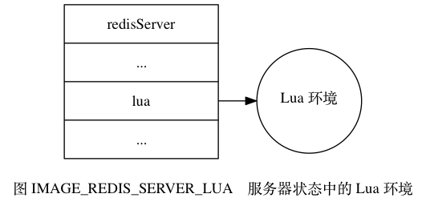

因为 Redis 使用串行化的方式来执行 Redis 命令， 所以在任何特定时间里， 最多都只会有一个脚本能够被放进 Lua 环境里面运行， 因此， 整个 Redis 服务器只需要创建一个 Lua 环境即可。

## 20.2 Lua 环境协作组件

除了创建并修改Lua环境之外，Redis服务器还创建了两个用于与Lua环境进行协作的组件，它们分别是负责执行Lua脚本中的Redis命令的伪客户端，以及用于保存Lua脚本的lua_scripts字典。

接下来的两个小节将分别介绍这两个组件。

20.2.1　伪客户端

因为执行Redis命令必须有相应的客户端状态，所以为了执行Lua脚本中包含的Redis命令，Redis服务器专门为Lua环境创建了一个伪客户端，并由这个伪客户端负责处理Lua脚本中包含的所有Redis命令。

Lua脚本使用redis.call函数或者redis.pcall函数执行一个Redis命令，需要完成以下步骤：

1）Lua环境将redis.call函数或者redis.pcall函数想要执行的命令传给伪客户端。

2）伪客户端将脚本想要执行的命令传给命令执行器。

3）命令执行器执行伪客户端传给它的命令，并将命令的执行结果返回给伪客户端。

4）伪客户端接收命令执行器返回的命令结果，并将这个命令结果返回给Lua环境。

5）Lua环境在接收到命令结果之后，将该结果返回给redis.call函数或者redis.pcall函数。

6）接收到结果的redis.call函数或者redis.pcall函数会将命令结果作为函数返回值返回给脚本中的调用者。

图20-2展示了Lua脚本在调用redis.call函数时，Lua环境、伪客户端、命令执行器三者之间的通信过程（调用redis.pcall函数时产生的通信过程也是一样的）。

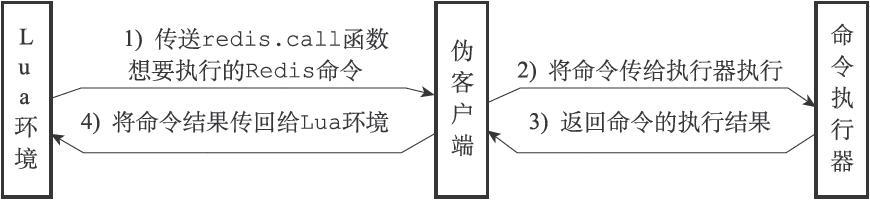

图20-2　Lua脚本执行Redis命令时的通信步骤

举个例子，图20-3展示了Lua脚本在执行以下命令时：

```
redis> EVAL "return redis.call('DBSIZE')" 0
(integer) 10086
```

Lua环境、伪客户端、命令执行器三者之间的通信过程。

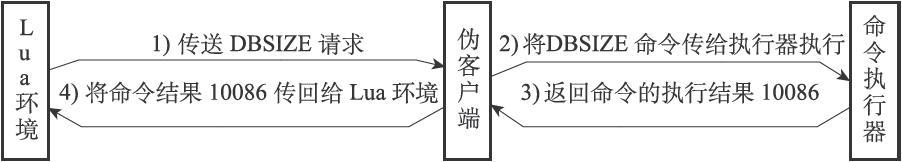

图20-3　Lua脚本执行DBSIZE命令时的通信步骤

20.2.2　lua_scripts字典

除了伪客户端之外，Redis服务器为Lua环境创建的另一个协作组件是lua_scripts字典，这个字典的键为某个Lua脚本的SHA1校验和（checksum），而字典的值则是SHA1校验和对应的Lua脚本：

```
struct redisServer {
    // ...
    dict *lua_scripts;
    // ...
};

```

Redis服务器会将所有被EVAL命令执行过的Lua脚本，以及所有被SCRIPT LOAD命令载入过的Lua脚本都保存到lua_scripts字典里面。

举个例子，如果客户端向服务器发送以下命令：

```
redis> SCRIPT LOAD "return 'hi'"
"2f31ba2bb6d6a0f42cc159d2e2dad55440778de3"
redis> SCRIPT LOAD "return 1+1"
"a27e7e8a43702b7046d4f6a7ccf5b60cef6b9bd9"
redis> SCRIPT LOAD "return 2*2"
"4475bfb5919b5ad16424cb50f74d4724ae833e72"
```

那么服务器的lua_scripts字典将包含被SCRIPT LOAD命令载入的三个Lua脚本，如图20-4所示。

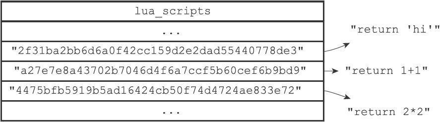

图20-4　lua_scripts字典示例

lua_scripts字典有两个作用，一个是实现SCRIPT EXISTS命令，另一个是实现脚本复制功能，本章稍后将详细说明lua_scripts字典在这两个功能中的作用。

## 20.3 EVAL命令的实现

EVAL命令的执行过程可以分为以下三个步骤：

1）根据客户端给定的Lua脚本，在Lua环境中定义一个Lua函数。

2）将客户端给定的脚本保存到lua_scripts字典，等待将来进一步使用。

3）执行刚刚在Lua环境中定义的函数，以此来执行客户端给定的Lua脚本。

以下三个小节将以：

```
redis> EVAL "return 'hello world'" 0
"hello world"
```

命令为示例，分别介绍EVAL命令执行的三个步骤。

### 20.3.1　定义脚本函数

当客户端向服务器发送EVAL命令，要求执行某个Lua脚本的时候，服务器首先要做的就是在Lua环境中，为传入的脚本定义一个与这个脚本相对应的Lua函数，其中，Lua函数的名字由f_前缀加上脚本的SHA1校验和（四十个字符长）组成，而函数的体（body）则是脚本本身。

举个例子，对于命令：

```
EVAL "return 'hello world'" 0
```

来说，服务器将在Lua环境中定义以下函数：

```
function f_5332031c6b470dc5a0dd9b4bf2030dea6d65de91()
    return 'hello world'
end
```

因为客户端传入的脚本为return'hello world'，而这个脚本的SHA1校验和为5332031c6b470dc5a0dd9b4bf2030dea6d65de91，所以函数的名字为f_5332031c6b470dc5a0dd9b4bf2030dea6d65de91，而函数的体则为return'hello world'。

使用函数来保存客户端传入的脚本有以下好处：

- 执行脚本的步骤非常简单，只要调用与脚本相对应的函数即可。
- 通过函数的局部性来让Lua环境保持清洁，减少了垃圾回收的工作量，并且避免了使用全局变量。

- 如果某个脚本所对应的函数在Lua环境中被定义过至少一次，那么只要记得这个脚本的SHA1校验和，服务器就可以在不知道脚本本身的情况下，直接通过调用Lua函数来执行脚本，这是EVALSHA命令的实现原理，稍后在介绍EVALSHA命令的实现时就会说到这一点。

### 20.3.2　将脚本保存到lua_scripts字典

EVAL命令要做的第二件事是将客户端传入的脚本保存到服务器的lua_scripts字典里面。举个例子，对于命令：

```
EVAL "return 'hello world'" 0
```

来说，服务器将在lua_scripts字典中新添加一个键值对，其中键为Lua脚本的SHA1校验和：

```
5332031c6b470dc5a0dd9b4bf2030dea6d65de91
```

而值则为Lua脚本本身：

```
return 'hello world'
```

添加新键值对之后的lua_scripts字典如图20-5所示。

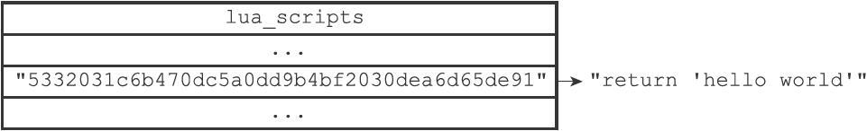

图20-5　添加新键值对之后的lua_scripts字典

### 20.3.3　执行脚本函数

在为脚本定义函数，并且将脚本保存到lua_scripts字典之后，服务器还需要进行一些设置钩子、传入参数之类的准备动作，才能正式开始执行脚本。

整个准备和执行脚本的过程如下：

1）将EVAL命令中传入的键名（key name）参数和脚本参数分别保存到KEYS数组和ARGV数组，然后将这两个数组作为全局变量传入到Lua环境里面。

2）为Lua环境装载超时处理钩子（hook），这个钩子可以在脚本出现超时运行情况时，让客户端通过SCRIPT KILL命令停止脚本，或者通过SHUTDOWN命令直接关闭服务器。

3）执行脚本函数。

4）移除之前装载的超时钩子。

5）将执行脚本函数所得的结果保存到客户端状态的输出缓冲区里面，等待服务器将结果返回给客户端。

6）对Lua环境执行垃圾回收操作。

举个例子，对于如下命令：

```
EVAL "return 'hello world'" 0
```

服务器将执行以下动作：

1）因为这个脚本没有给定任何键名参数或者脚本参数，所以服务器会跳过传值到KEYS数组或ARGV数组这一步。

2）为Lua环境装载超时处理钩子。

3）在Lua环境中执行f_5332031c6b470dc5a0dd9b4bf2030dea6d65de91函数。

4）移除超时钩子。

5）将执行f_5332031c6b470dc5a0dd9b4bf2030dea6d65de91函数所得的结果"hello world"保存到客户端状态的输出缓冲区里面。

6）对Lua环境执行垃圾回收操作。

至此，命令：

```
EVAL "return 'hello world'" 0
```

执行算是告一段落，之后服务器只要将保存在输出缓冲区里面的执行结果返回给执行EVAL命令的客户端就可以了。


## 20.4 EVALSHA 命令的实现

本章前面介绍EVAL命令的实现时说过，每个被EVAL命令成功执行过的Lua脚本，在Lua环境里面都有一个与这个脚本相对应的Lua函数，函数的名字由f_前缀加上40个字符长的SHA1校验和组成，例如f_5332031c6b470dc5a0dd9b4bf2030dea6d65de91。

只要脚本对应的函数曾经在Lua环境里面定义过，那么即使不知道脚本的内容本身，客户端也可以根据脚本的SHA1校验和来调用脚本对应的函数，从而达到执行脚本的目的，这就是EVALSHA命令的实现原理。

可以用伪代码来描述这一原理：

```
def EVALSHA(sha1):
    # 
拼接出函数的名字
    # 
例如：f_5332031c6b470dc5a0dd9b4bf2030dea6d65de91 
    func_name = "f_" + sha1
    # 
查看这个函数在Lua
环境中是否存在
    if function_exists_in_lua_env(func_name):
        # 
如果函数存在，那么执行它
        execute_lua_function(func_name)
    else:
        # 
如果函数不存在，那么返回一个错误
        send_script_error("SCRIPT NOT FOUND")
```

举个例子，当服务器执行完以下EVAL命令之后：

```
redis> EVAL "return 'hello world'" 0
"hello world"
```

Lua环境里面就定义了以下函数：

```
function f_5332031c6b470dc5a0dd9b4bf2030dea6d65de91()
    return 'hello world'
end
```

当客户端执行以下EVALSHA命令时：

```
redis> EVALSHA "5332031c6b470dc5a0dd9b4bf2030dea6d65de91" 0
"hello world"
```

服务器首先根据客户端输入的SHA1校验和，检查函数f_5332031c6b470dc5a0dd9b4bf2030dea6d65de91是否存在于Lua环境中，得到的回应是该函数确实存在，于是服务器执行Lua环境中的f_5332031c6b470dc5a0dd9b4bf2030dea6d65de91函数，并将结果"hello world"返回给客户端。

## 20.5 脚本管理命令的实现

除了EVAL命令和EVALSHA命令之外，Redis中与Lua脚本有关的命令还有四个，它们分别是SCRIPT FLUSH命令、SCRIPT EXISTS命令、SCRIPT LOAD命令、以及SCRIPT KILL命令。

接下来的四个小节将分别对这四个命令的实现原理进行介绍。

### 20.5.1　SCRIPT FLUSH

SCRIPT FLUSH命令用于清除服务器中所有和Lua脚本有关的信息，这个命令会释放并重建lua_scripts字典，关闭现有的Lua环境并重新创建一个新的Lua环境。

以下为SCRIPT FLUSH命令的实现伪代码：

```
def SCRIPT_FLUSH():
    # 
释放脚本字典
    dictRelease(server.lua_scripts)
    # 
重建脚本字典
    server.lua_scripts = dictCreate(...)
    # 
关闭Lua
环境
    lua_close(server.lua)
    # 
初始化一个新的Lua
环境
    server.lua = init_lua_env()
```

### 20.5.2　SCRIPT EXISTS

SCRIPT EXISTS命令根据输入的SHA1校验和，检查校验和对应的脚本是否存在于服务器中。

SCRIPT EXISTS命令是通过检查给定的校验和是否存在于lua_scripts字典来实现的，以下是该命令的实现伪代码：

```
def SCRIPT_EXISTS(*sha1_list):
    # 
结果列表
    result_list = []
    # 
遍历输入的所有SHA1
校验和
    for sha1 in sha1_list:
        # 
检查校验和是否为lua_scripts
字典的键
        # 
如果是的话，那么表示校验和对应的脚本存在
        # 
否则的话，脚本就不存在
        if sha1 in server.lua_scripts:
            # 
存在用1
表示
            result_list.append(1)
        else:
            # 
不存在用0
表示
            result_list.append(0)
    # 
向客户端返回结果列表
    send_list_reply(result_list)
```

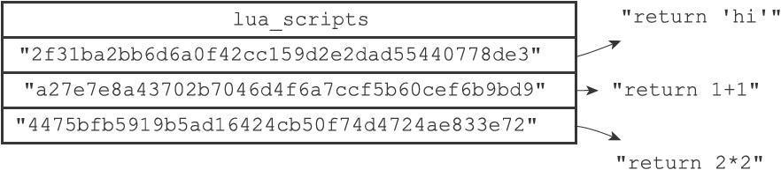

图20-6　lua_scripts字典

举个例子，对于图20-6所示的lua_scripts字典来说，我们可以进行以下测试：

```
redis> SCRIPT EXISTS "2f31ba2bb6d6a0f42cc159d2e2dad55440778de3"
1) (integer) 1
redis> SCRIPT EXISTS "a27e7e8a43702b7046d4f6a7ccf5b60cef6b9bd9"
1) (integer) 1
redis> SCRIPT EXISTS "4475bfb5919b5ad16424cb50f74d4724ae833e72"
1) (integer) 1
redis> SCRIPT EXISTS "NotExistsScriptSha1HereABCDEFGHIJKLMNOPQ"
1) (integer) 0
```

从测试结果可知，除了最后一个校验和之外，其他校验和对应的脚本都存在于服务器中。

**注意**

SCRIPT EXISTS命令允许一次传入多个SHA1校验和，不过因为SHA1校验和太长，所以示例里分开多次来进行测试。

实现SCRIPT EXISTS实际上并不需要lua_scripts字典的值。如果lua_scripts字典只用于实现SCRIPT EXISTS命令的话，那么字典只需要保存Lua脚本的SHA1校验和就可以了，并不需要保存Lua脚本本身。lua_scripts字典既保存脚本的SHA1校验和，又保存脚本本身的原因是为了实现脚本复制功能，详细的情况请看本章稍后对脚本复制功能实现原理的介绍。

### 20.5.3　SCRIPT LOAD

SCRIPT LOAD命令所做的事情和EVAL命令执行脚本时所做的前两步完全一样：命令首先在Lua环境中为脚本创建相对应的函数，然后再将脚本保存到lua_scripts字典里面。

举个例子，如果我们执行以下命令：

```
redis> SCRIPT LOAD "return 'hi'"
"2f31ba2bb6d6a0f42cc159d2e2dad55440778de3"
```

那么服务器将在Lua环境中创建以下函数：

```
function f_2f31ba2bb6d6a0f42cc159d2e2dad55440778de3()
    return 'hi'
end
```

并将键为"2f31ba2bb6d6a0f42cc159d2e2dad55440778de3"，值为"return'hi'"的键值对添加到服务器的lua_scripts字典里面，如图20-7所示。

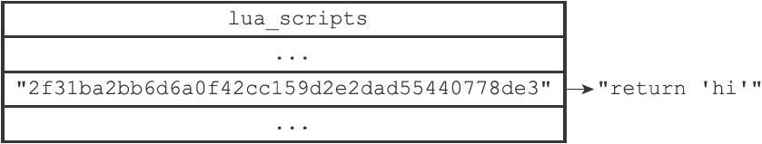

图20-7　lua_scripts字典

完成了这些步骤之后，客户端就可以使用EVALSHA命令来执行前面被SCRIPT LOAD命令载入的脚本了：

```
redis> EVALSHA "2f31ba2bb6d6a0f42cc159d2e2dad55440778de3" 0
"hi"
```

### 20.5.4　SCRIPT KILL

如果服务器设置了lua-time-limit配置选项，那么在每次执行Lua脚本之前，服务器都会在Lua环境里面设置一个超时处理钩子（hook）。

超时处理钩子在脚本运行期间，会定期检查脚本已经运行了多长时间，一旦钩子发现脚本的运行时间已经超过了lua-time-limit选项设置的时长，钩子将定期在脚本运行的间隙中，查看是否有SCRIPT KILL命令或者SHUTDOWN命令到达服务器。

图20-8展示了带有超时处理钩子的脚本的运行过程。

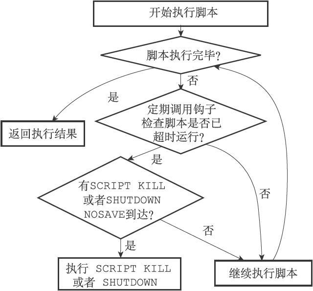

图20-8　带有超时处理钩子的脚本的执行过程

如果超时运行的脚本未执行过任何写入操作，那么客户端可以通过SCRIPT KILL命令来指示服务器停止执行这个脚本，并向执行该脚本的客户端发送一个错误回复。处理完SCRIPT KILL命令之后，服务器可以继续运行。

另一方面，如果脚本已经执行过写入操作，那么客户端只能用SHUTDOWN nosave命令来停止服务器，从而防止不合法的数据被写入数据库中。

## 20.6 脚本复制

与其他普通Redis命令一样，当服务器运行在复制模式之下时，具有写性质的脚本命令也会被复制到从服务器，这些命令包括EVAL命令、EVALSHA命令、SCRIPT FLUSH命令，以及SCRIPT LOAD命令。

接下来的两个小节将分别介绍这四个命令的复制方法。

### 20.6.1　复制EVAL命令、SCRIPT FLUSH命令和SCRIPT LOAD命令

Redis复制EVAL、SCRIPT FLUSH、SCRIPT LOAD三个命令的方法和复制其他普通Redis命令的方法一样，当主服务器执行完以上三个命令的其中一个时，主服务器会直接将被执行的命令传播（propagate）给所有从服务器，如图20-9所示。

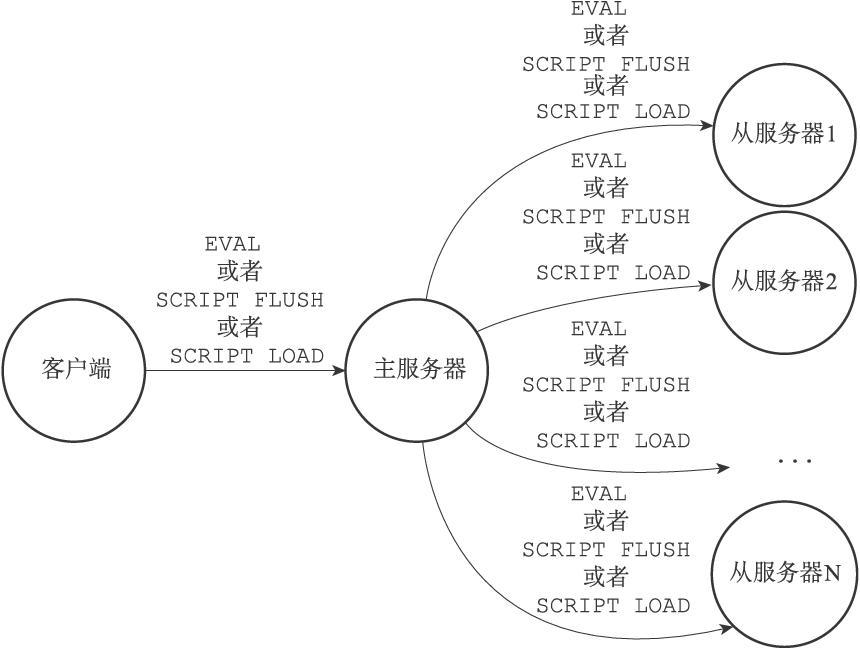

图20-9　将脚本命令传播给从服务器

#### 1. EVAL

对于EVAL命令来说，在主服务器执行的Lua脚本同样会在所有从服务器中执行。

举个例子，如果客户端向主服务器执行以下命令：

```
redis> EVAL "return redis.call('SET', KEYS[1], ARGV[1])" 1 "msg" "hello world"
OK
```

那么主服务器在执行这个EVAL命令之后，将向所有从服务器传播这条EVAL命令，从服务器会接收并执行这条EVAL命令，最终结果是，主从服务器双方都会将数据库"msg"键的值设置为"hello world"，并且将脚本：

```
"return redis.call('SET', KEYS[1], ARGV[1])"
```

保存在脚本字典里面。

#### 2. SCRIPT FLUSH

如果客户端向主服务器发送SCRIPT FLUSH命令，那么主服务器也会向所有从服务器传播SCRIPT FLUSH命令。

最终的结果是，主从服务器双方都会重置自己的Lua环境，并清空自己的脚本字典。

#### 3. SCRIPT LOAD

如果客户端使用SCRIPT LOAD命令，向主服务器载入一个Lua脚本，那么主服务器将向所有从服务器传播相同的SCRIPT LOAD命令，使得所有从服务器也会载入相同的Lua脚本。

举个例子，如果客户端向主服务器发送命令：

```
redis> SCRIPT LOAD "return 'hello world'"
"5332031c6b470dc5a0dd9b4bf2030dea6d65de91"
```

那么主服务器也会向所有从服务器传播同样的命令：

```
SCRIPT LOAD "return 'hello world'"
```

最终的结果是，主从服务器双方都会载入脚本：

```
"return 'hello world'"
```

### 20.6.2　复制EVALSHA命令

EVALSHA命令是所有与Lua脚本有关的命令中，复制操作最复杂的一个，因为主服务器与从服务器载入Lua脚本的情况可能有所不同，所以主服务器不能像复制EVAL命令、SCRIPT LOAD命令或者SCRIPT FLUSH命令那样，直接将EVALSHA命令传播给从服务器。对于一个在主服务器被成功执行的EVALSHA命令来说，相同的EVALSHA命令在从服务器执行时却可能会出现脚本未找到（not found）错误。

举个例子，假设现在有一个主服务器master，如果客户端向主服务器发送命令：

```
master> SCRIPT LOAD "return 'hello world'"
"5332031c6b470dc5a0dd9b4bf2030dea6d65de91"
```

那么在执行这个SCRIPT LOAD命令之后，SHA1值为5332031c6b470dc5a0dd9b4bf2030dea6d65de91的脚本就存在于主服务器中了。

现在，假设一个从服务器slave1开始复制主服务器master，如果master不想办法将脚本：

```
"return 'hello world'"
```

传送给slave1载入的话，那么当客户端向主服务器发送命令：

```
master> EVALSHA "5332031c6b470dc5a0dd9b4bf2030dea6d65de91" 0
"hello world"
```

的时候，master将成功执行这个EVALSHA命令，而当master将这个命令传播给slave1执行的时候，slave1却会出现脚本未找到错误：

```
slave1> EVALSHA "5332031c6b470dc5a0dd9b4bf2030dea6d65de91" 0
(error) NOSCRIPT No matching script. Please use EVAL.
```

更为复杂的是，因为多个从服务器之间载入Lua脚本的情况也可能各有不同，所以即使一个EVALSHA命令可以在某个从服务器成功执行，也不代表这个EVALSHA命令就一定可以在另一个从服务器成功执行。

举个例子，假设有主服务器master和从服务器slave1，并且slave1一直复制着master，所以master载入的所有Lua脚本，slave1也有载入（通过传播EVAL命令或者SCRIPT LOAD命令来实现）。

例如说，如果客户端向master发送命令：

```
master> SCRIPT LOAD "return 'hello world'"
"5332031c6b470dc5a0dd9b4bf2030dea6d65de91"
```

那么这个命令也会被传播到slave1上面，所以master和slave1都会成功载入SHA1校验和为5332031c6b470dc5a0dd9b4bf2030dea6d65de91的Lua脚本。

如果这时，一个新的从服务器slave2开始复制主服务器master，如果master不想办法将脚本：

```
"return 'hello world'"
```

传送给slave2的话，那么当客户端向主服务器发送命令：

```
master> EVALSHA "5332031c6b470dc5a0dd9b4bf2030dea6d65de91" 0
"hello world"
```

的时候，master和slave1都将成功执行这个EVALSHA命令，而slave2却会发生脚本未找到错误。

为了防止以上假设的情况出现，Redis要求主服务器在传播EVALSHA命令的时候，必须确保EVALSHA命令要执行的脚本已经被所有从服务器载入过，如果不能确保这一点的话，主服务器会将EVALSHA命令转换成一个等价的EVAL命令，然后通过传播EVAL命令来代替EVALSHA命令。

传播EVALSHA命令，或者将EVALSHA命令转换成EVAL命令，都需要用到服务器状态的lua_scripts字典和repl_scriptcache_dict字典，接下来的小节将分别介绍这两个字典的作用，并最终说明Redis复制EVALSHA命令的方法。

#### 1.判断传播EVALSHA命令是否安全的方法

主服务器使用服务器状态的repl_scriptcache_dict字典记录自己已经将哪些脚本传播给了所有从服务器：

```
struct redisServer {
    // ...
    dict *repl_scriptcache_dict;
    // ...
};
```

repl_scriptcache_dict字典的键是一个个Lua脚本的SHA1校验和，而字典的值则全部都是NULL，当一个校验和出现在repl_scriptcache_dict字典时，说明这个校验和对应的Lua脚本已经传播给了所有从服务器，主服务器可以直接向从服务器传播包含这个SHA1校验和的EVALSHA命令，而不必担心从服务器会出现脚本未找到错误。

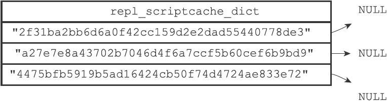

图20-10　一个repl_scriptcache_dict字典示例

举个例子，如果主服务器repl_scriptcache_dict字典的当前状态如图20-10所示，那么主服务器可以向从服务器传播以下三个EVALSHA命令，并且从服务器在执行这些EVALSHA命令的时候不会出现脚本未找到错误：

```
EVALSHA "2f31ba2bb6d6a0f42cc159d2e2dad55440778de3" ...
EVALSHA "a27e7e8a43702b7046d4f6a7ccf5b60cef6b9bd9" ...
EVALSHA "4475bfb5919b5ad16424cb50f74d4724ae833e72" ...
```

另一方面，如果一个脚本的SHA1校验和存在于lua_scripts字典，但是却不存在于repl_scriptcache_dict字典，那么说明校验和对应的Lua脚本已经被主服务器载入，但是并没有传播给所有从服务器，如果我们尝试向从服务器传播包含这个SHA1校验和的EVALSHA命令，那么至少有一个从服务器会出现脚本未找到错误。

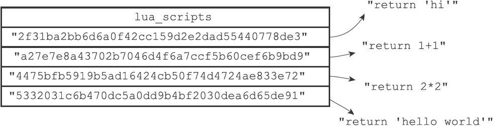

图20-11　lua_scripts字典

举个例子，对于图20-11所示的lua_scripts字典，以及图20-10所示的repl_scriptcache_dict字典来说，SHA1校验和为：

```
"5332031c6b470dc5a0dd9b4bf2030dea6d65de91"
```

的脚本：

```
"return 'hello world'"
```


虽然存在于lua_scripts字典，但是repl_scriptcache_dict字典却并不包含校验和"5332031c6b470dc5a0dd9b4bf2030dea6d65de91"，这说明脚本：

```
"return 'hello world'"
```

虽然已经载入到主服务器里面，但并未传播给所有从服务器，如果主服务器尝试向从服务器发送命令：

```
EVALSHA "5332031c6b470dc5a0dd9b4bf2030dea6d65de91" ...
```

那么至少会有一个从服务器遇上脚本未找到错误。

#### 2.清空repl_scriptcache_dict字典

每当主服务器添加一个新的从服务器时，主服务器都会清空自己的repl_scriptcache_dict字典，这是因为随着新从服务器的出现，repl_scriptcache_dict字典里面记录的脚本已经不再被所有从服务器载入过，所以主服务器会清空repl_scriptcache_dict字典，强制自己重新向所有从服务器传播脚本，从而确保新的从服务器不会出现脚本未找到错误。

#### 3.EVALSHA命令转换成EVAL命令的方法

通过使用EVALSHA命令指定的SHA1校验和，以及lua_scripts字典保存的Lua脚本，服务器总可以将一个EVALSHA命令：

```
EVALSHA <sha1> <numkeys> [key ...] [arg ...]
```

转换成一个等价的EVAL命令：

```
EVAL <script> <numkeys> [key ...] [arg ...]
```

具体的转换方法如下：

1）根据SHA1校验和sha1，在lua_scripts字典中查找sha1对应的Lua脚本script。

2）将原来的EVALSHA命令请求改写成EVAL命令请求，并且将校验和sha1改成脚本script，至于numkeys、key、arg等参数则保持不变。

举个例子，对于图20-11所示的lua_scripts字典，以及图20-10所示的repl_scriptcache_dict字典来说，我们总可以将命令：

```
EVALSHA "5332031c6b470dc5a0dd9b4bf2030dea6d65de91" 0
```

改写成命令：

```
EVAL "return 'hello world'" 0
```

其中脚本的内容：

```
"return 'hello world'"
```

来源于lua_scripts字典“5332031c6b470dc5a0dd9b4bf2030dea6d65de91”键的值。

如果一个SHA1值所对应的Lua脚本没有被所有从服务器载入过，那么主服务器可以将EVALSHA命令转换成等价的EVAL命令，然后通过传播等价的EVAL命令来代替原本想要传播的EVALSHA命令，以此来产生相同的脚本执行效果，并确保所有从服务器都不会出现脚本未找到错误。

另外，因为主服务器在传播完EVAL命令之后，会将被传播脚本的SHA1校验和（也即是原本EVALSHA命令指定的那个校验和）添加到repl_scriptcache_dict字典里面，如果之后EVALSHA命令再次指定这个SHA1校验和，主服务器就可以直接传播EVALSHA命令，而不必再次对EVALSHA命令进行转换。

#### 4.传播EVALSHA命令的方法

当主服务器成功在本机执行完一个EVALSHA命令之后，它将根据EVALSHA命令指定的SHA1校验和是否存在于repl_scriptcache_dict字典来决定是向从服务器传播EVALSHA命令还是EVAL命令：

1）如果EVALSHA命令指定的SHA1校验和存在于repl_scriptcache_dict字典，那么主服务器直接向从服务器传播EVALSHA命令。

2）如果EVALSHA命令指定的SHA1校验和不存在于repl_scriptcache_dict字典，那么主服务器会将EVALSHA命令转换成等价的EVAL命令，然后传播这个等价的EVAL命令，并将EVALSHA命令指定的SHA1校验和添加到repl_scriptcache_dict字典里面。

图20-12展示了这个判断过程。

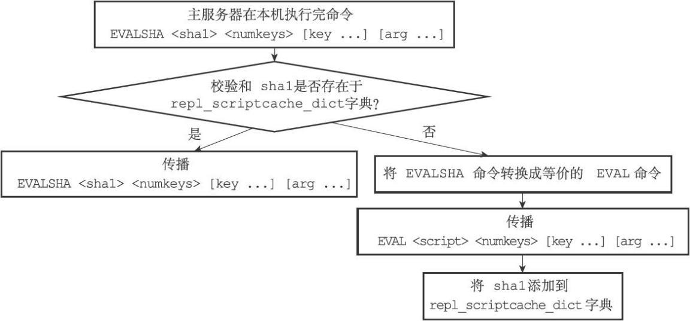

图20-12　主服务器判断传播EVAL还是EVALSHA的过程

举个例子，假设服务器当前lua_scripts字典和repl_scriptcache_dict字典的状态如图20-13所示，如果客户端向主服务器发送命令：

```
EVALSHA "5332031c6b470dc5a0dd9b4bf2030dea6d65de91" 0
```

那么主服务器在执行完这个EVALSHA命令之后，会将这个EVALSHA命令转换成等价的EVAL命令：

```
EVAL "return 'hello world'" 0
```

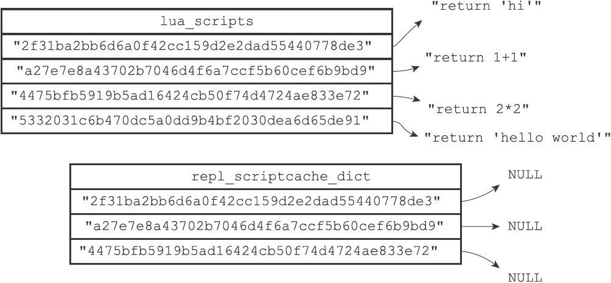

图20-13　执行EVALSHA命令之前的lua_scripts字典和repl_scriptcache_dict字典

并向所有从服务器传播这个EVAL命令。

除此之外，主服务器还会将SHA1校验和"5332031c6b470dc5a0dd9b4bf2030dea6d65de91"添加到repl_scriptcache_dict字典里，这样当客户端下次再发送命令：

```
EVALSHA "5332031c6b470dc5a0dd9b4bf2030dea6d65de91" 0
```

的时候，主服务器就可以直接向从服务器传播这个EVALSHA命令，而无须将EVALSHA命令转换成EVAL命令再传播。

添加"5332031c6b470dc5a0dd9b4bf2030dea6d65de91"之后的repl_scriptcac-he_dict字典如图20-14所示。

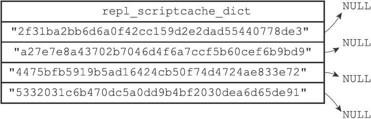

图20-14　执行EVALSHA命令之后的repl_scriptcache_dict字典

## 20.7 重点回顾

- Redis 服务器在启动时， 会对内嵌的 Lua 环境执行一系列修改操作， 从而确保内嵌的 Lua 环境可以满足 Redis 在功能性、安全性等方面的需要。
- Redis 服务器专门使用一个伪客户端来执行 Lua 脚本中包含的 Redis 命令。
- Redis 使用脚本字典来保存所有被 EVAL 命令执行过， 或者被 SCRIPT_LOAD 命令载入过的 Lua 脚本， 这些脚本可以用于实现 SCRIPT_EXISTS 命令， 以及实现脚本复制功能。
- EVAL 命令为客户端输入的脚本在 Lua 环境中定义一个函数， 并通过调用这个函数来执行脚本。
- EVALSHA 命令通过直接调用 Lua 环境中已定义的函数来执行脚本。
- SCRIPT_FLUSH 命令会清空服务器 `lua_scripts` 字典中保存的脚本， 并重置 Lua 环境。
- SCRIPT_EXISTS 命令接受一个或多个 SHA1 校验和为参数， 并通过检查 `lua_scripts` 字典来确认校验和对应的脚本是否存在。
- SCRIPT_LOAD 命令接受一个 Lua 脚本为参数， 为该脚本在 Lua 环境中创建函数， 并将脚本保存到 `lua_scripts` 字典中。
- 服务器在执行脚本之前， 会为 Lua 环境设置一个超时处理钩子， 当脚本出现超时运行情况时， 客户端可以通过向服务器发送 SCRIPT_KILL 命令来让钩子停止正在执行的脚本， 或者发送 SHUTDOWN nosave 命令来让钩子关闭整个服务器。
- 主服务器复制 EVAL 、 SCRIPT_FLUSH 、 SCRIPT_LOAD 三个命令的方法和复制普通 Redis 命令一样 —— 只要将相同的命令传播给从服务器就可以了。
- 主服务器在复制 EVALSHA 命令时， 必须确保所有从服务器都已经载入了 EVALSHA 命令指定的 SHA1 校验和所对应的 Lua 脚本， 如果不能确保这一点的话， 主服务器会将 EVALSHA 命令转换成等效的 EVAL 命令， 并通过传播 EVAL 命令来获得相同的脚本执行效果。

## 20.8 参考资料

《Lua 5.1 Reference Manual》对 Lua 语言的语法和标准库进行了很好的介绍： http://www.lua.org/manual/5.1/manual.html