# 第21章 排序

Redis的SORT命令可以对列表键、集合键或者有序集合键的值进行排序。

以下代码展示了SORT命令对列表键进行排序的例子：

```
redis> RPUSH numbers 5 3 1 4 2
(integer) 5
# 
按插入顺序排列的列表元素
redis> LRANGE numbers 0 -1
1) "5"
2) "3"
3) "1"
4) "4"
5) "2"
# 
按值从小到大有序排列的列表元素
redis> SORT numbers
1) "1"
2) "2"
3) "3"
4) "4"
5) "5"
```

以下代码展示了SORT命令使用ALPHA选项，对一个包含字符串值的集合键进行排序的例子：

```
redis> SADD alphabet a b c d e f g
(integer) 7
# 
乱序排列的集合元素
redis> SMEMBERS alphabet
1) "d"
2) "a"
3) "f"
4) "e"
5) "b"
6) "g"
7) "c"
# 
排序后的集合元素
redis> SORT alphabet ALPHA
1) "a"
2) "b"
3) "c"
4) "d"
5) "e"
6) "f"
7) "g"
```

接下来的例子使用了SORT命令和BY选项，以jack_number、peter_number、tom_number三个键的值为权重（weight），对有序集合test-result中的"jack"、"peter"、"tom"三个成员（member）进行排序：

```
redis> ZADD test-result 3.0 jack 3.5 peter 4.0 tom
(integer) 3
# 
按元素的分值排列
redis> ZRANGE test-result 0 -1
1) "jack"
2) "peter"
3) "tom"
# 
为各个元素设置序号
redis> MSET peter_number 1 tom_number 2 jack_number 3
OK
# 
以序号为权重，对有序集合中的元素进行排序
redis> SORT test-result BY *_number
1) "peter"
2) "tom"
3) "jack"
```

本章将对SORT命令的实现原理进行介绍，并说明包括ASC、DESC、ALPHA、LIMIT、STORE、BY、GET在内的所有SORT命令选项的实现原理。

除此之外，本章还将说明当SORT命令同时使用多个选项时，各个不同选项的执行顺序，以及选项的执行顺序对排序结果所产生的影响。

## 21.1 SORT <key> 命令的实现

SORT 命令的最简单执行形式为：

```
SORT <key>
```

这个命令可以对一个包含数字值的键 `key` 进行排序。

以下示例展示了如何使用 SORT 命令对一个包含三个数字值的列表键进行排序：

```
redis> RPUSH numbers 3 1 2
(integer) 3

redis> SORT numbers
1) "1"
2) "2"
3) "3"
```

服务器执行 `SORT numbers` 命令的详细步骤如下：

1. 创建一个和 `numbers` 列表长度相同的数组， 该数组的每个项都是一个 `redis.h/redisSortObject` 结构， 如图 IMAGE_CREATE_ARRAY 所示。
2. 遍历数组， 将各个数组项的 `obj` 指针分别指向 `numbers` 列表的各个项， 构成 `obj` 指针和列表项之间的一对一关系， 如图 IMAGE_POINT_OBJ 所示。
3. 遍历数组， 将各个 `obj` 指针所指向的列表项转换成一个 `double` 类型的浮点数， 并将这个浮点数保存在相应数组项的 `u.score` 属性里面， 如图 IMAGE_SET_SCORE 所示。
4. 根据数组项 `u.score` 属性的值， 对数组进行数字值排序， 排序后的数组项按 `u.score` 属性的值从小到大排列， 如图 IMAGE_SORTED 所示。
5. 遍历数组， 将各个数组项的 `obj` 指针所指向的列表项作为排序结果返回给客户端： 程序首先访问数组的索引 `0` ， 返回 `u.score` 值为 `1.0` 的列表项 `"1"` ； 然后访问数组的索引 `1` ， 返回 `u.score` 值为 `2.0` 的列表项 `"2"` ； 最后访问数组的索引 `2` ， 返回 `u.score` 值为 `3.0` 的列表项 `"3"` 。

其他 `SORT <key>` 命令的执行步骤也和这里给出的 `SORT numbers` 命令的执行步骤类似。

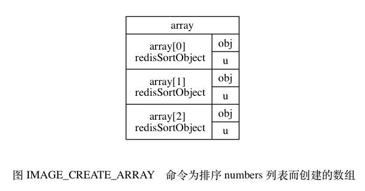

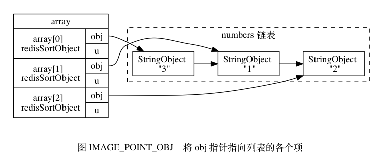


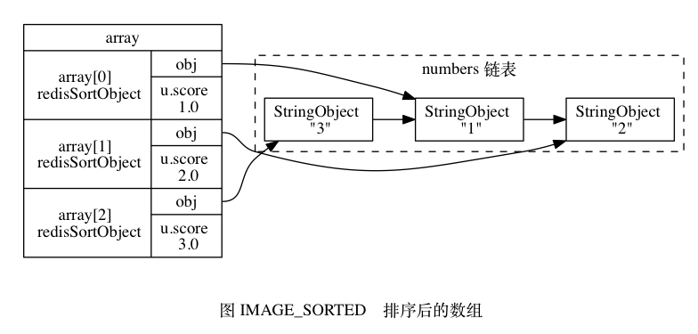

以下是 `redisSortObject` 结构的完整定义：

```
typedef struct _redisSortObject {

    // 被排序键的值
    robj *obj;

    // 权重
    union {

        // 排序数字值时使用
        double score;

        // 排序带有 BY 选项的字符串值时使用
        robj *cmpobj;

    } u;

} redisSortObject;
```

SORT 命令为每个被排序的键都创建一个与键长度相同的数组， 数组的每个项都是一个 `redisSortObject` 结构， 根据 SORT 命令使用的选项不同， 程序使用 `redisSortObject` 结构的方式也不同， 稍后介绍 SORT 命令的各种选项时我们会看到这一点。

## 21.2 ALPHA 选项的实现

通过使用ALPHA选项，SORT命令可以对包含字符串值的键进行排序：

```c
SORT <key> ALPHA
```


以下命令展示了如何使用SORT命令对一个包含三个字符串值的集合键进行排序：

```c
redis> SADD fruits apple banana cherry
(integer) 3
# 
元素在集合中是乱序存放的
redis> SMEMBERS fruits
1) "apple"
2) "cherry"
3) "banana"
# 
对fruits
键进行字符串排序
redis> SORT fruits ALPHA
1) "apple"
2) "banana"
3) "cherry"
```

服务器执行SORT fruits ALPHA命令的详细步骤如下：

1）创建一个redisSortObject结构数组，数组的长度等于fruits集合的大小。

2）遍历数组，将各个数组项的obj指针分别指向fruits集合的各个元素，如图21-5所示。

3）根据obj指针所指向的集合元素，对数组进行字符串排序，排序后的数组项按集合元素的字符串值从小到大排列：因为"apple"、"banana"、"cherry"三个字符串的大小顺序为"apple"<"banana"<"cherry"，所以排序后数组的第一项指向"apple"元素，第二项指向"banana"元素，第三项指向"cherry"元素，如图21-6所示。

4）遍历数组，依次将数组项的obj指针所指向的元素返回给客户端。

其他SORT<key>ALPHA命令的执行步骤也和这里给出的SORT fruits ALPHA命令的执行步骤类似。

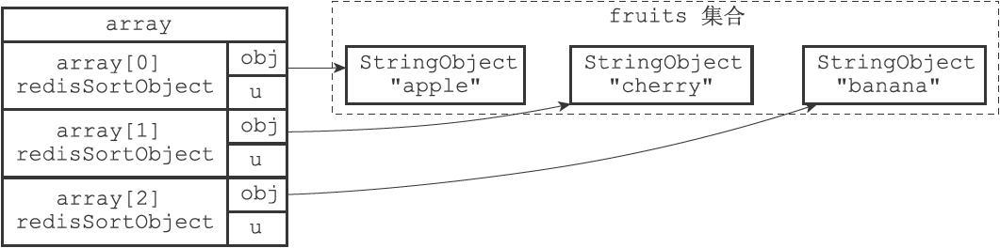

图21-5　将obj指针指向集合的各个元素

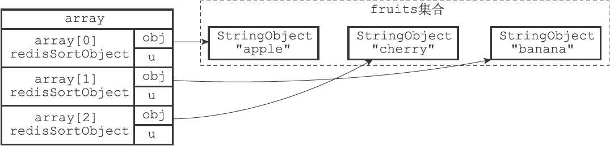

图21-6　按集合元素进行排序后的数组

## 21.3 ASC 选项和DESC 选项的实现

在默认情况下，SORT命令执行升序排序，排序后的结果按值的大小从小到大排列，以下两个命令是完全等价的：

```
SORT <key>
SORT <key> ASC
```

相反地，在执行SORT命令时使用DESC选项，可以让命令执行降序排序，让排序后的结果按值的大小从大到小排列：

```
SORT <key> DESC
```

以下是两个对numbers列表进行升序排序的例子，第一个命令根据默认设置，对numbers列表进行升序排序，而第二个命令则通过显式地使用ASC选项，对numbers列表进行升序排序，两个命令产生的结果完全一样：

```
redis> RPUSH numbers 3 1 2
(integer) 3
redis> SORT numbers
1) "1"
2) "2"
3) "3"
redis> SORT numbers ASC
1) "1"
2) "2"
3) "3"
```

与升序排序相反，以下是一个对numbers列表进行降序排序的例子：

```
redis> SORT numbers DESC
1) "3"
2) "2"
3) "1"
```

升序排序和降序排序都由相同的快速排序算法执行，它们之间的不同之处在于：

- 在执行升序排序时，排序算法使用的对比函数产生升序对比结果。

- 而在执行降序排序时，排序算法所使用的对比函数产生降序对比结果。

因为升序对比和降序对比的结果正好相反，所以它们会产生元素排列方式正好相反的两种排序结果。以numbers列表为例：

- 图21-7展示了SORT命令在对numbers列表执行升序排序时所创建的数组。

- 图21-8展示了SORT命令在对numbers列表执行降序排序时所创建的数组。

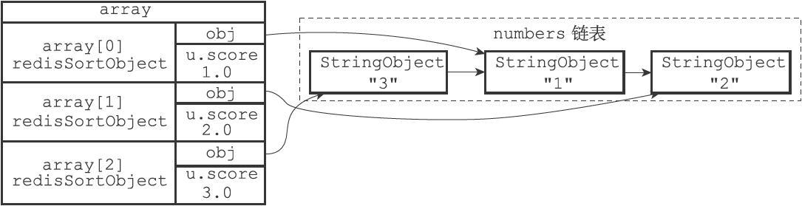

图21-7　执行升序排序的数组

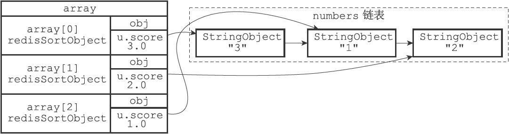

图21-8　执行降序排序的数组

其他SORT <Key> DESC命令的执行步骤也和这里给出的步骤类似。

## 21.4 BY选项的实现

在默认情况下，SORT命令使用被排序键包含的元素作为排序的权重，元素本身决定了元素在排序之后所处的位置。

例如，在下面这个例子里面，排序fruits集合所使用的权重就是"apple"、"banana"、"cherry"三个元素本身：

```
redis> SADD fruits "apple" "banana" "cherry"
(integer) 3
redis> SORT fruits ALPHA
1) "apple"
2) "banana"
3) "cherry"
```

另一方面，通过使用BY选项，SORT命令可以指定某些字符串键，或者某个哈希键所包含的某些域（field）来作为元素的权重，对一个键进行排序。

例如，以下这个例子就使用苹果、香蕉、樱桃三种水果的价钱，对集合键fruits进行了排序：

```
redis> MSET apple-price 8 banana-price 5.5 cherry-price 7
OK
redis> SORT fruits BY *-price
1) "banana"
2) "cherry"
3) "apple"
```

服务器执行SORT fruits BY*-price命令的详细步骤如下：

1）创建一个redisSortObject结构数组，数组的长度等于fruits集合的大小。

2）遍历数组，将各个数组项的obj指针分别指向fruits集合的各个元素，如图21-9所示。

3）遍历数组，根据各个数组项的obj指针所指向的集合元素，以及BY选项所给定的模式*-price，查找相应的权重键：

- 对于"apple"元素，查找程序返回权重键"apple-price"。
- 对于"banana"元素，查找程序返回权重键"banana-price"。
- 对于"cherry"元素，查找程序返回权重键"cherry-price"。

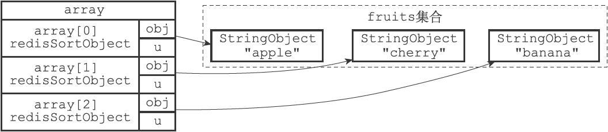

图21-9　将obj指针指向集合的各个元素

4）将各个权重键的值转换成一个double类型的浮点数，然后保存在相应数组项的u.score属性里面，如图21-10所示：

- "apple"元素的权重键"apple-price"的值转换之后为8.0。
- "banana"元素的权重键"banana-price"的值转换之后为5.5。
- "cherry"元素的权重键"cherry-price"的值转换之后为7.0。

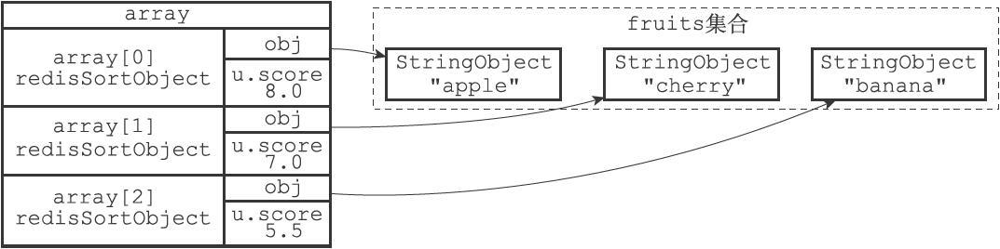

图21-10　根据权重键的值设置数组项的u.score属性

5）以数组项u.score属性的值为权重，对数组进行排序，得到一个按u.score属性的值从小到大排序的数组，如图21-11所示：

- 权重为5.5的"banana"元素位于数组的索引0位置上。
- 权重为7.0的"cherry"元素位于数组的索引1位置上。
- 权重为8.0的"apple"元素位于数组的索引2位置上。

6）遍历数组，依次将数组项的obj指针所指向的集合元素返回给客户端。

其他SORT<key>BY<pattern>命令的执行步骤也和这里给出的步骤类似。

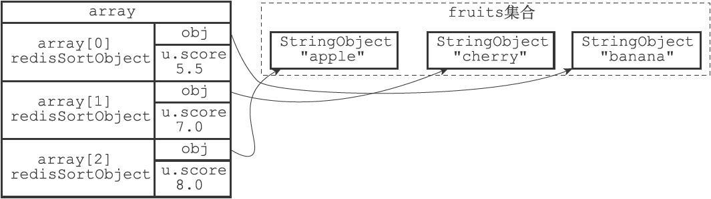

图21-11　根据u.score属性进行排序之后的数组

## 21.5 带有ALPHA 选项的BY 选项的实现

BY选项默认假设权重键保存的值为数字值，如果权重键保存的是字符串值的话，那么就需要在使用BY选项的同时，配合使用ALPHA选项。

举个例子，如果fruits集合包含的三种水果都有一个相应的字符串编号：

```
redis> SADD fruits "apple" "banana" "cherry"
(integer) 3
redis> MSET apple-id "FRUIT-25" banana-id "FRUIT-79" cherry-id "FRUIT-13"
OK
```

那么我们可以使用水果的编号为权重，对fruits集合进行排序：

```
redis> SORT fruits BY *-id ALPHA
1)"cherry"
2)"apple"
3)"banana"
```

服务器执行SORT fruits BY*-id ALPHA命令的详细步骤如下：

1）创建一个redisSortObject结构数组，数组的长度等于fruits集合的大小。

2）遍历数组，将各个数组项的obj指针分别指向fruits集合的各个元素，如图21-12所示。

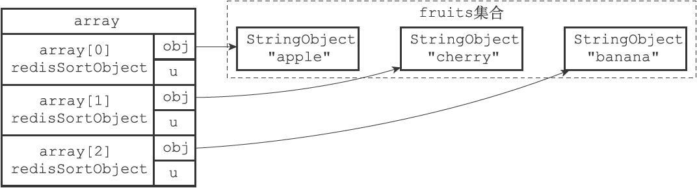

图21-12　将obj指针指向集合的各个元素

3）遍历数组，根据各个数组项的obj指针所指向的集合元素，以及BY选项所给定的模式*-id，查找相应的权重键：

- 对于"apple"元素，查找程序返回权重键"apple-id"。
- 对于"banana"元素，查找程序返回权重键"banana-id"。
- 对于"cherry"元素，查找程序返回权重键"cherry-id"。

4）将各个数组项的u.cmpobj指针分别指向相应的权重键（一个字符串对象），如图21-13所示。

5）以各个数组项的权重键的值为权重，对数组执行字符串排序，结果如图12-14所示：

- 权重为"FRUIT-13"的"cherry"元素位于数组的索引0位置上。
- 权重为"FRUIT-25"的"apple"元素位于数组的索引1位置上。
- 权重为"FRUIT-79"的"banana"元素位于数组的索引2位置上。

6）遍历数组，依次将数组项的obj指针所指向的集合元素返回给客户端。

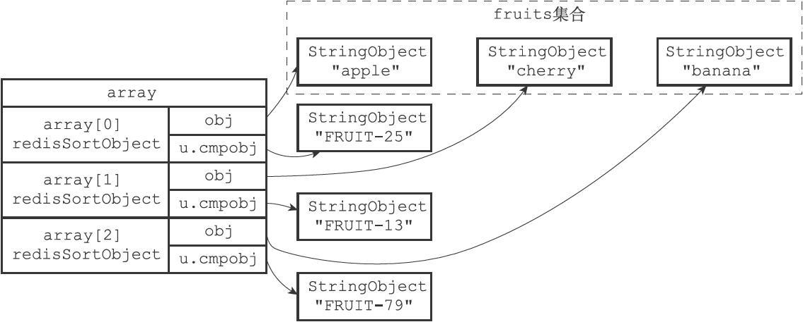

图21-13　将u.cmpobj指针指向权重键

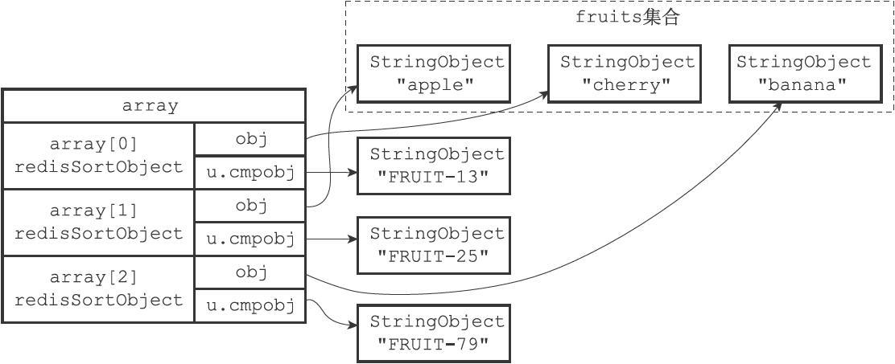

图21-14　按u.cmpobj所指向的字符串对象进行排序之后的数组

其他SORT <key> BY <pattern>ALPHA命令的执行步骤也和这里给出的步骤类似。

## 21.6 LIMIT 选项的实现

在默认情况下，SORT命令总会将排序后的所有元素都返回给客户端：

```
redis> SADD alphabet a b c d e f
(integer) 6
# 
集合中的元素是乱序存放的
redis> SMEMBERS alphabet
1) "d"
2) "c"
3) "a"
4) "b"
5) "f"
6) "e"
# 
对集合进行排序，并返回所有排序后的元素
redis> SORT alphabet ALPHA
1) "a"
2) "b"
3) "c"
4) "d"
5) "e"
6) "f"
```

但是，通过LIMIT选项，我们可以让SORT命令只返回其中一部分已排序的元素。

LIMIT选项的格式为LIMIT<offset><count>：

·offset参数表示要跳过的已排序元素数量。

·count参数表示跳过给定数量的已排序元素之后，要返回的已排序元素数量。

举个例子，以下代码首先对alphabet集合进行排序，接着跳过0个已排序元素，然后返回4个已排序元素：

```
redis> SORT alphabet ALPHA LIMIT 0 4
1) "a"
2) "b"
3) "c"
4) "d"
```

与此类似，以下代码首先对alphabet集合进行排序，接着跳过2个已排序元素，然后返回3个已排序元素：

```
redis> SORT alphabet ALPHA LIMIT 2 3
1) "c"
2) "d"
3) "e"
```

服务器执行SORT alphabet ALPHA LIMIT 0 4命令的详细步骤如下：

1）创建一个redisSortObject结构数组，数组的长度等于alphabet集合的大小。

2）遍历数组，将各个数组项的obj指针分别指向alphabet集合的各个元素，如图21-15所示。

3）根据obj指针所指向的集合元素，对数组进行字符串排序，排序后的数组如图21-16所示。

4）根据选项LIMIT 0 4，将指针移动到数组的索引0上面，然后依次访问array[0]、array[1]、array[2]、array[3]这4个数组项，并将数组项的obj指针所指向的元素"a"、"b"、"c"、"d"返回给客户端。

服务器执行SORT alphabet ALPHA LIMIT 2 3命令时的第一至第三步都和执行SORT alphabet ALPHA LIMIT 0 4命令时的步骤一样，只是第四步有所不同，上面的第4步如下：

4）根据选项LIMIT 2 3，将指针移动到数组的索引2上面，然后依次访问array[2]、array[3]、array[4]这3个数组项，并将数组项的obj指针所指向的元素"c"、"d"、"e"返回给客户端。

SORT命令在执行其他带有LIMIT选项的排序操作时，执行的步骤也和这里给出的步骤类似。

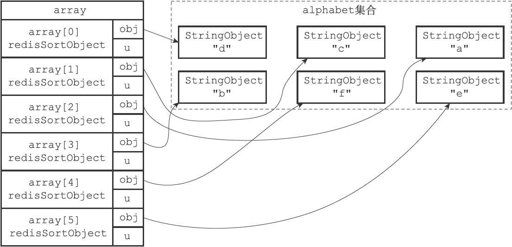

图21-15　将obj指针指向集合的各个元素

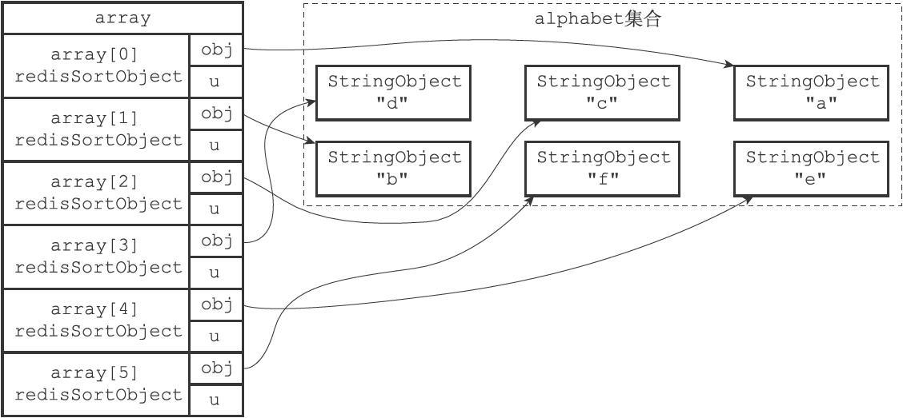

图21-16　排序后的数组

## 21.7 GET选项的实现

在默认情况下，SORT命令在对键进行排序之后，总是返回被排序键本身所包含的元素。

比如说，在以下这个对students集合进行排序的例子中，SORT命令返回的就是被排序之后的students集合的元素：

```
redis> SADD students "peter" "jack" "tom"
(integer) 3
redis> SORT students ALPHA
1) "jack"
2) "peter"
3) "tom"
```

但是，通过使用GET选项，我们可以让SORT命令在对键进行排序之后，根据被排序的元素，以及GET选项所指定的模式，查找并返回某些键的值。

比如说，在以下这个例子中，SORT命令首先对students集合进行排序，然后根据排序结果中的元素（学生的简称），查找并返回这些学生的全名：

```
# 
设置peter
、jack
、tom
的全名
redis> SET peter-name "Peter White"
OK
redis> SET jack-name "Jack Snow"
OK
redis> SET tom-name "Tom Smith"
OK
# SORT
命令首先对students
集合进行排序，得到排序结果
# 1) "jack"
# 2) "peter"
# 3) "tom"
# 
然后根据这些结果，获取并返回键jack-name
、peter-name
和tom-name
的值
redis> SORT students ALPHA GET *-name
1) "Jack Snow"
2) "Peter White"
3) "Tom Smith"
```

服务器执行SORT students ALPHA GET*-name命令的详细步骤如下：

1）创建一个redisSortObject结构数组，数组的长度等于students集合的大小。

2）遍历数组，将各个数组项的obj指针分别指向students集合的各个元素，如图21-17所示。

3）根据obj指针所指向的集合元素，对数组进行字符串排序，排序后的数组如图21-18所示：

- 被排序到数组索引0位置的是"jack"元素。
- 被排序到数组索引1位置的是"peter"元素。
- 被排序到数组索引2位置的是"tom"元素。

4）遍历数组，根据数组项obj指针所指向的集合元素，以及GET选项所给定的*-name模式，查找相应的键：

- 对于"jack"元素和*-name模式，查找程序返回键jack-name。*
- 对于"peter"元素和-name模式，查找程序返回键peter-name。
- 对于"tom"元素和*-name模式，查找程序返回键tom-name。

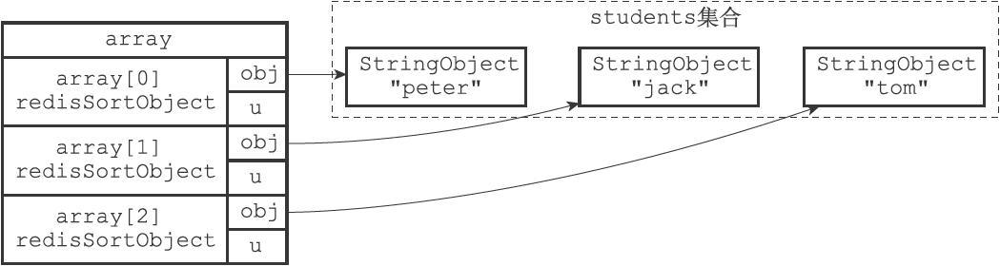

图21-17　排序之前的数组


图21-18　排序之后的数组

5）遍历查找程序返回的三个键，并向客户端返回它们的值：

- 首先返回的是jack-name键的值"Jack Snow"。
- 然后返回的是peter-name键的值"Peter White"。
- 最后返回的是tom-name键的值"Tom Smith"。

因为一个SORT命令可以带有多个GET选项，所以随着GET选项的增多，命令要执行的查找操作也会增多。

举个例子，以下SORT命令对students集合进行了排序，并通过两个GET选项来获取被排序元素（一个学生）所对应的全名和出生日期：

```bash
# 
为学生设置出生日期
redis> SET peter-birth 1995-6-7
OK
redis> SET tom-birth 1995-8-16
OK
redis> SET jack-birth 1995-5-24
OK
# 
排序students
集合，并获取相应的全名和出生日期
redis> SORT students ALPHA GET *-name GET *-birth
1) "Jack Snow"
2) "1995-5-24"
3) "Peter White"
4) "1995-6-7"
5) "Tom Smith"
6) "1995-8-16"
```

服务器执行SORT students ALPHA GET*-name GET*-birth命令的前三个步骤，和执行SORT students ALPHA GET*-name命令时的前三个步骤相同，但从第四步开始有所区别：

4）遍历数组，根据数组项obj指针所指向的集合元素，以及两个GET选项所给定的*-name模式和*-birth模式，查找相应的键：

- 对于"jack"元素和*-name模式，查找程序返回jack-name键。

- 对于"jack"元素和*-birth模式，查找程序返回jack-birth键。

- 对于"peter"元素和*-name模式，查找程序返回peter-name键。

- 对于"peter"元素和*-birth模式，查找程序返回peter-birth键。

- 对于"tom"元素和*-name模式，查找程序返回tom-name键。

- 对于"tom"元素和*-birth模式，查找程序返回tom-birth键。

5）遍历查找程序返回的六个键，并向客户端返回它们的值：

- 首先返回jack-name键的值"Jack Snow"。

- 其次返回jack-birth键的值"1995-5-24"。

- 之后返回peter-name键的值"Peter White"。

- 再之后返回peter-birth键的值"1995-6-7"。

- 然后返回tom-name键的值"Tom Smith"。

- 最后返回tom-birth键的值"1995-8-16"。

SORT命令在执行其他带有GET选项的排序操作时，执行的步骤也和这里给出的步骤类似。

## 21.8 STORE 选项的实现

在默认情况下，SORT命令只向客户端返回排序结果，而不保存排序结果：

```
redis> SADD students "peter" "jack" "tom"
(integer) 3
redis> SORT students ALPHA
1) "jack"
2) "peter"
3) "tom"
```

但是，通过使用STORE选项，我们可以将排序结果保存在指定的键里面，并在有需要时重用这个排序结果：

```
redis> SORT students ALPHA STORE sorted_students
(integer) 3
redis> LRANGE sorted_students 0-1
1) "jack"
2) "peter"
3) "tom"
```

服务器执行SORT students ALPHA STORE sorted_students命令的详细步骤如下：

1）创建一个redisSortObject结构数组，数组的长度等于students集合的大小。

2）遍历数组，将各个数组项的obj指针分别指向students集合的各个元素。

3）根据obj指针所指向的集合元素，对数组进行字符串排序，排序后的数组如图21-19所示：

- 被排序到数组索引0位置的是"jack"元素。

- 被排序到数组索引1位置的是"peter"元素。

- 被排序到数组索引2位置的是"tom"元素。

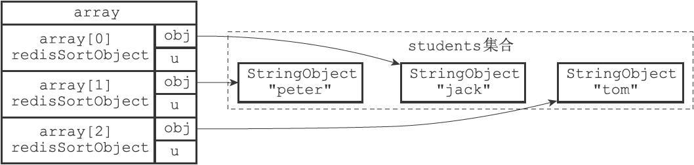

图21-19　排序之后的数组

4）检查sorted_students键是否存在，如果存在的话，那么删除该键。

5）设置sorted_students为空白的列表键。

6）遍历数组，将排序后的三个元素"jack"、"peter"和"tom"依次推入sorted_students列表的末尾，相当于执行命令RPUSH sorted_students"jack"、"peter"、"tom"。

7）遍历数组，向客户端返回"jack"、"peter"、"tom"三个元素。

SORT命令在执行其他带有STORE选项的排序操作时，执行的步骤也和这里给出的步骤类似。

## 21.9 多个选项的执行顺序

前面的章节介绍了SORT命令以及相关选项的实现原理，为了简单起见，在介绍单个选项的实现原理时，文章通常只在代码示例中使用被介绍的那个选项，但在SORT命令的实际使用中，情况并不总是那么简单的，一个SORT命令请求通常会用到多个选项，而这些选项的执行顺序是有先后之分的。

### 21.9.1　选项的执行顺序

如果按照选项来划分的话，一个SORT命令的执行过程可以分为以下四步：

1）排序：在这一步，命令会使用ALPHA、ASC或DESC、BY这几个选项，对输入键进行排序，并得到一个排序结果集。

2）限制排序结果集的长度：在这一步，命令会使用LIMIT选项，对排序结果集的长度进行限制，只有LIMIT选项指定的那部分元素会被保留在排序结果集中。

3）获取外部键：在这一步，命令会使用GET选项，根据排序结果集中的元素，以及GET选项指定的模式，查找并获取指定键的值，并用这些值来作为新的排序结果集。

4）保存排序结果集：在这一步，命令会使用STORE选项，将排序结果集保存到指定的键上面去。

5）向客户端返回排序结果集：在最后这一步，命令遍历排序结果集，并依次向客户端返回排序结果集中的元素。

在以上这些步骤中，后一个步骤必须在前一个步骤完成之后进行。

举个例子，如果客户端向服务器发送以下命令：

```c
SORT <key> ALPHA DESC BY <by-pattern> LIMIT <offset> <count> GET <get-pattern> STORE <store_key>
```
那么命令首先会执行：
```c
SORT <key> ALPHA DESC BY <by-pattern>
```
接着执行：
```c
LIMIT <offset> <count>
```
然后执行：
```c
GET <get-pattern>
```
之后执行：
```c
STORE <store_key>
```

最后，命令遍历排序结果集，将结果集中的元素依次返回给客户端。

### 21.9.2　选项的摆放顺序

另外要提醒的一点是，调用SORT命令时，除了GET选项之外，改变选项的摆放顺序并不会影响SORT命令执行这些选项的顺序。

例如，命令：


```
SORT <key> ALPHA DESC BY <by-pattern> LIMIT <offset> <count> GET <get-pattern> STORE <store_key>
```

和命令：

```
SORT <key> LIMIT <offset> <count> BY <by-pattern> ALPHA GET <get-pattern> STORE <store_key> DESC
```

以及命令：

```
SORT <key> STORE <store_key> DESC BY <by-pattern> GET <get-pattern> ALPHA LIMIT <offset> <count>
```

都产生完全相同的排序数据集。

不过，如果命令包含了多个GET选项，那么在调整选项的位置时，我们必须保证多个GET选项的摆放顺序不变，这才可以让排序结果集保持不变。

例如，命令：

```
SORT <key> GET <pattern-a> GET <pattern-b> STORE <store_key>
```

和命令：

```
SORT <key> STORE <store_key> GET <pattern-a> GET <pattern-b>
```

产生的排序结果集是完全一样的，但如果将两个GET选项的顺序调整一下：

```
SORT <key> STORE <store_key> GET <pattern-b> GET <pattern-a>
```

那么这个命令产生的排序结果集就会和前面两个命令产生的排序结果集不同。

因此在调整SORT命令各个选项的摆放顺序时，必须小心处理GET选项。

## 21.10 重点回顾

- SORT 命令通过将被排序键包含的元素载入到数组里面， 然后对数组进行排序来完成对键进行排序的工作。
- 在默认情况下， SORT 命令假设被排序键包含的都是数字值， 并且以数字值的方式来进行排序。
- 如果 SORT 命令使用了 `ALPHA` 选项， 那么 SORT 命令假设被排序键包含的都是字符串值， 并且以字符串的方式来进行排序。
- SORT 命令的排序操作由快速排序算法实现。
- SORT 命令会根据用户是否使用了 `DESC` 选项来决定是使用升序对比还是降序对比来比较被排序的元素， 升序对比会产生升序排序结果， 被排序的元素按值的大小从小到大排列， 降序对比会产生降序排序结果， 被排序的元素按值的大小从大到小排列。
- 当 SORT 命令使用了 `BY` 选项时， 命令使用其他键的值作为权重来进行排序操作。
- 当 SORT 命令使用了 `LIMIT` 选项时， 命令只保留排序结果集中 `LIMIT` 选项指定的元素。
- 当 SORT 命令使用了 `GET` 选项时， 命令会根据排序结果集中的元素， 以及 `GET` 选项给定的模式， 查找并返回其他键的值， 而不是返回被排序的元素。
- 当 SORT 命令使用了 `STORE` 选项时， 命令会将排序结果集保存在指定的键里面。
- 当 SORT 命令同时使用多个选项时， 命令先执行排序操作（可用的选项为 `ALPHA` 、 `ASC` 或 `DESC` 、 `BY` ）， 然后执行 `LIMIT` 选项， 之后执行 `GET` 选项， 再之后执行 `STORE` 选项， 最后才将排序结果集返回给客户端。
- 除了 `GET` 选项之外， 调整选项的摆放位置不会影响 SORT 命令的排序结果。