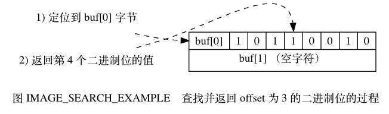
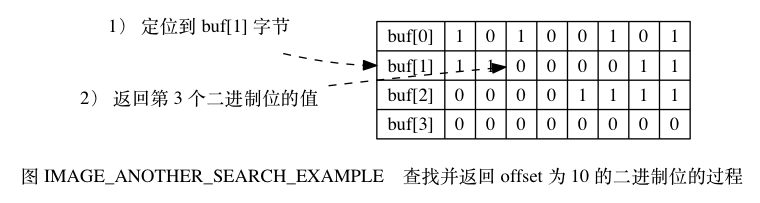

# 第22章 二进制位数组
## 22.1 位数组的表示
## 22.2 GETBIT命令的实现

GETBIT 命令用于返回位数组 `bitarray` 在 `offset` 偏移量上的二进制位的值：

```
GETBIT <bitarray> <offset>
```

GETBIT 命令的执行过程如下：

1. 计算 byte = \lfloor offset \div 8 \rfloor ， `byte` 值记录了 `offset` 偏移量指定的二进制位保存在位数组的哪个字节。
2. 计算 bit = (offset \bmod 8) + 1 ， `bit` 值记录了 `offset` 偏移量指定的二进制位是 `byte` 字节的第几个二进制位。
3. 根据 `byte` 值和 `bit` 值， 在位数组 `bitarray` 中定位 `offset` 偏移量指定的二进制位， 并返回这个位的值。

举个例子， 对于图 IMAGE_BIT_EXAMPLE 所示的位数组来说， 命令：

```
GETBIT <bitarray> 3
```

将执行以下操作：

1. \lfloor 3 \div 8 \rfloor 的值为 `0` 。
2. (3 \bmod 8) + 1 的值为 `4` 。
3. 定位到 `buf[0]` 字节上面， 然后取出该字节上的第 `4` 个二进制位（从左向右数）的值。
4. 向客户端返回二进制位的值 `1` 。

命令的执行过程如图 IMAGE_SEARCH_EXAMPLE 所示。



再举一个例子， 对于图 IMAGE_ANOTHER_BIT_EXAMPLE 所示的位数组来说， 命令：

```
GETBIT <bitarray> 10
```

将执行以下操作：

1. \lfloor 10 \div 8 \rfloor 的值为 `1` 。
2. (10 \bmod 8) + 1 的值为 `3` 。
3. 定位到 `buf[1]` 字节上面， 然后取出该字节上的第 `3` 个二进制位的值。
4. 向客户端返回二进制位的值 `0` 。

命令的执行过程如图 IMAGE_ANOTHER_SEARCH_EXAMPLE 所示。



因为 GETBIT 命令执行的所有操作都可以在常数时间内完成， 所以该命令的算法复杂度为 O(1) 。

## 22.3 SETBIT 命令的实现
## 22.4 BITCOUNT 命令的实现
## 22.5 BITOP 命令的实现
## 22.6 重点回顾

- Redis 使用 SDS 来保存位数组。
- SDS 使用逆序来保存位数组， 这种保存顺序简化了 SETBIT 命令的实现， 使得 SETBIT 命令可以在不移动现有二进制位的情况下， 对位数组进行空间扩展。
- BITCOUNT 命令使用了查表算法和 variable-precision SWAR 算法来优化命令的执行效率。
- BITOP 命令的所有操作都使用 C 语言内置的位操作来实现。

## 22.7 参考资料

StackOverflow 网站上的一个帖子对 Hamming Weight 主题进行了讨论，并给出了有用的参考信息： http://stackoverflow.com/questions/109023/how-to-count-the-number-of-set-bits-in-a-32-bit-integer 。

博客文章《Counting The Number Of Set Bits In An Integer》给出了 variable-precision SWAR 算法的介绍： http://yesteapea.wordpress.com/2013/03/03/counting-the-number-of-set-bits-in-an-integer/ ， 本章对相同算法的介绍就是参考这篇文章写出的。