# 第22章 二进制位数组

Redis提供了SETBIT、GETBIT、BITCOUNT、BITOP四个命令用于处理二进制位数组（bit array，又称“位数组”）。

其中，SETBIT命令用于为位数组指定偏移量上的二进制位设置值，位数组的偏移量从0开始计数，而二进制位的值则可以是0或者1：

```
redis> SETBIT bit 0 1  # 0000 0001 
(integer) 0     
redis> SETBIT bit 3 1        # 0000 1001 
(integer) 0     
redis> SETBIT bit 0 0        # 0000 1000 
(integer) 1 
```

而GETBIT命令则用于获取位数组指定偏移量上的二进制位的值：

```
redis> GETBIT bit 0 # 0000 1000
(integer) 0
redis> GETBIT bit 3 # 0000 1000
(integer) 1
```

BITCOUNT命令用于统计位数组里面，值为1的二进制位的数量：

```
redis> BITCOUNT bit  # 0000 1000
(integer) 1
redis> SETBIT bit 0 1        # 0000 1001
(integer) 0
redis> BITCOUNT bit
(integer) 2
redis> SETBIT bit 1 1        # 0000 1011
(integer) 0
redis> BITCOUNT bit
(integer) 3
```

最后，BITOP命令既可以对多个位数组进行按位与（and）、按位或（or）、按位异或（xor）运算：

```
redis> SETBIT x 3 1        # x = 0000 1011
(integer) 0
redis> SETBIT x 1 1
(integer) 0
redis> SETBIT x 0 1
(integer) 0
redis> SETBIT y 2 1  # y = 0000 0110
(integer) 0
redis> SETBIT y 1 1
(integer) 0
redis> SETBIT z 2 1  # z = 0000 0101
(integer) 0
redis> SETBIT z 0 1
(integer) 0
redis> BITOP AND and-result x y z    # 0000 0000
(integer) 1
redis> BITOP OR or-result x y z              # 0000 1111
(integer) 1
redis> BITOP XOR xor-result x y z    # 0000 1000
(integer) 1
```

也可以对给定的位数组进行取反（not）运算：

```
redis> SETBIT value 0 1                # 0000 1001
(integer) 0
redis> SETBIT value 3 1
(integer) 0
redis> BITOP NOT not-value value     # 1111 0110
(integer) 1
```

本章将对Redis表示位数组的方法进行说明，并介绍GETBIT、SETBIT、BITCOUNT、BITOP四个命令的实现原理。

## 22.1 位数组的表示

Redis使用字符串对象来表示位数组，因为字符串对象使用的SDS数据结构是二进制安全的，所以程序可以直接使用SDS结构来保存位数组，并使用SDS结构的操作函数来处理位数组。

图22-1展示了用SDS表示的，一字节长的位数组：

- redisObject.type的值为REDIS_STRING，表示这是一个字符串对象。

- sdshdr.len的值为1，表示这个SDS保存了一个一字节长的位数组。

- buf数组中的buf[0]字节保存了一字节长的位数组。

- buf数组中的buf[1]字节保存了SDS程序自动追加到值的末尾的空字符'\0'。

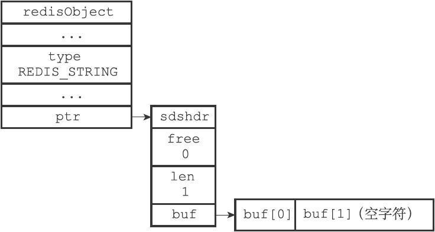

图22-1　SDS表示的位数组

因为本章介绍的操作涉及二进制位，为了清晰地展示各个位的值，本章会对SDS中buf数组的展示方式进行一些修改，让各个字节的各个位都可以清楚地展现出来。比如说，本章会将前面图22-1展示的SDS值改成图22-2所示的样子。

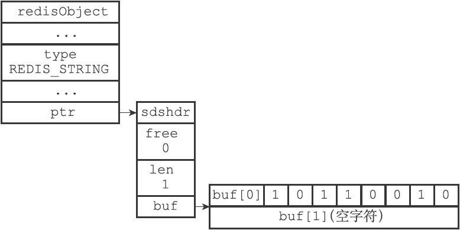

图22-2　一字节长的位数组的SDS表示

现在，buf数组的每个字节都用一行来表示，每行的第一个格子buf[i]表示这是buf数组的哪个字节，而buf[i]之后的八个格子则分别代表这一字节中的八个位。

需要注意的是，buf数组保存位数组的顺序和我们平时书写位数组的顺序是完全相反的，例如，在图22-2的buf[0]字节中，各个位的值分别是1、0、1、1、0、0、1、0，这表示buf[0]字节保存的位数组为0100 1101。使用逆序来保存位数组可以简化SETBIT命令的实现，详细的情况稍后在介绍SETBIT命令的实现原理时会说到。

图22-3展示了另一个位数组示例：

·sdshdr.len属性的值为3，表示这个SDS保存了一个三字节长的位数组。

·位数组由buf数组中的buf[0]、buf[1]、buf[2]三个字节保存，和之前说明的一样，buf数组使用逆序来保存位数组：位数组1111 0000 1100 0011 1010 0101在buf数组中会被保存为1010 0101 1100 0011 0000 1111。

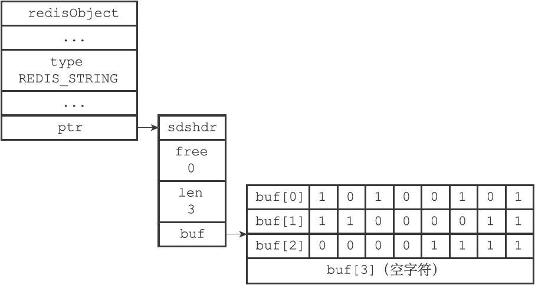

图22-3　三字节长的位数组的SDS表示

## 22.2 GETBIT命令的实现

GETBIT 命令用于返回位数组 `bitarray` 在 `offset` 偏移量上的二进制位的值：

```
GETBIT <bitarray> <offset>
```

GETBIT 命令的执行过程如下：

1. 计算 byte = \lfloor offset \div 8 \rfloor ， `byte` 值记录了 `offset` 偏移量指定的二进制位保存在位数组的哪个字节。
2. 计算 bit = (offset \bmod 8) + 1 ， `bit` 值记录了 `offset` 偏移量指定的二进制位是 `byte` 字节的第几个二进制位。
3. 根据 `byte` 值和 `bit` 值， 在位数组 `bitarray` 中定位 `offset` 偏移量指定的二进制位， 并返回这个位的值。

举个例子， 对于图 IMAGE_BIT_EXAMPLE 所示的位数组来说， 命令：

```
GETBIT <bitarray> 3
```

将执行以下操作：

1. \lfloor 3 \div 8 \rfloor 的值为 `0` 。
2. (3 \bmod 8) + 1 的值为 `4` 。
3. 定位到 `buf[0]` 字节上面， 然后取出该字节上的第 `4` 个二进制位（从左向右数）的值。
4. 向客户端返回二进制位的值 `1` 。

命令的执行过程如图 IMAGE_SEARCH_EXAMPLE 所示。


再举一个例子， 对于图 IMAGE_ANOTHER_BIT_EXAMPLE 所示的位数组来说， 命令：

```
GETBIT <bitarray> 10
```

将执行以下操作：

1. \lfloor 10 \div 8 \rfloor 的值为 `1` 。
2. (10 \bmod 8) + 1 的值为 `3` 。
3. 定位到 `buf[1]` 字节上面， 然后取出该字节上的第 `3` 个二进制位的值。
4. 向客户端返回二进制位的值 `0` 。

命令的执行过程如图 IMAGE_ANOTHER_SEARCH_EXAMPLE 所示。


因为 GETBIT 命令执行的所有操作都可以在常数时间内完成， 所以该命令的算法复杂度为 O(1) 。

## 22.3 SETBIT 命令的实现

SETBIT用于将位数组bitarray在offset偏移量上的二进制位的值设置为value，并向客户端返回二进制位被设置之前的旧值：

```
SETBIT <bitarray> <offset> <value>
```

以下是SETBIT命令的执行过程：

1）计算len= offset÷8」+1，len值记录了保存offset偏移量指定的二进制位至少需要多少字节。

2）检查bitarray键保存的位数组（也即是SDS）的长度是否小于len，如果是的话，将SDS的长度扩展为len字节，并将所有新扩展空间的二进制位的值设置为0。

3）计算byte= offset÷8」，byte值记录了offset偏移量指定的二进制位保存在位数组的哪个字节。

4）计算bit=（offset mod 8）+1，bit值记录了offset偏移量指定的二进制位是byte字节的第几个二进制位。

5）根据byte值和bit值，在bitarray键保存的位数组中定位offset偏移量指定的二进制位，首先将指定二进制位现在值保存在oldvalue变量，然后将新值value设置为这个二进制位的值。

6）向客户端返回oldvalue变量的值。

因为SETBIT命令执行的所有操作都可以在常数时间内完成，所以该命令的时间复杂度为O（1）。

### 22.3.1　SETBIT命令的执行示例

让我们通过观察一些SETBIT命令的执行例子来熟悉SETBIT命令的运行过程。

首先，如果我们对图22-2所示的位数组执行命令：

```
SETBIT <bitarray> 1 1
```

那么服务器将执行以下操作：

1）计算 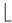1÷8」+1，得出值1，这表示保存偏移量为1的二进制位至少需要1字节长位数组。

2）检查位数组的长度，发现SDS的长度不小于1字节，无须执行扩展操作。

3）计算 1÷8」，得出值0，说明偏移量为1的二进制位位于buf[0]字节。

4）计算（1 mod 8）+1，得出值2，说明偏移量为1的二进制位是buf[0]字节的第2个二进制位。

5）定位到buf[0]字节的第2个二进制位上面，将二进制位现在的值0保存到oldvalue变量，然后将二进制位的值设置为1。

6）向客户端返回oldvalue变量的值0。


图22-6　SETBIT命令的执行过程

图22-6展示了SETBIT命令的执行过程，而图22-7则展示了SETBIT命令执行之后，位数组的样子。

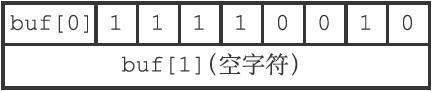

图22-7　SETBIT命令执行之后的位数组

### 22.3.2　带扩展操作的SETBIT命令示例

前面展示的SETBIT例子无须对位数组进行扩展，现在，让我们来看一个需要对位数组进行扩展的例子。

假设我们对图22-2所示的位数组执行命令：

```
SETBIT <bitarray> 12 1
```

那么服务器将执行以下操作：

1）计算 12÷8」+1，得出值2，这表示保存偏移量为12的二进制位至少需要2字节长的位数组。

2）对位数组的长度进行检查，得知位数组现在的长度为1字节，这比执行命令所需的最小长度2字节要小，所以程序会要求将位数组的长度扩展为2字节。不过，尽管程序只要求2字节长的位数组，但SDS的空间预分配策略会为SDS额外多分配2字节的未使用空间，再加上为保存空字符而额外分配的1字节，扩展之后buf数组的实际长度为5字节，如图22-8所示。

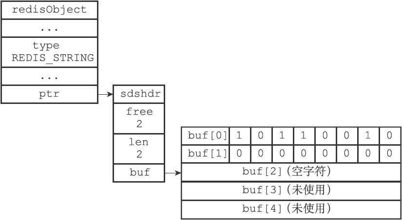

图22-8　扩展空间之后的位数组

3）计算 12÷8」，得出值1，说明偏移量为12的二进制位位于buf[1]字节中。

4）计算（12 mod 8）+1，得出值5，说明偏移量为12的二进制位是buf[1]字节的第5个二进制位。

5）定位到buf[1]字节的第5个二进制位，将二进制位现在的值0保存到oldvalue变量，然后将二进制位的值设置为1。

6）向客户端返回oldvalue变量的值0。

图22-9展示了SETBIT命令定位并设置指定二进制位的过程，而图22-10则展示了SETBIT命令执行之后，位数组的样子。

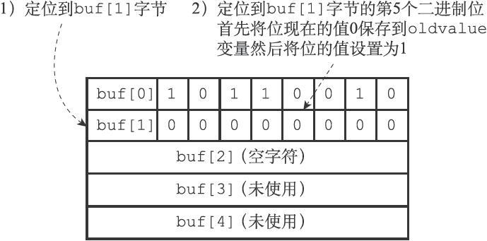

图22-9　SETBIT命令的执行过程

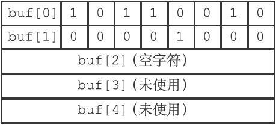

图22-10　执行SETBIT命令之后的位数组

注意，因为buf数组使用逆序来保存位数组，所以当程序对buf数组进行扩展之后，写入操作可以直接在新扩展的二进制位中完成，而不必改动位数组原来已有的二进制位。

相反地，如果buf数组使用和书写位数组时一样的顺序来保存位数组，那么在每次扩展buf数组之后，程序都需要将位数组已有的位进行移动，然后才能执行写入操作，这比SETBIT命令目前的实现方式要复杂，并且移位带来的CPU时间消耗也会影响命令的执行速度。

图22-11至图22-14模拟了程序在buf数组按书写顺序保存位数组的情况下，对位数组0100 1101执行命令SETBIT <bitarray> 12 1，将值改为0001 0000 0100 1101的整个过程。

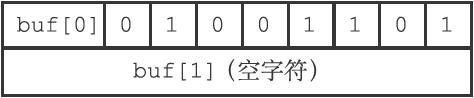

图22-11　按书写顺序保存的位数组0100 1101

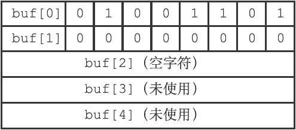

图22-12　扩展之后的位数组

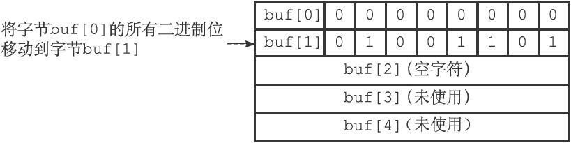

图22-13　移动已有的二进制位

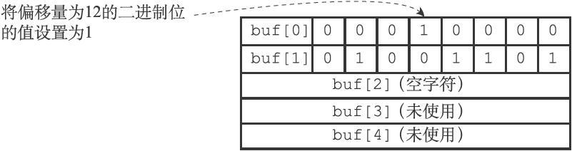

图22-14　设置指定二进制位的值

## 22.4 BITCOUNT 命令的实现

BITCOUNT命令用于统计给定位数组中，值为1的二进制位的数量。

举个例子，对于图22-15所示的位数组来说，BITCOUNT命令将返回4。

而对于图22-16所示的位数组来说，BITCOUNT命令将返回12。

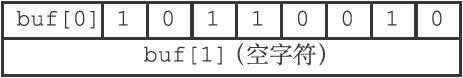

图22-15　BITCOUNT命令示例一

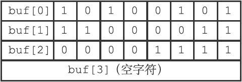

图22-16　BITCOUNT命令示例二

BITCOUNT命令要做的工作初看上去并不复杂，但实际上要高效地实现这个命令并不容易，需要用到一些精巧的算法。

接下来的几个小节将对BITCOUNT命令可能使用的几种算法进行介绍，并最终给出BITCOUNT命令的具体实现原理。

### 22.4.1　二进制位统计算法（1）：遍历算法

实现BITCOUNT命令最简单直接的方法，就是遍历位数组中的每个二进制位，并在遇到值为1的二进制位时，将计数器的值增一。

图22-17展示了程序使用遍历算法，对一个8位长的位数组进行遍历并计数的整个过程。

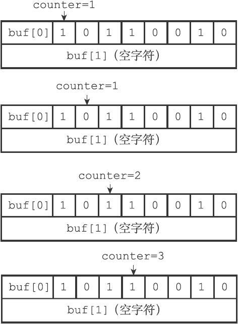

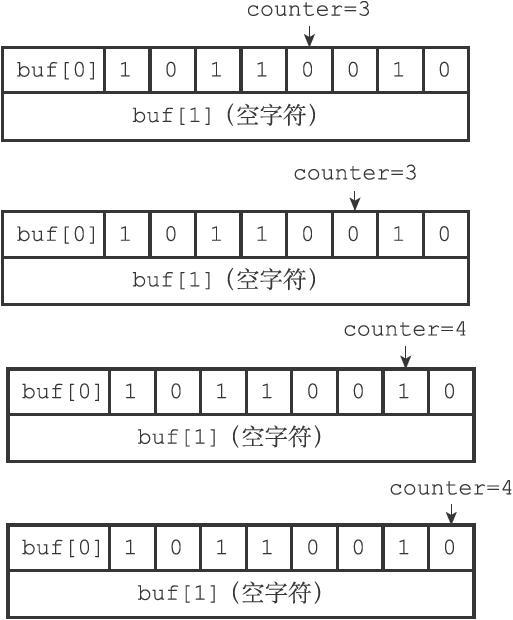

图22-17　遍历算法的运行过程

遍历算法虽然实现起来简单，但效率非常低，因为这个算法在每次循环中只能检查一个二进制位的值是否为1，所以检查操作执行的次数将与位数组包含的二进制位的数量成正比。

例如，假设要检查的位数组的长度为100MB，那么按1MB=1000000Byte=8000000bit来计算，使用遍历算法检查长度为100MB的位数组将需要执行检查操作八亿次（100*8000000）！而对于长度为500MB的位数组来说，遍历算法将需要执行检查操作四十亿次！

尽管遍历算法对单个二进制位的检查可以在很短的时间内完成，但重复执行上亿次这种检查肯定不是一个高效程序应有的表现，为了让BITCOUNT命令的实现尽可能地高效，程序必须尽可能地增加每次检查所能处理的二进制位的数量，从而减少检查操作执行的次数。

### 22.4.2　二进制位统计算法（2）：查表算法

优化检查操作的一个办法是使用查表法：

- 对于一个有限集合来说，集合元素的排列方式是有限的。

- 而对于一个有限长度的位数组来说，它能表示的二进制位排列也是有限的。

根据这个原理，我们可以创建一个表，表的键为某种排列的位数组，而表的值则是相应位数组中，值为1的二进制位的数量。

创建了这种表之后，我们就可以根据输入的位数组进行查表，在无须对位数组的每个位进行检查的情况下，直接知道这个位数组包含了多少个值为1的二进制位。

举个例子，对于8位长的位数组来说，我们可以创建表格22-1，通过这个表格，我们可以一次从位数组中读入8个位，然后根据这8个位的值进行查表，直接知道这个值包含了多少个值为1的位。

表22-1　可以快速检查8位长的位数组包含多少个1

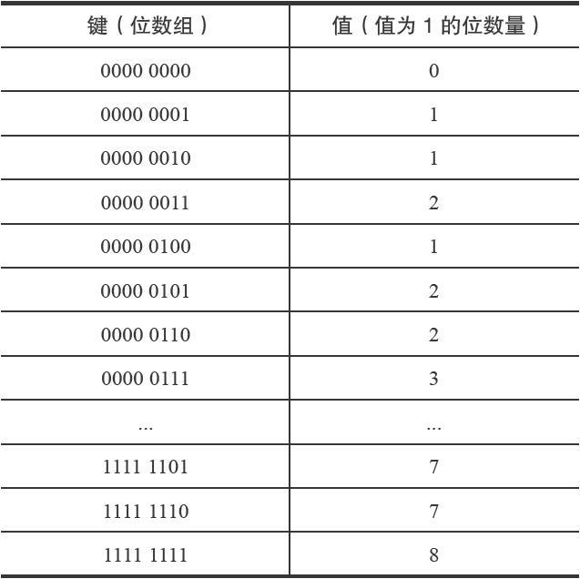

通过使用表22-1，我们只需执行一次查表操作，就可以检查8个二进制位，和之前介绍的遍历算法相比，查表法的效率提升了8倍：

- 以100MB=800000000bit（八亿位）来计算，使用查表法处理长度为100MB的位数组需要执行查表操作一亿次。

- 而对于500MB长的位数组来说，使用查表法处理该位数组需要执行五亿次查表操作。

如果我们创建一个更大的表的话，那么每次查表所能处理的位就会更多，从而减少查表操作执行的次数：

- 如果我们将表键的大小扩展为16位，那么每次查表就可以处理16个二进制位，检查100MB长的二进制位只需要五千万次查表，检查500MB长的二进制位只需要两亿五千万次查表。

- 如果我们将表键的大小扩展为32位，那么每次查表就可以处理32个二进制位，检查100MB长的二进制位只需要两千五百万次查表，检查500MB长的二进制位只需要一亿两千五百万次查表。

初看起来，只要我们创建一个足够大的表，那么统计工作就可以轻易地完成，但这个问题实际上并没有那么简单，因为查表法的实际效果会受到内存和缓存两方面因素的限制：

- 因为查表法是典型的空间换时间策略，算法在计算方面节约的时间是通过花费额外的内存换取而来的，节约的时间越多，花费的内存就越大。对于我们这里讨论的统计二进制位的问题来说，创建键长为8位的表仅需数百个字节，创建键长为16位的表也仅需数百个KB，但创建键长为32位的表却需要十多个GB。在实际中，服务器只可能接受数百个字节或者数百KB的内存消耗。

- 除了内存大小的问题之外，查表法的效果还会受到CPU缓存的限制：对于固定大小的CPU缓存来说，创建的表格越大，CPU缓存所能保存的内容相比整个表格的比例就越少，查表时出现缓存不命中（cache miss）的情况就会越高，缓存的换入和换出操作就会越频繁，最终影响查表法的实际效率。

由于以上列举的两个原因，我们可以得出结论，查表法是一种比遍历算法更好的统计办法，但受限于查表法带来的内存压力，以及缓存不命中可能带来的影响，我们只能考虑创建键长为8位或者键长为16位的表，而这两种表带来的效率提升，对于处理非常长的位数组来说仍然远远不够。

为了高效地实现BITCOUNT命令，我们需要一种不会带来内存压力、并且可以在一次检查中统计多个二进制位的算法，接下来要介绍的variable-precision SWAR算法就是这样一种算法。

### 22.4.3　二进制位统计算法（3）：variable-precision SWAR算法

BITCOUNT命令要解决的问题——统计一个位数组中非0二进制位的数量，在数学上被称为“计算汉明重量（Hamming Weight）”。

因为汉明重量经常被用于信息论、编码理论和密码学，所以研究人员针对计算汉明重量开发了多种不同的算法，一些处理器甚至直接带有计算汉明重量的指令，而对于不具备这种特殊指令的普通处理器来说，目前已知效率最好的通用算法为variable-precision SWAR算法，该算法通过一系列位移和位运算操作，可以在常数时间内计算多个字节的汉明重量，并且不需要使用任何额外的内存。

以下是一个处理32位长度位数组的variable-precision SWAR算法的实现：

```
uint32_t swar(uint32_t i) {
    // 
步骤1 
    i = (i & 0x55555555) + ((i >> 1) & 0x55555555);
    // 
步骤2 
    i = (i & 0x33333333) + ((i >> 2) & 0x33333333);
    // 
步骤3 
    i = (i & 0x0F0F0F0F) + ((i >> 4) & 0x0F0F0F0F);
    // 
步骤4 
    i = (i*(0x01010101) >> 24);
    return i;
}
```

以下是调用swar（bitarray）的执行步骤：

- 步骤1计算出的值i的二进制表示可以按每两个二进制位为一组进行分组，各组的十进制表示就是该组的汉明重量。

- 步骤2计算出的值i的二进制表示可以按每四个二进制位为一组进行分组，各组的十进制表示就是该组的汉明重量。

- 步骤3计算出的值i的二进制表示可以按每八个二进制位为一组进行分组，各组的十进制表示就是该组的汉明重量。

- 步骤4的i*0x01010101语句计算出bitarray的汉明重量并记录在二进制位的最高八位，而>>24语句则通过右移运算，将bitarray的汉明重量移动到最低八位，得出的结果就是bitarray的汉明重量。

举个例子，对于调用swar（0x3A70F21B），程序在第一步将计算出值0x2560A116，这个值的每两个二进制位的十进制表示记录了0x3A70F21B每两个二进制位的汉明重量，如表22-2所示。

表22-2　在对二进制进行两位分组下，0x3A70F21B的汉明重量

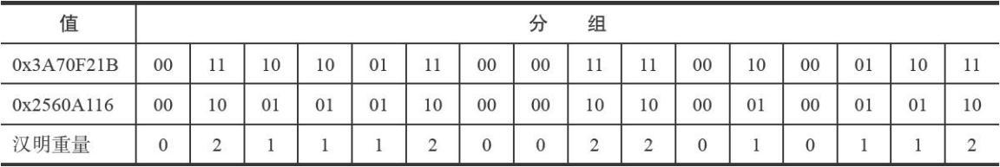

之后，程序在第二步将计算出值0x22304113，这个值的每四个二进制位的十进制表示记录了0x3A70F21B每四个二进制位的汉明重量，如表22-3所示。

表22-3　在对二进制进行四位分组下，0x3A70F21B的汉明重量

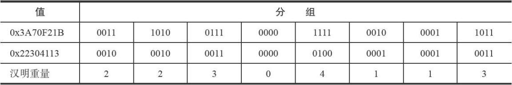

接下来，程序在第三步将计算出值0x4030504，这个值的每八个二进制位的十进制表示记录了0x3A70F21B每八个二进制位的汉明重量，如表22-4所示。

表22-4　在对二进制进行八位分组下，0x3A70F21B的汉明重量

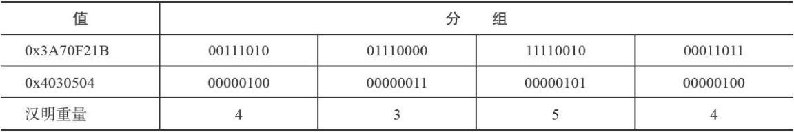

在第四步，程序首先计算0x4030504*0x01010101=0x100c0904，将汉明重量聚集到二进制位的最高八位，如表22-5所示。

表22-5　0x3A70F21B的汉明重量聚集在0x100c0904的最高八位

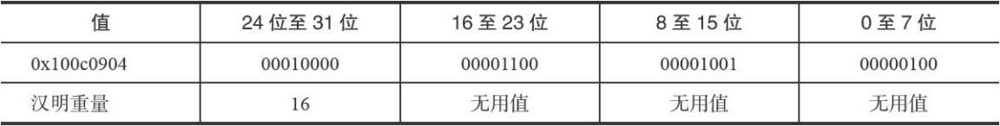

之后程序计算0x100c0904 >> 24，将汉明重量移动到低八位，最终得出值0x10，也即是十进制值16，这个值就是0x3A70F21B的汉明重量，如表22-6所示。

表22-6　进行移位之后，0x3A70F21B的汉明重量

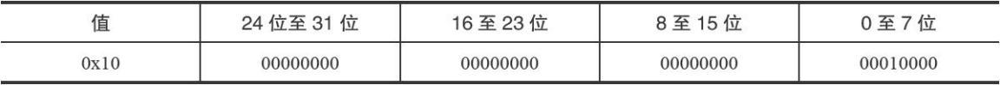

swar函数每次执行可以计算32个二进制位的汉明重量，它比之前介绍的遍历算法要快32倍，比键长为8位的查表法快4倍，比键长为16位的查表法快2倍，并且因为swar函数是单纯的计算操作，所以它无须像查表法那样，使用额外的内存。

另外，因为swar函数是一个常数复杂度的操作，所以我们可以按照自己的需要，在一次循环中多次执行swar，从而按倍数提升计算汉明重量的效率：

- 例如，如果我们在一次循环中调用两次swar函数，那么计算汉明重量的效率就从之前的一次循环计算32位提升到了一次循环计算64位。

- 又例如，如果我们在一次循环中调用四次swar函数，那么一次循环就可以计算128个二进制位的汉明重量，这比每次循环只调用一次swar函数要快四倍！

当然，在一个循环里执行多个swar调用这种优化方式是有极限的：一旦循环中处理的位数组的大小超过了缓存的大小，这种优化的效果就会降低并最终消失。

### 22.4.4　二进制位统计算法（4）：Redis的实现

BITCOUNT命令的实现用到了查表和variable-precisionSWAR两种算法：

- 查表算法使用键长为8位的表，表中记录了从0000 0000到1111 1111在内的所有二进制位的汉明重量。

- 至于variable-precision SWAR算法方面，BITCOUNT命令在每次循环中载入128个二进制位，然后调用四次32位variable-precision SWAR算法来计算这128个二进制位的汉明重量。

在执行BITCOUNT命令时，程序会根据未处理的二进制位的数量来决定使用那种算法：

- 如果未处理的二进制位的数量大于等于128位，那么程序使用variable-precision SWAR算法来计算二进制位的汉明重量。

- 如果未处理的二进制位的数量小于128位，那么程序使用查表算法来计算二进制位的汉明重量。

以下伪代码展示了BITCOUNT命令的实现原理：

```
# 
一个表，记录了所有八位长位数组的汉明重量
# 
程序将8
位长的位数组转换成无符号整数，并在表中进行索引
# 
例如，对于输入0000 0011
，程序将二进制转换为无符号整数3
# 
然后取出weight_in_byte[3]
的值2
# 2
就是0000 0011
的汉明重量
weight_in_byte = [0,1,1,2,1,2,2,/*...*/,7,7,8]
def BITCOUNT(bits):
    # 
计算位数组包含了多少个二进制位
    count = count_bit(bits)
    # 
初始化汉明重量为零
    weight = 0
    # 
如果未处理的二进制位大于等于128
位
    # 
那么使用variable-precision SWAR
算法来处理
    while count >= 128:
        # 
四个swar
调用，每个调用计算32
个二进制位的汉明重量
        # 
注意：bits[i:j]
中的索引j
是不包含在取值范围之内的
        weight += swar(bits[0:32])
        weight += swar(bits[32:64])
        weight += swar(bits[64:96])
        weight += swar(bits[96:128])
        # 
移动指针，略过已处理的位，指向未处理的位
        bits = bits[128:]
        # 
减少未处理位的长度
        count -= 128
    # 
如果执行到这里，说明未处理的位数量不足128
位
    # 
那么使用查表法来计算汉明重量
    while count:
        # 
将8 
个位转换成无符号整数，作为查表的索引（键）
        index = bits_to_unsigned_int(bits[0:8])
        weight += weight_in_byte[index]
        # 
移动指针，略过已处理的位，指向未处理的位
        bits = bits[8:]
        # 
减少未处理位的长度
        count -= 8
    # 
计算完毕，返回输入二进制位的汉明重量
    return weight
```

这个BITCOUNT实现的算法复杂度为O（n），其中n为输入二进制位的数量。

更具体一点，我们可以用以下公式来计算BITCOUNT命令在处理长度为n的二进制位输入时，命令中的两个循环需要执行的次数：

- 第一个循环的执行次数可以用公式loop 1=n÷128」计算得出。

- 第二个循环的执行次数可以用公式loop 2=n mod 128计算得出。

以100MB=800000000bit来计算，BITCOUNT命令处理一个100MB长的位数组共需要执行第一个循环六百二十五万次，第二个循环零次。以500MB=4000000000bit来计算，BITCOUNT命令处理一个500MB长的位数组共需要执行第一个循环三千一百二十五万次，第二个循环零次。

通过使用更好的算法，我们将计算100MB和500MB长的二进制位所需的循环次数从最开始使用遍历算法时的数亿甚至数十亿次减少到了数百万次和数千万次。

## 22.5 BITOP 命令的实现

因为C语言直接支持对字节执行逻辑与（&）、逻辑或（|）、逻辑异或（^）和逻辑非（~）操作，所以BITOP命令的AND、OR、XOR和NOT四个操作都是直接基于这些逻辑操作实现的：

·在执行BITOP AND命令时，程序用&操作计算出所有输入二进制位的逻辑与结果，然后保存在指定的键上面。

·在执行BITOP OR命令时，程序用|操作计算出所有输入二进制位的逻辑或结果，然后保存在指定的键上面。

·在执行BITOP XOR命令时，程序用^操作计算出所有输入二进制位的逻辑异或结果，然后保存在指定的键上面。

·在执行BITOP NOT命令时，程序用~操作计算出输入二进制位的逻辑非结果，然后保存在指定的键上面。

举个例子，假设客户端执行命令：

```
BITOP AND result x y
```

其中，键x保存的位数组如图22-18所示，而键y保存的位数组如图22-19所示，BITOP命令将执行以下操作：

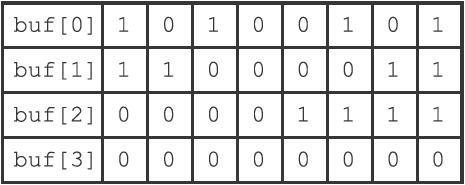

图22-18　键x所保存的位数组

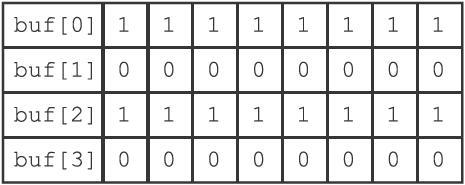

图22-19　键y所保存的位数组

1）创建一个空白的位数组value，用于保存AND操作的结果。

2）对两个位数组的第一个字节执行buf[0] & buf[0]操作，并将结果保存到value[0]字节。

3）对两个位数组的第二个字节执行buf[1] & buf[1]操作，并将结果保存到value[1]字节。

4）对两个位数组的第三个字节执行buf[2] & buf[2]操作，并将结果保存到value[2]字节。

5）经过前面的三次逻辑与操作，程序得到了图22-20所示的计算结果，并将它保存在键result上面。

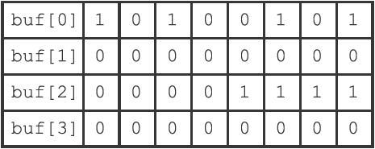

图22-20　键x和键y执行BITOP AND命令产生的结果

BITOP OR、BITOP XOR、BITOP NOT命令的执行过程和这里列出的BITOP AND的执行过程类似。

因为BITOP AND、BITOP OR、BITOP XOR三个命令可以接受多个位数组作为输入，程序需要遍历输入的每个位数组的每个字节来进行计算，所以这些命令的复杂度为O（n2）；与此相反，因为BITOP NOT命令只接受一个位数组输入，所以它的复杂度为O（n）。

## 22.6 重点回顾

- Redis 使用 SDS 来保存位数组。
- SDS 使用逆序来保存位数组， 这种保存顺序简化了 SETBIT 命令的实现， 使得 SETBIT 命令可以在不移动现有二进制位的情况下， 对位数组进行空间扩展。
- BITCOUNT 命令使用了查表算法和 variable-precision SWAR 算法来优化命令的执行效率。
- BITOP 命令的所有操作都使用 C 语言内置的位操作来实现。

## 22.7 参考资料

StackOverflow 网站上的一个帖子对 Hamming Weight 主题进行了讨论，并给出了有用的参考信息： http://stackoverflow.com/questions/109023/how-to-count-the-number-of-set-bits-in-a-32-bit-integer 。

博客文章《Counting The Number Of Set Bits In An Integer》给出了 variable-precision SWAR 算法的介绍： http://yesteapea.wordpress.com/2013/03/03/counting-the-number-of-set-bits-in-an-integer/ ， 本章对相同算法的介绍就是参考这篇文章写出的。